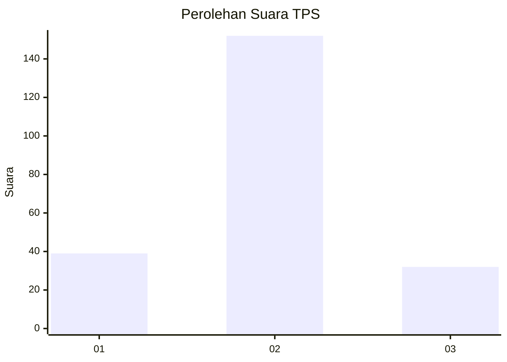
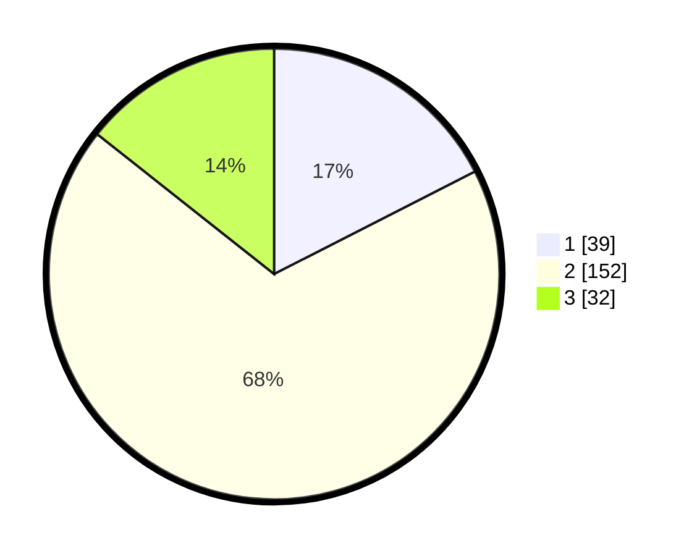

# Hasil

## Grafik

## Tabel

| No. | Nama Paslon    | Suara | Suara (raw) | Persentase |
|:--- |:-------------- | -----:| -----------:| ----------:|
| 1   | ANIES MUHAIMIN | 39    | [39][p-1]   | 17,49      |
| 2   | PRABOWO GIBRAN | 152   | [152][p-2]  | 68,16      |
| 3   | GANJAR MAHFUD  | 32    | [32][p-3]   | 14,35      |

[p-1]: https://github.com/gigit-pemilu/pemilu-2024-32-jawa-barat/blob/main/pilpres/hitung-suara/sub/32-jawa-barat/sub/09-cirebon/sub/20-kedawung/sub/2010-sutawinangun/sub/005-tps/sub/paslon-1.txt
[p-2]: https://github.com/gigit-pemilu/pemilu-2024-32-jawa-barat/blob/main/pilpres/hitung-suara/sub/32-jawa-barat/sub/09-cirebon/sub/20-kedawung/sub/2010-sutawinangun/sub/005-tps/sub/paslon-2.txt
[p-3]: https://github.com/gigit-pemilu/pemilu-2024-32-jawa-barat/blob/main/pilpres/hitung-suara/sub/32-jawa-barat/sub/09-cirebon/sub/20-kedawung/sub/2010-sutawinangun/sub/005-tps/sub/paslon-3.txt

## Foto C Plano

https://sirekap-obj-formc.kpu.go.id/37fe/pemilu/ppwp/32/09/20/20/10/3209202010005-20240214-230919--558469ca-9c45-4658-84d4-644bedf7e146.jpg

https://sirekap-obj-formc.kpu.go.id/37fe/pemilu/ppwp/32/09/20/20/10/3209202010005-20240216-172201--ba80bb57-4704-47be-b811-3be3542b9c67.jpg

https://sirekap-obj-formc.kpu.go.id/37fe/pemilu/ppwp/32/09/20/20/10/3209202010005-20240216-172302--d4ce96b9-3ce2-417c-ab26-4d2e12e553d7.jpg

## Metadata

| Key        | Value               |
| ---------- | ------------------- |
| Time Stamp | 2024-02-17 04:00:03 |

## DATA PEMILIH TETAP

Jumlah pemilih dalam DPT: **202**.
 * L: **0**.
 * P: **5**.

## DATA PENGGUNA HAK PILIH

Jumlah pengguna hak pilih dalam DPT: **2**.
 * L: **200**.
 * P: **200**.

Jumlah pengguna hak pilih dalam DPTb: **233**.
 * L: **446**.
 * P: **422**.

Jumlah pengguna hak pilih dalam DPK: **760**.
 * L: **425**.
 * P: **0**.

Jumlah pengguna hak pilih: **322**.
 * L: **757**.
 * P: **245**.

## JUMLAH SUARA SAH DAN TIDAK SAH

JUMLAH SELURUH SUARA SAH: **223**.

JUMLAH SUARA TIDAK SAH: **3**.

JUMLAH SELURUH SUARA SAH DAN SUARA TIDAK SAH: **226**.

