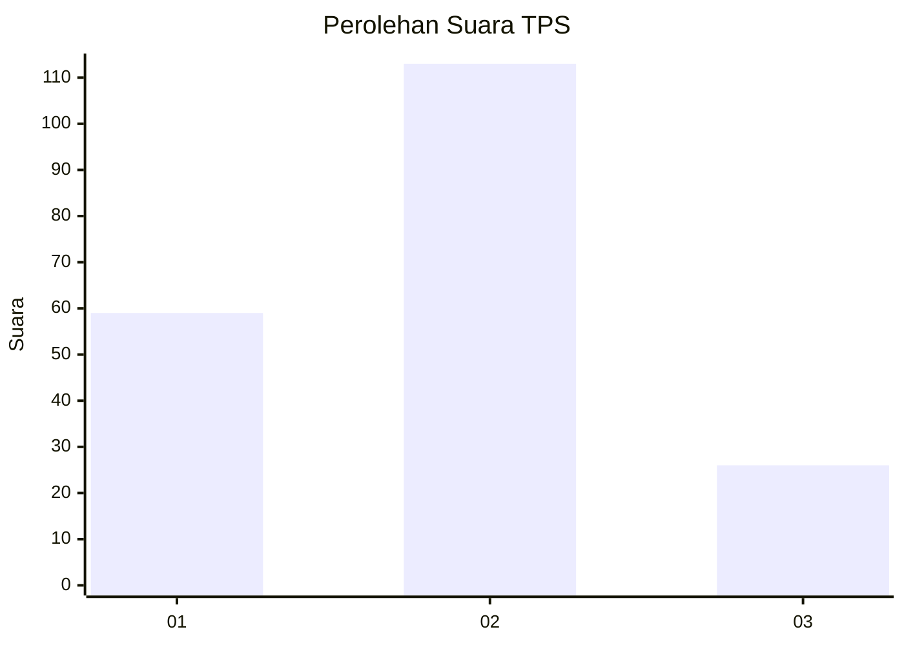
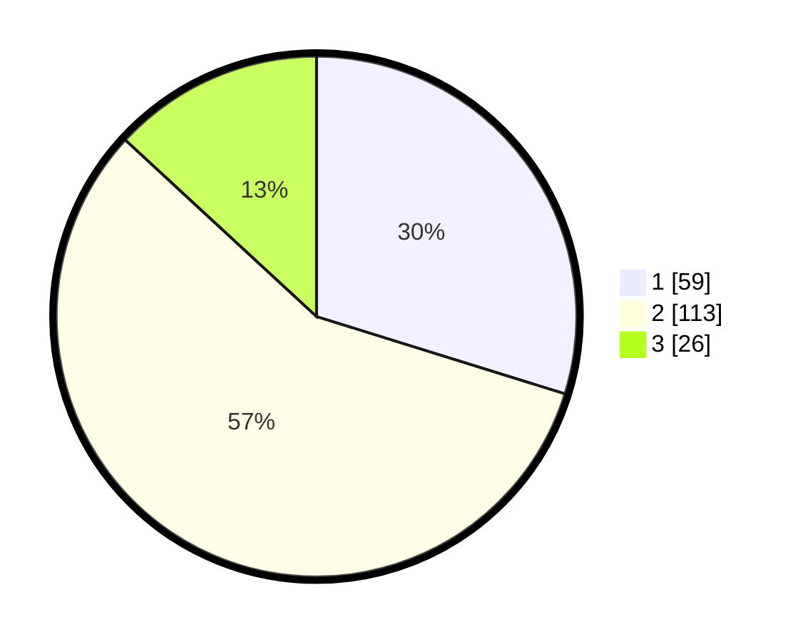

# Hasil

## Grafik

## Tabel

| No. | Nama Paslon    | Suara | Suara (raw) | Persentase |
|:--- |:-------------- | -----:| -----------:| ----------:|
| 1   | ANIES MUHAIMIN | 59    | [59][p-1]   | 29,80      |
| 2   | PRABOWO GIBRAN | 113   | [113][p-2]  | 57,07      |
| 3   | GANJAR MAHFUD  | 26    | [26][p-3]   | 13,13      |

[p-1]: https://github.com/gigit-pemilu/pemilu-2024/blob/main/pilpres/hitung-suara/sub/32-jawa-barat/sub/09-cirebon/sub/21-gunung-jati/sub/2001-adidharma/sub/001-tps/sub/paslon-1.txt
[p-2]: https://github.com/gigit-pemilu/pemilu-2024/blob/main/pilpres/hitung-suara/sub/32-jawa-barat/sub/09-cirebon/sub/21-gunung-jati/sub/2001-adidharma/sub/001-tps/sub/paslon-2.txt
[p-3]: https://github.com/gigit-pemilu/pemilu-2024/blob/main/pilpres/hitung-suara/sub/32-jawa-barat/sub/09-cirebon/sub/21-gunung-jati/sub/2001-adidharma/sub/001-tps/sub/paslon-3.txt

## Foto C Plano

https://sirekap-obj-formc.kpu.go.id/61c4/pemilu/ppwp/32/09/21/20/01/3209212001001-20240214-185513--eea0e511-bf9f-48e6-9b99-bd6819dd0761.jpg

https://sirekap-obj-formc.kpu.go.id/61c4/pemilu/ppwp/32/09/21/20/01/3209212001001-20240214-185255--314f716d-e1a9-4809-a77e-b072cc2fcc81.jpg

https://sirekap-obj-formc.kpu.go.id/61c4/pemilu/ppwp/32/09/21/20/01/3209212001001-20240214-185416--312391c9-05d8-4759-af08-d50426803d05.jpg

## Metadata

| Key        | Value               |
| ---------- | ------------------- |
| Time Stamp | 2024-02-25 12:00:00 |

