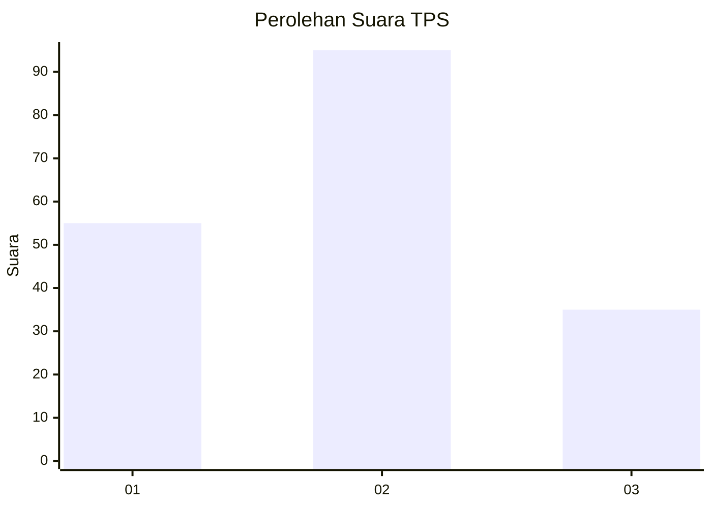
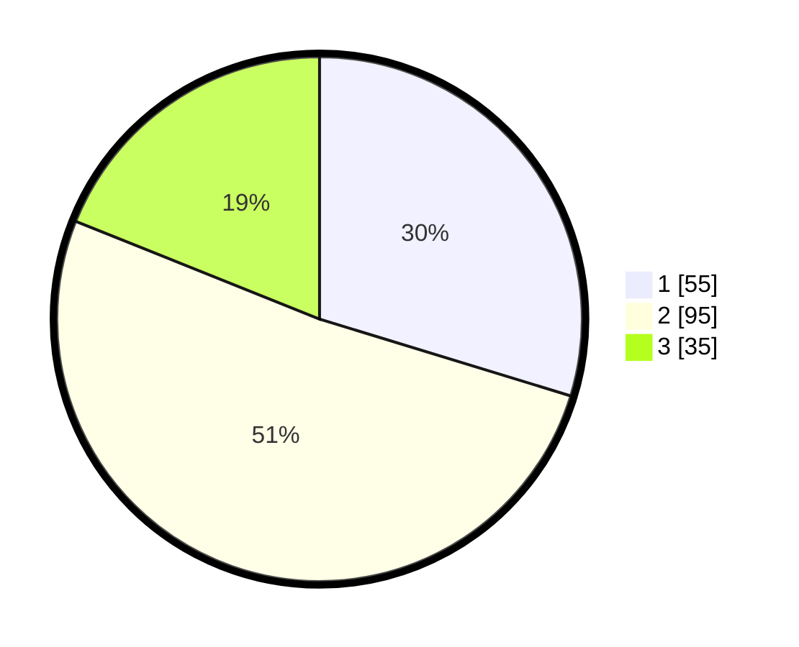

# Hasil

## Grafik

## Tabel

| No. | Nama Paslon    | Suara | Suara (raw) | Persentase |
|:--- |:-------------- | -----:| -----------:| ----------:|
| 1   | ANIES MUHAIMIN | 55    | [55][p-1]   | 29,73      |
| 2   | PRABOWO GIBRAN | 95    | [95][p-2]   | 51,35      |
| 3   | GANJAR MAHFUD  | 35    | [35][p-3]   | 18,92      |

[p-1]: https://github.com/gigit-pemilu/pemilu-2024/blob/main/pilpres/hitung-suara/sub/32-jawa-barat/sub/09-cirebon/sub/21-gunung-jati/sub/2001-adidharma/sub/004-tps/sub/paslon-1.txt
[p-2]: https://github.com/gigit-pemilu/pemilu-2024/blob/main/pilpres/hitung-suara/sub/32-jawa-barat/sub/09-cirebon/sub/21-gunung-jati/sub/2001-adidharma/sub/004-tps/sub/paslon-2.txt
[p-3]: https://github.com/gigit-pemilu/pemilu-2024/blob/main/pilpres/hitung-suara/sub/32-jawa-barat/sub/09-cirebon/sub/21-gunung-jati/sub/2001-adidharma/sub/004-tps/sub/paslon-3.txt

## Foto C Plano

https://sirekap-obj-formc.kpu.go.id/3d38/pemilu/ppwp/32/09/21/20/01/3209212001004-20240217-202132--d740ca99-4d0a-4797-9eb4-5fd8f931ed4a.jpg

https://sirekap-obj-formc.kpu.go.id/3d38/pemilu/ppwp/32/09/21/20/01/3209212001004-20240217-085139--e6c91ba9-514d-453a-8409-f96542d57abb.jpg

https://sirekap-obj-formc.kpu.go.id/3d38/pemilu/ppwp/32/09/21/20/01/3209212001004-20240217-085403--7ec5022b-1d90-475a-bdd8-9cb1c5ded0f8.jpg

## Metadata

| Key        | Value               |
| ---------- | ------------------- |
| Time Stamp | 2024-02-24 22:31:28 |

