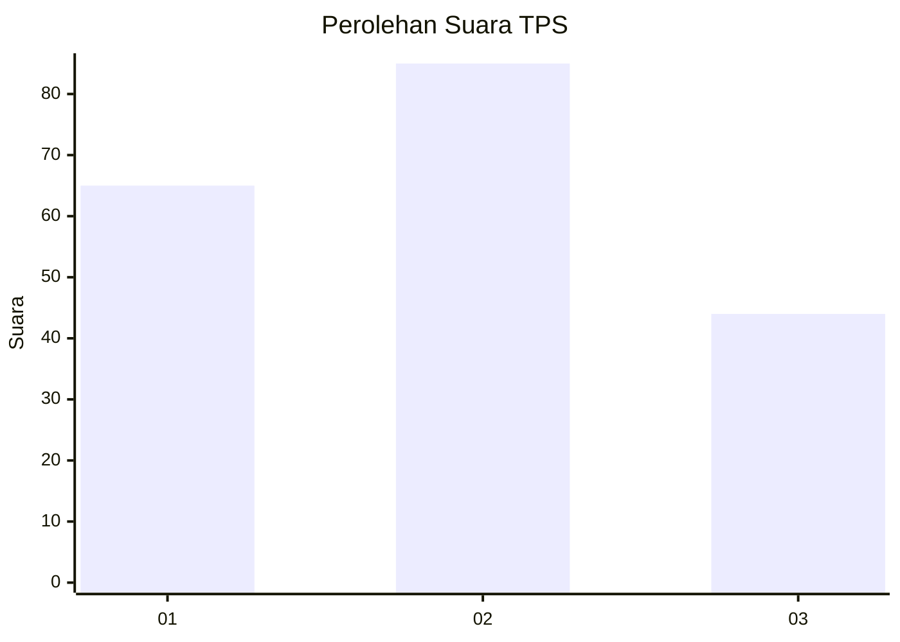
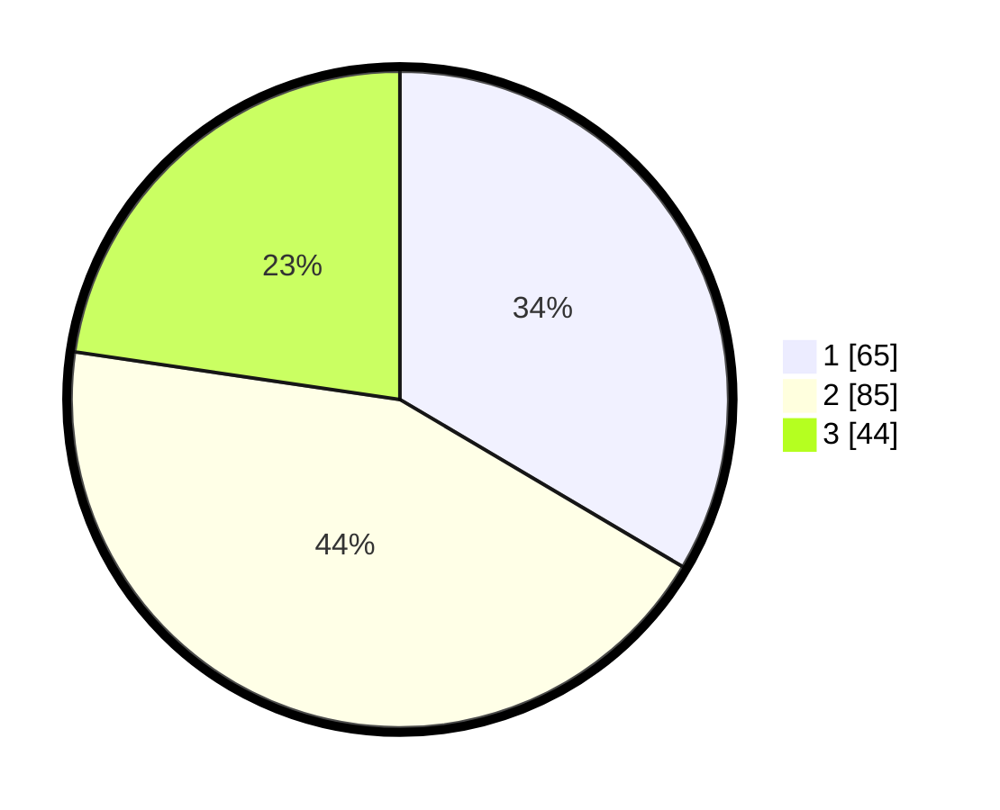

# Hasil

## Grafik

## Tabel

| No. | Nama Paslon    | Suara | Suara (raw) | Persentase |
|:--- |:-------------- | -----:| -----------:| ----------:|
| 1   | ANIES MUHAIMIN | 65    | [65][p-1]   | 33,51      |
| 2   | PRABOWO GIBRAN | 85    | [85][p-2]   | 43,81      |
| 3   | GANJAR MAHFUD  | 44    | [44][p-3]   | 22,68      |

[p-1]: https://github.com/gigit-pemilu/pemilu-2024/blob/main/pilpres/hitung-suara/sub/32-jawa-barat/sub/09-cirebon/sub/21-gunung-jati/sub/2001-adidharma/sub/005-tps/sub/paslon-1.txt
[p-2]: https://github.com/gigit-pemilu/pemilu-2024/blob/main/pilpres/hitung-suara/sub/32-jawa-barat/sub/09-cirebon/sub/21-gunung-jati/sub/2001-adidharma/sub/005-tps/sub/paslon-2.txt
[p-3]: https://github.com/gigit-pemilu/pemilu-2024/blob/main/pilpres/hitung-suara/sub/32-jawa-barat/sub/09-cirebon/sub/21-gunung-jati/sub/2001-adidharma/sub/005-tps/sub/paslon-3.txt

## Foto C Plano

https://sirekap-obj-formc.kpu.go.id/c63e/pemilu/ppwp/32/09/21/20/01/3209212001005-20240217-072802--a98eece0-2f4c-45d4-859f-543198a1f6be.jpg

https://sirekap-obj-formc.kpu.go.id/c63e/pemilu/ppwp/32/09/21/20/01/3209212001005-20240217-120819--eed26638-8add-4d6c-879e-b3e266f0b01e.jpg

https://sirekap-obj-formc.kpu.go.id/c63e/pemilu/ppwp/32/09/21/20/01/3209212001005-20240214-191917--48b247fa-a85b-4200-9dab-662ed3b3b707.jpg

## Metadata

| Key        | Value               |
| ---------- | ------------------- |
| Time Stamp | 2024-02-27 22:00:00 |

