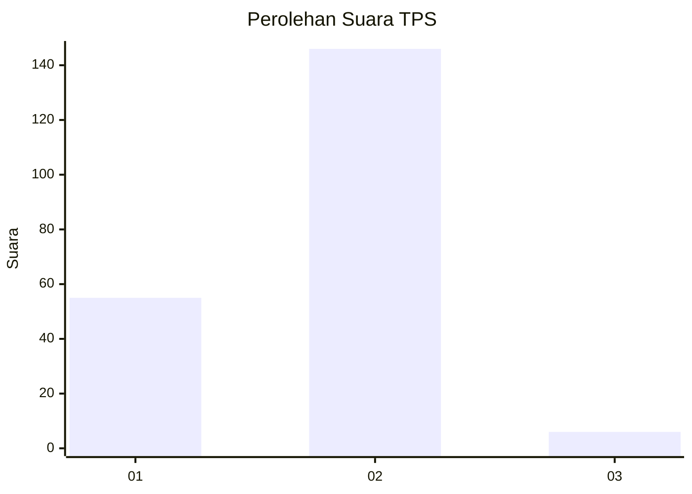
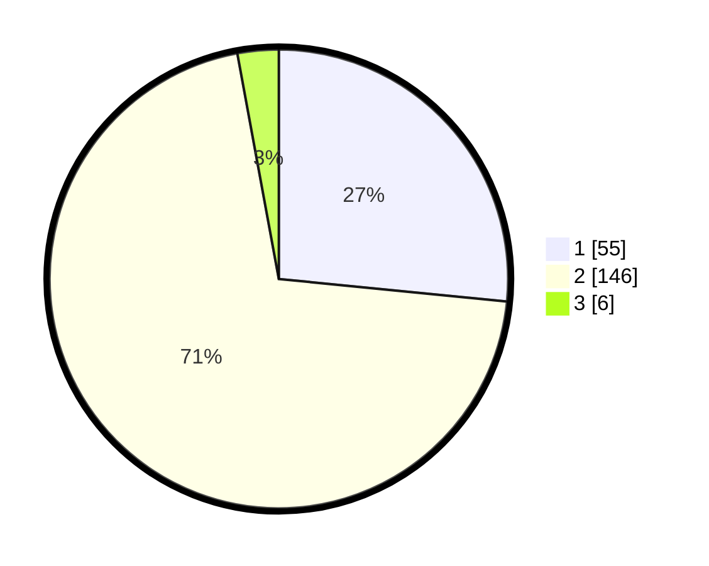

# Hasil

## Grafik

## Tabel

| No. | Nama Paslon    | Suara | Suara (raw) | Persentase |
|:--- |:-------------- | -----:| -----------:| ----------:|
| 1   | ANIES MUHAIMIN | 55    | [55][p-1]   | 26,57      |
| 2   | PRABOWO GIBRAN | 146   | [146][p-2]  | 70,53      |
| 3   | GANJAR MAHFUD  | 6     | [6][p-3]    | 2,90       |

[p-1]: https://github.com/gigit-pemilu/pemilu-2024/blob/main/pilpres/hitung-suara/sub/32-jawa-barat/sub/09-cirebon/sub/22-kapetakan/sub/2010-kertasura/sub/007-tps/sub/paslon-1.txt
[p-2]: https://github.com/gigit-pemilu/pemilu-2024/blob/main/pilpres/hitung-suara/sub/32-jawa-barat/sub/09-cirebon/sub/22-kapetakan/sub/2010-kertasura/sub/007-tps/sub/paslon-2.txt
[p-3]: https://github.com/gigit-pemilu/pemilu-2024/blob/main/pilpres/hitung-suara/sub/32-jawa-barat/sub/09-cirebon/sub/22-kapetakan/sub/2010-kertasura/sub/007-tps/sub/paslon-3.txt

## Foto C Plano

https://sirekap-obj-formc.kpu.go.id/999b/pemilu/ppwp/32/09/22/20/10/3209222010007-20240215-074902--cda59571-021a-47ae-bc6e-cc71a4110af5.jpg

https://sirekap-obj-formc.kpu.go.id/999b/pemilu/ppwp/32/09/22/20/10/3209222010007-20240216-133731--a89e98f8-d62c-4c00-99c4-3fbc61c4187b.jpg

https://sirekap-obj-formc.kpu.go.id/999b/pemilu/ppwp/32/09/22/20/10/3209222010007-20240215-074929--49620371-0043-49e8-bfd6-2b1595e10e0c.jpg

## Metadata

| Key        | Value               |
| ---------- | ------------------- |
| Time Stamp | 2024-02-25 17:00:00 |

