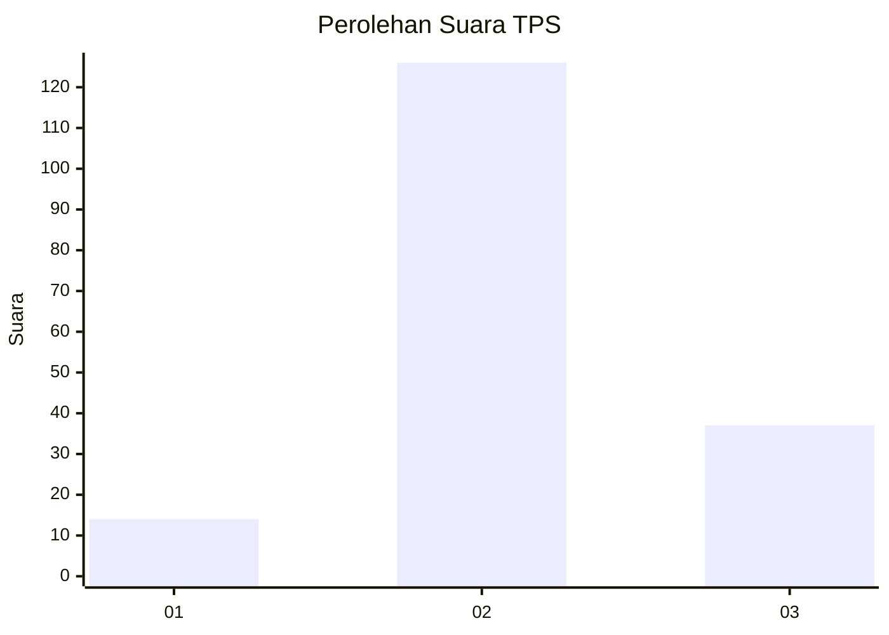
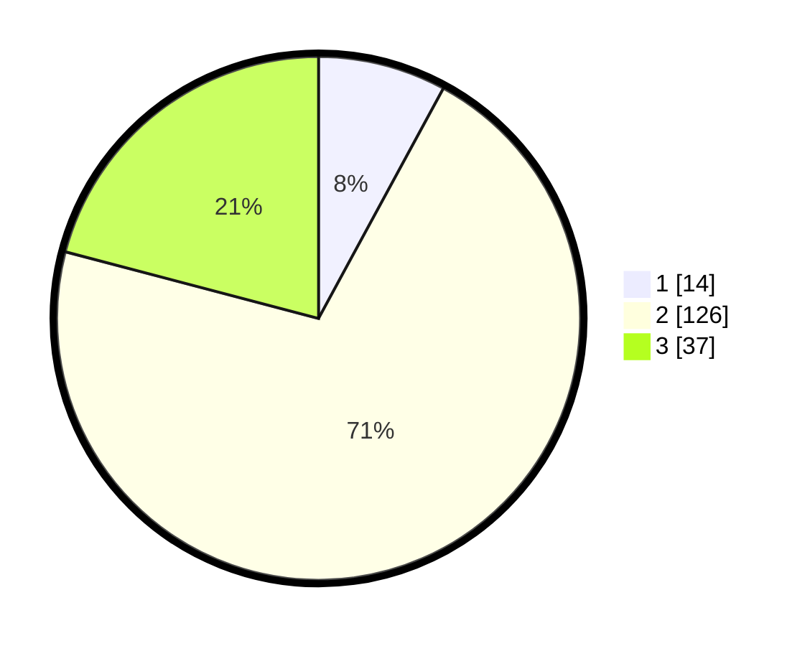

# Hasil

## Grafik

## Tabel

| No. | Nama Paslon    | Suara | Suara (raw) | Persentase |
|:--- |:-------------- | -----:| -----------:| ----------:|
| 1   | ANIES MUHAIMIN | 14    | [14][p-1]   | 7,91       |
| 2   | PRABOWO GIBRAN | 126   | [126][p-2]  | 71,19      |
| 3   | GANJAR MAHFUD  | 37    | [37][p-3]   | 20,90      |

[p-1]: https://github.com/gigit-pemilu/pemilu-2024-32-jawa-barat/blob/main/pilpres/hitung-suara/sub/32-jawa-barat/sub/09-cirebon/sub/24-arjawinangun/sub/2001-sende/sub/007-tps/sub/paslon-1.txt
[p-2]: https://github.com/gigit-pemilu/pemilu-2024-32-jawa-barat/blob/main/pilpres/hitung-suara/sub/32-jawa-barat/sub/09-cirebon/sub/24-arjawinangun/sub/2001-sende/sub/007-tps/sub/paslon-2.txt
[p-3]: https://github.com/gigit-pemilu/pemilu-2024-32-jawa-barat/blob/main/pilpres/hitung-suara/sub/32-jawa-barat/sub/09-cirebon/sub/24-arjawinangun/sub/2001-sende/sub/007-tps/sub/paslon-3.txt

## Foto C Plano

https://sirekap-obj-formc.kpu.go.id/b76e/pemilu/ppwp/32/09/24/20/01/3209242001007-20240219-190203--21f7869e-3815-4e2f-8857-41720f2bd1d0.jpg

https://sirekap-obj-formc.kpu.go.id/b76e/pemilu/ppwp/32/09/24/20/01/3209242001007-20240216-134750--8074d593-8a9c-46d7-a998-9ccebf1d0804.jpg

https://sirekap-obj-formc.kpu.go.id/b76e/pemilu/ppwp/32/09/24/20/01/3209242001007-20240219-191452--5423d918-4701-4775-a71d-557edb202ff7.jpg

## Metadata

| Key        | Value               |
| ---------- | ------------------- |
| Time Stamp | 2024-02-24 22:31:28 |

