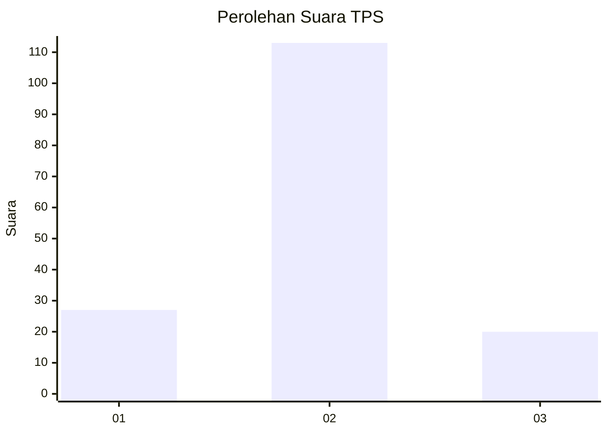
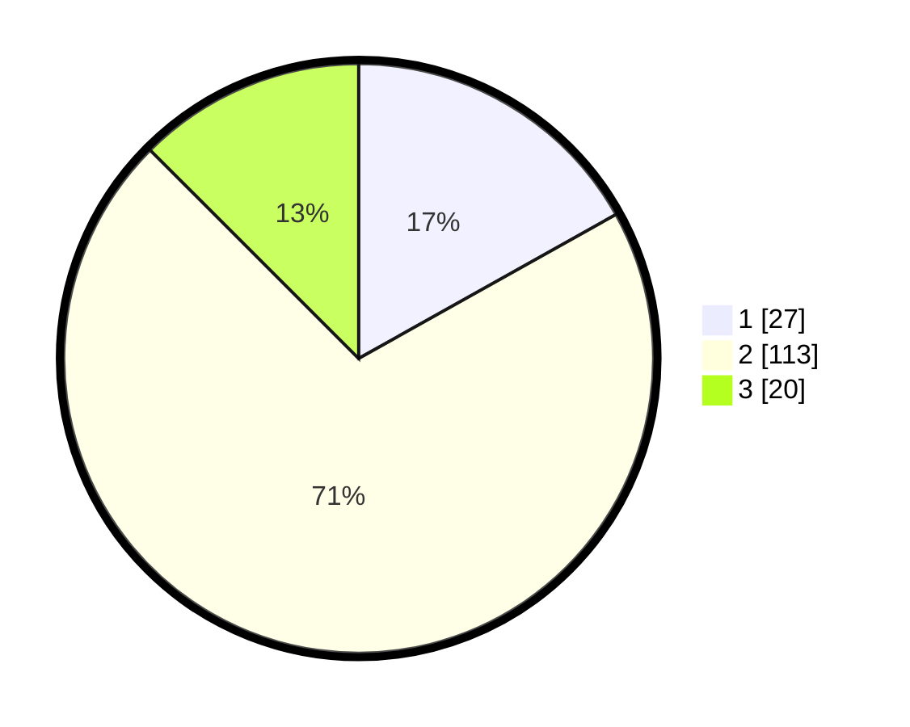

# Hasil

## Grafik

## Tabel

| No. | Nama Paslon    | Suara | Suara (raw) | Persentase |
|:--- |:-------------- | -----:| -----------:| ----------:|
| 1   | ANIES MUHAIMIN | 27    | [27][p-1]   | 16,88      |
| 2   | PRABOWO GIBRAN | 113   | [113][p-2]  | 70,63      |
| 3   | GANJAR MAHFUD  | 20    | [20][p-3]   | 12,50      |

[p-1]: https://github.com/gigit-pemilu/pemilu-2024/blob/main/pilpres/hitung-suara/sub/32-jawa-barat/sub/09-cirebon/sub/25-panguragan/sub/2001-kalianyar/sub/011-tps/sub/paslon-1.txt
[p-2]: https://github.com/gigit-pemilu/pemilu-2024/blob/main/pilpres/hitung-suara/sub/32-jawa-barat/sub/09-cirebon/sub/25-panguragan/sub/2001-kalianyar/sub/011-tps/sub/paslon-2.txt
[p-3]: https://github.com/gigit-pemilu/pemilu-2024/blob/main/pilpres/hitung-suara/sub/32-jawa-barat/sub/09-cirebon/sub/25-panguragan/sub/2001-kalianyar/sub/011-tps/sub/paslon-3.txt

## Foto C Plano

https://sirekap-obj-formc.kpu.go.id/677b/pemilu/ppwp/32/09/25/20/01/3209252001011-20240214-234041--2c93c97e-14c1-41f5-b6d5-1b3e591c18a1.jpg

https://sirekap-obj-formc.kpu.go.id/677b/pemilu/ppwp/32/09/25/20/01/3209252001011-20240221-004239--96549670-526a-40b1-a52d-a7f6aa5e81e5.jpg

https://sirekap-obj-formc.kpu.go.id/677b/pemilu/ppwp/32/09/25/20/01/3209252001011-20240221-004317--a3daa626-e982-405b-bc9d-d29248694ac8.jpg

## Metadata

| Key        | Value               |
| ---------- | ------------------- |
| Time Stamp | 2024-02-21 01:00:00 |

