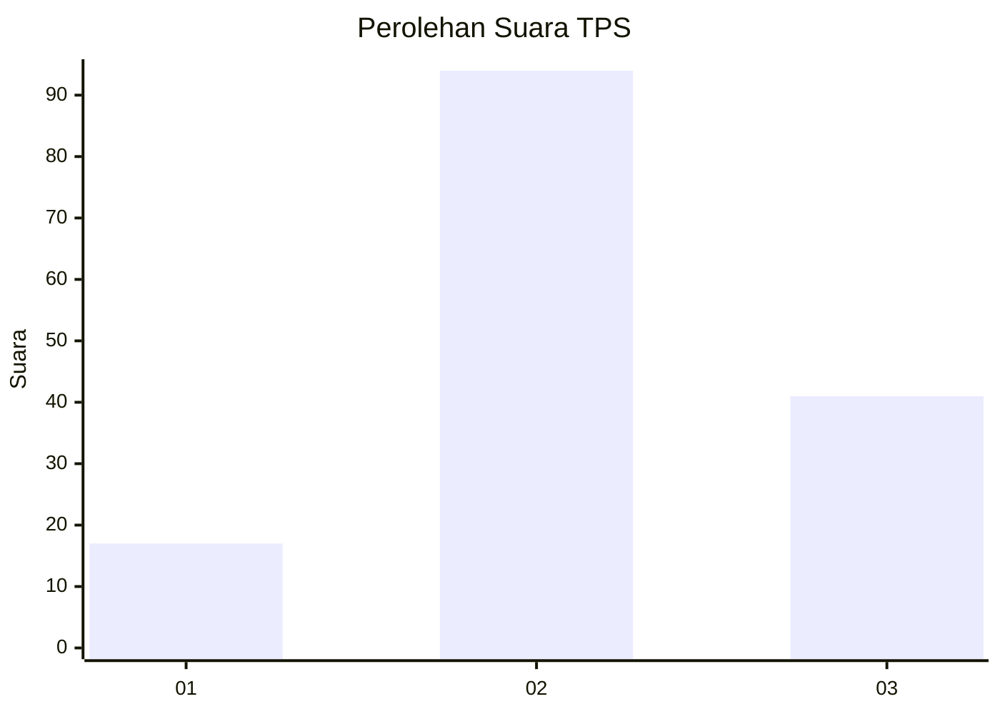
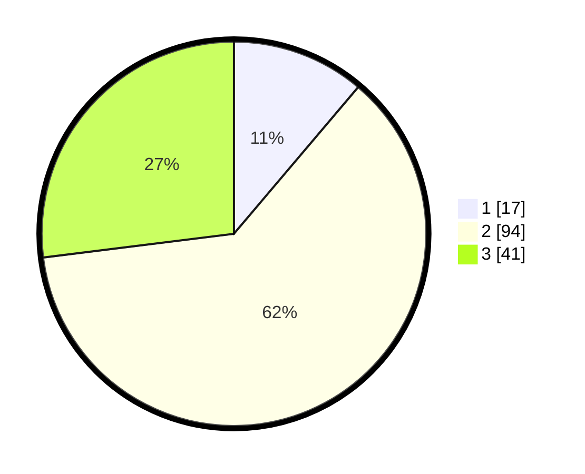

# Hasil

## Grafik

## Tabel

| No. | Nama Paslon    | Suara | Suara (raw) | Persentase |
|:--- |:-------------- | -----:| -----------:| ----------:|
| 1   | ANIES MUHAIMIN | 17    | [17][p-1]   | 11,18      |
| 2   | PRABOWO GIBRAN | 94    | [94][p-2]   | 61,84      |
| 3   | GANJAR MAHFUD  | 41    | [41][p-3]   | 26,97      |

[p-1]: https://github.com/gigit-pemilu/pemilu-2024-32-jawa-barat/blob/main/pilpres/hitung-suara/sub/32-jawa-barat/sub/09-cirebon/sub/25-panguragan/sub/2005-pangurangan/sub/002-tps/sub/paslon-1.txt
[p-2]: https://github.com/gigit-pemilu/pemilu-2024-32-jawa-barat/blob/main/pilpres/hitung-suara/sub/32-jawa-barat/sub/09-cirebon/sub/25-panguragan/sub/2005-pangurangan/sub/002-tps/sub/paslon-2.txt
[p-3]: https://github.com/gigit-pemilu/pemilu-2024-32-jawa-barat/blob/main/pilpres/hitung-suara/sub/32-jawa-barat/sub/09-cirebon/sub/25-panguragan/sub/2005-pangurangan/sub/002-tps/sub/paslon-3.txt

## Foto C Plano

https://sirekap-obj-formc.kpu.go.id/3dac/pemilu/ppwp/32/09/25/20/05/3209252005002-20240219-100929--bfc6fbcd-3e2b-452d-912b-9888b4b559fd.jpg

https://sirekap-obj-formc.kpu.go.id/3dac/pemilu/ppwp/32/09/25/20/05/3209252005002-20240219-100601--b13ede10-f16e-4194-9f66-3d555596745e.jpg

https://sirekap-obj-formc.kpu.go.id/3dac/pemilu/ppwp/32/09/25/20/05/3209252005002-20240219-100659--f3f0f322-7d38-4467-800c-e623ac742ee9.jpg

## Metadata

| Key        | Value               |
| ---------- | ------------------- |
| Time Stamp | 2024-02-21 16:00:00 |

## DATA PEMILIH TETAP

Jumlah pemilih dalam DPT: **229**.
 * L: **404**.
 * P: **425**.

## DATA PENGGUNA HAK PILIH

Jumlah pengguna hak pilih dalam DPT: **654**.
 * L: **857**.
 * P: **397**.

Jumlah pengguna hak pilih dalam DPTb: **884**.
 * L: **387**.
 * P: **348**.

Jumlah pengguna hak pilih dalam DPK: **838**.
 * L: **844**.
 * P: **885**.

Jumlah pengguna hak pilih: **655**.
 * L: **857**.
 * P: **899**.

## JUMLAH SUARA SAH DAN TIDAK SAH

JUMLAH SELURUH SUARA SAH: **152**.

JUMLAH SUARA TIDAK SAH: **3**.

JUMLAH SELURUH SUARA SAH DAN SUARA TIDAK SAH: **155**.

