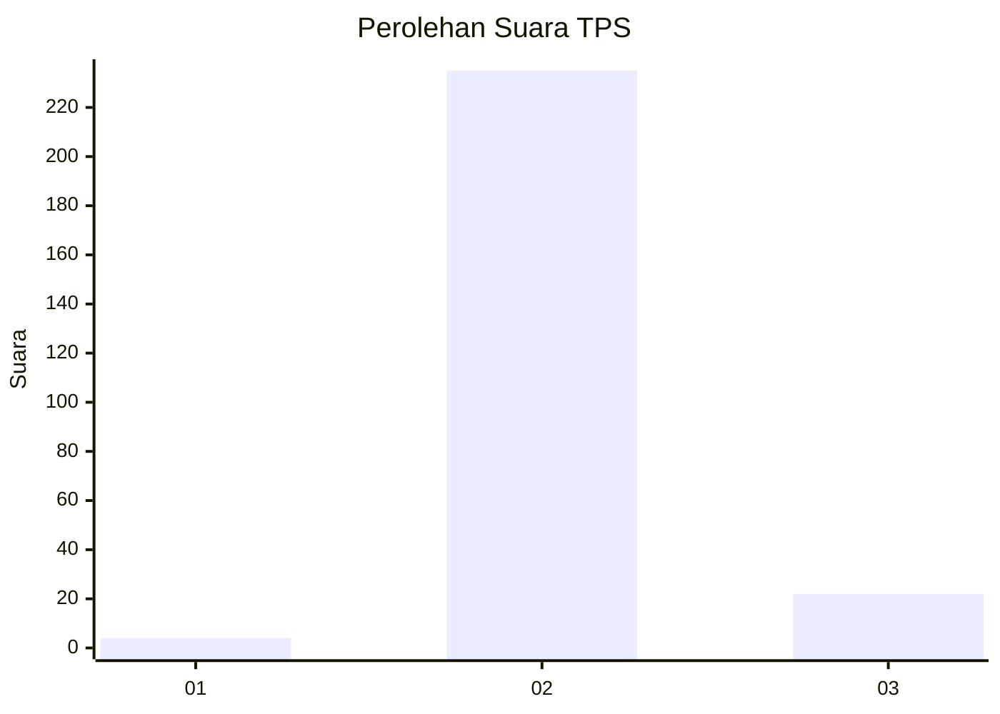
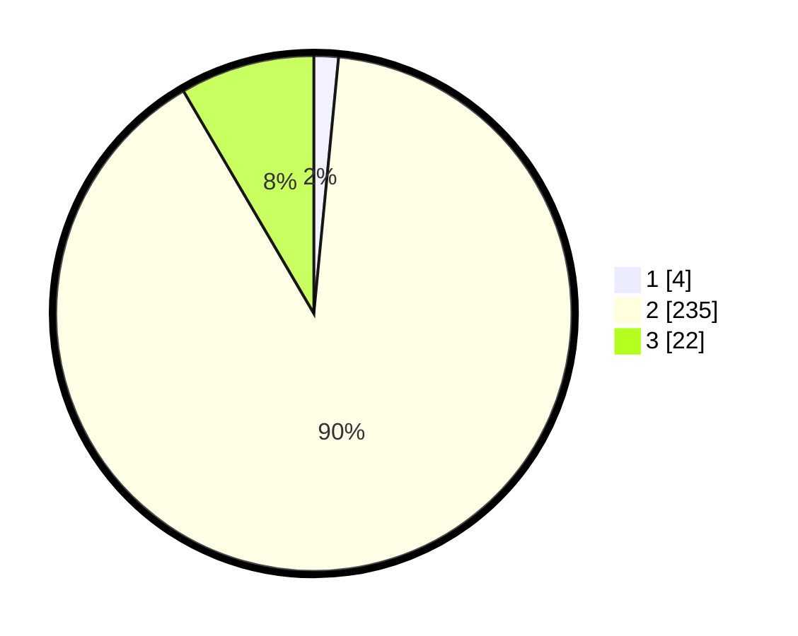

# Hasil

## Grafik

## Tabel

| No. | Nama Paslon    | Suara | Suara (raw) | Persentase |
|:--- |:-------------- | -----:| -----------:| ----------:|
| 1   | ANIES MUHAIMIN | 4     | [4][p-1]    | 1,53       |
| 2   | PRABOWO GIBRAN | 235   | [235][p-2]  | 90,04      |
| 3   | GANJAR MAHFUD  | 22    | [22][p-3]   | 8,43       |

[p-1]: https://github.com/gigit-pemilu/pemilu-2024/blob/main/pilpres/hitung-suara/sub/32-jawa-barat/sub/09-cirebon/sub/25-panguragan/sub/2005-pangurangan/sub/015-tps/sub/paslon-1.txt
[p-2]: https://github.com/gigit-pemilu/pemilu-2024/blob/main/pilpres/hitung-suara/sub/32-jawa-barat/sub/09-cirebon/sub/25-panguragan/sub/2005-pangurangan/sub/015-tps/sub/paslon-2.txt
[p-3]: https://github.com/gigit-pemilu/pemilu-2024/blob/main/pilpres/hitung-suara/sub/32-jawa-barat/sub/09-cirebon/sub/25-panguragan/sub/2005-pangurangan/sub/015-tps/sub/paslon-3.txt

## Foto C Plano

https://sirekap-obj-formc.kpu.go.id/7df4/pemilu/ppwp/32/09/25/20/05/3209252005015-20240219-113617--69d07f45-6629-46e1-91bc-9996cadf54ef.jpg

https://sirekap-obj-formc.kpu.go.id/7df4/pemilu/ppwp/32/09/25/20/05/3209252005015-20240219-113723--6df673d4-70bf-4249-90c5-a42d14fae46d.jpg

https://sirekap-obj-formc.kpu.go.id/7df4/pemilu/ppwp/32/09/25/20/05/3209252005015-20240219-113403--3c813397-a5ce-454e-bca4-bbbdbdbe5cd3.jpg

## Metadata

| Key        | Value               |
| ---------- | ------------------- |
| Time Stamp | 2024-02-19 12:00:00 |

## DATA PEMILIH TETAP

Jumlah pemilih dalam DPT: **0**.
 * L: **302**.
 * P: **0**.

## DATA PENGGUNA HAK PILIH

Jumlah pengguna hak pilih dalam DPT: **0**.
 * L: **2**.
 * P: **0**.

Jumlah pengguna hak pilih dalam DPTb: **430**.
 * L: **65**.
 * P: **444**.

Jumlah pengguna hak pilih dalam DPK: **808**.
 * L: **434**.
 * P: **448**.

Jumlah pengguna hak pilih: **444**.
 * L: **200**.
 * P: **482**.

## JUMLAH SUARA SAH DAN TIDAK SAH

JUMLAH SELURUH SUARA SAH: **171**.

JUMLAH SUARA TIDAK SAH: **1**.

JUMLAH SELURUH SUARA SAH DAN SUARA TIDAK SAH: **172**.

