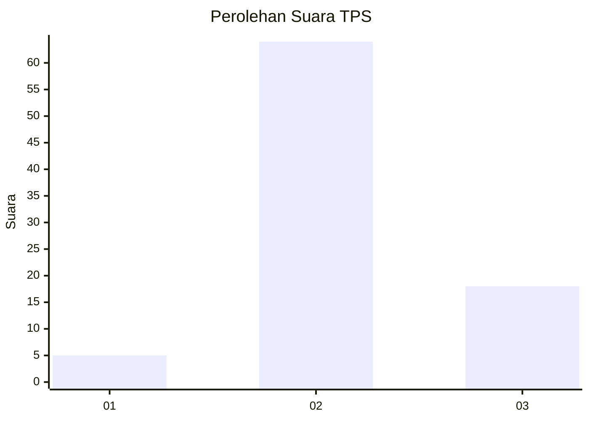

# Hasil

## Grafik

## Tabel

| No. | Nama Paslon    | Suara | Suara (raw) | Persentase |
|:--- |:-------------- | -----:| -----------:| ----------:|
| 1   | ANIES MUHAIMIN | 5     | [5][p-1]    | 5,75       |
| 2   | PRABOWO GIBRAN | 64    | [64][p-2]   | 73,56      |
| 3   | GANJAR MAHFUD  | 18    | [18][p-3]   | 20,69      |

[p-1]: https://github.com/gigit-pemilu/pemilu-2024/blob/main/pilpres/hitung-suara/sub/32-jawa-barat/sub/09-cirebon/sub/25-panguragan/sub/2006-gujeg/sub/005-tps/sub/paslon-1.txt
[p-2]: https://github.com/gigit-pemilu/pemilu-2024/blob/main/pilpres/hitung-suara/sub/32-jawa-barat/sub/09-cirebon/sub/25-panguragan/sub/2006-gujeg/sub/005-tps/sub/paslon-2.txt
[p-3]: https://github.com/gigit-pemilu/pemilu-2024/blob/main/pilpres/hitung-suara/sub/32-jawa-barat/sub/09-cirebon/sub/25-panguragan/sub/2006-gujeg/sub/005-tps/sub/paslon-3.txt

## Foto C Plano

https://sirekap-obj-formc.kpu.go.id/94ab/pemilu/ppwp/32/09/25/20/06/3209252006005-20240214-140938--3f05a2fc-482c-4694-9bd6-a74df9724342.jpg

https://sirekap-obj-formc.kpu.go.id/94ab/pemilu/ppwp/32/09/25/20/06/3209252006005-20240214-141436--a86a1721-f9e9-44fb-9cda-a2e77cba2587.jpg

https://sirekap-obj-formc.kpu.go.id/94ab/pemilu/ppwp/32/09/25/20/06/3209252006005-20240214-141701--0d607db1-aaf1-4b89-9446-c0b37a48c09c.jpg

## Metadata

| Key        | Value               |
| ---------- | ------------------- |
| Time Stamp | 2024-02-24 22:31:28 |

