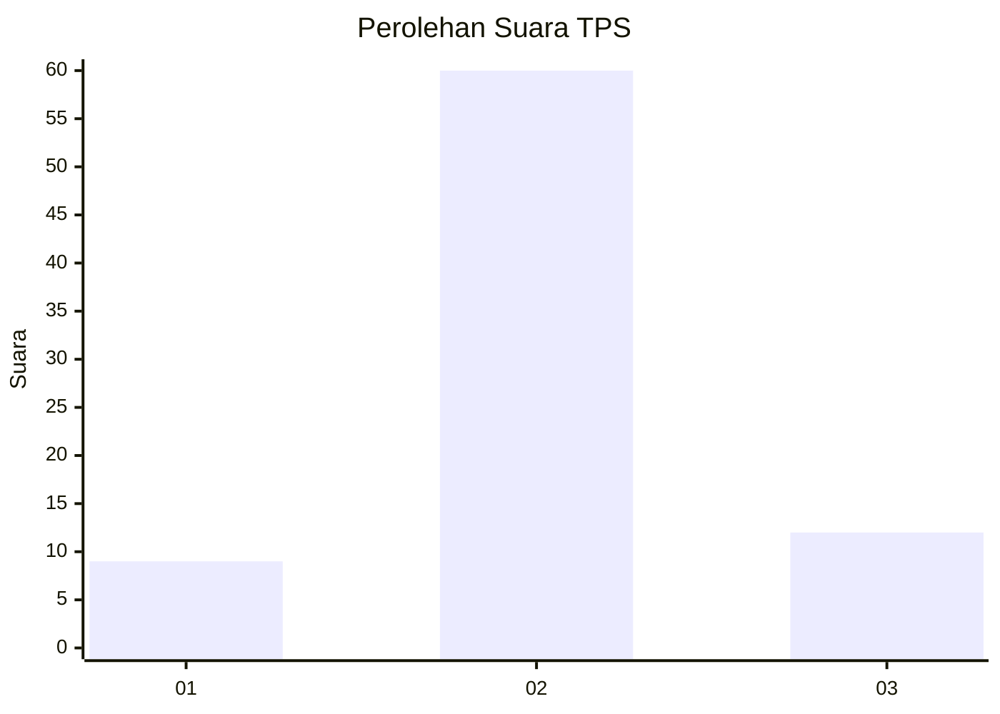
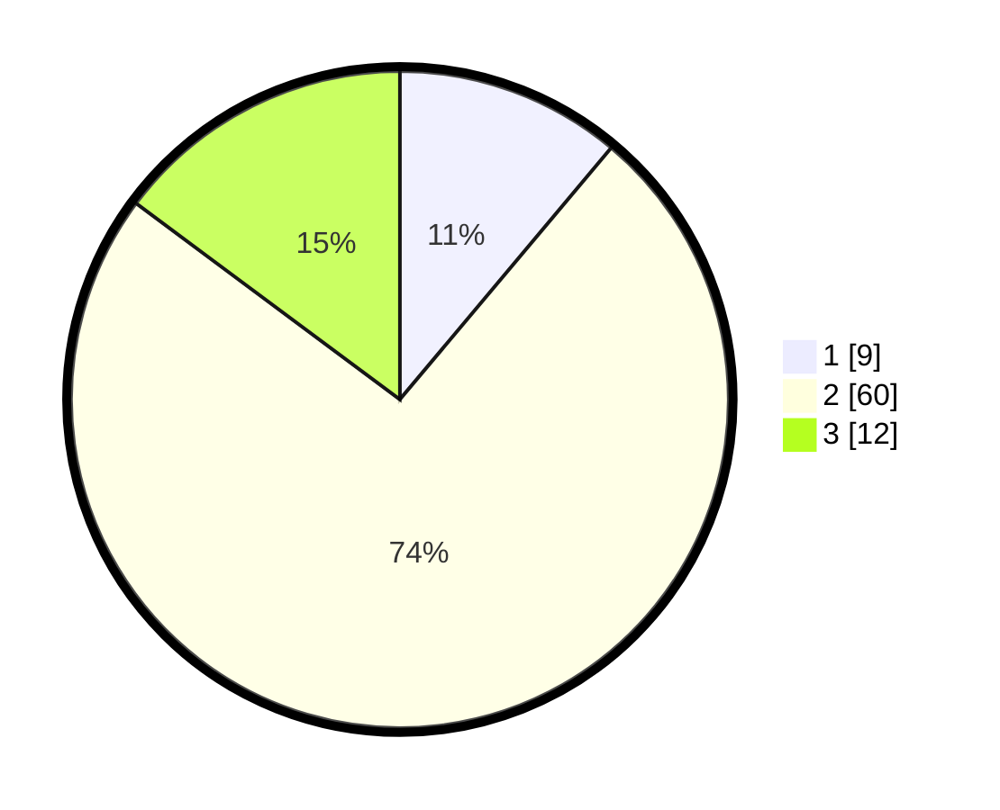

# Hasil

## Grafik

## Tabel

| No. | Nama Paslon    | Suara | Suara (raw) | Persentase |
|:--- |:-------------- | -----:| -----------:| ----------:|
| 1   | ANIES MUHAIMIN | 9     | [9][p-1]    | 11,11      |
| 2   | PRABOWO GIBRAN | 60    | [60][p-2]   | 74,07      |
| 3   | GANJAR MAHFUD  | 12    | [12][p-3]   | 14,81      |

[p-1]: https://github.com/gigit-pemilu/pemilu-2024-32-jawa-barat/blob/main/pilpres/hitung-suara/sub/32-jawa-barat/sub/09-cirebon/sub/25-panguragan/sub/2006-gujeg/sub/008-tps/sub/paslon-1.txt
[p-2]: https://github.com/gigit-pemilu/pemilu-2024-32-jawa-barat/blob/main/pilpres/hitung-suara/sub/32-jawa-barat/sub/09-cirebon/sub/25-panguragan/sub/2006-gujeg/sub/008-tps/sub/paslon-2.txt
[p-3]: https://github.com/gigit-pemilu/pemilu-2024-32-jawa-barat/blob/main/pilpres/hitung-suara/sub/32-jawa-barat/sub/09-cirebon/sub/25-panguragan/sub/2006-gujeg/sub/008-tps/sub/paslon-3.txt

## Foto C Plano

https://sirekap-obj-formc.kpu.go.id/5a11/pemilu/ppwp/32/09/25/20/06/3209252006008-20240214-141030--e430f9e6-5c12-457e-8047-38ade30408cb.jpg

https://sirekap-obj-formc.kpu.go.id/5a11/pemilu/ppwp/32/09/25/20/06/3209252006008-20240218-091219--da02a8c4-705e-4cba-9273-1f117a1befbb.jpg

https://sirekap-obj-formc.kpu.go.id/5a11/pemilu/ppwp/32/09/25/20/06/3209252006008-20240214-141440--f4c0d99f-9d05-4dc7-94be-1cc38e98285e.jpg

## Metadata

| Key        | Value               |
| ---------- | ------------------- |
| Time Stamp | 2024-02-25 00:00:00 |

