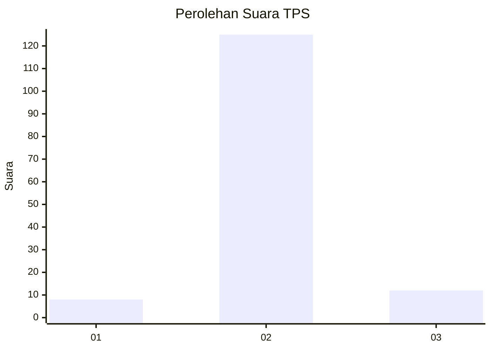
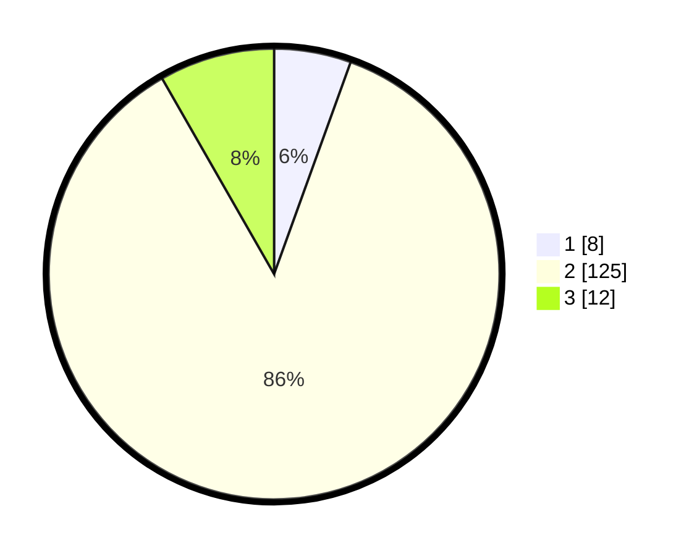

# Hasil

## Grafik

## Tabel

| No. | Nama Paslon    | Suara | Suara (raw) | Persentase |
|:--- |:-------------- | -----:| -----------:| ----------:|
| 1   | ANIES MUHAIMIN | 8     | [8][p-1]    | 5,52       |
| 2   | PRABOWO GIBRAN | 125   | [125][p-2]  | 86,21      |
| 3   | GANJAR MAHFUD  | 12    | [12][p-3]   | 8,28       |

[p-1]: https://github.com/gigit-pemilu/pemilu-2024/blob/main/pilpres/hitung-suara/sub/32-jawa-barat/sub/09-cirebon/sub/27-susukan/sub/2001-tangkil/sub/005-tps/sub/paslon-1.txt
[p-2]: https://github.com/gigit-pemilu/pemilu-2024/blob/main/pilpres/hitung-suara/sub/32-jawa-barat/sub/09-cirebon/sub/27-susukan/sub/2001-tangkil/sub/005-tps/sub/paslon-2.txt
[p-3]: https://github.com/gigit-pemilu/pemilu-2024/blob/main/pilpres/hitung-suara/sub/32-jawa-barat/sub/09-cirebon/sub/27-susukan/sub/2001-tangkil/sub/005-tps/sub/paslon-3.txt

## Foto C Plano

https://sirekap-obj-formc.kpu.go.id/e1c6/pemilu/ppwp/32/09/27/20/01/3209272001005-20240217-081229--d9cbfd70-321a-44fc-9741-64d73ebbbbc3.jpg

https://sirekap-obj-formc.kpu.go.id/e1c6/pemilu/ppwp/32/09/27/20/01/3209272001005-20240216-113820--0c46d81e-044d-46d4-9d59-2668c5ee7121.jpg

https://sirekap-obj-formc.kpu.go.id/e1c6/pemilu/ppwp/32/09/27/20/01/3209272001005-20240217-081420--7aa4e9f5-cf9b-44e8-be87-8412a1217548.jpg

## Metadata

| Key        | Value               |
| ---------- | ------------------- |
| Time Stamp | 2024-02-20 10:00:00 |

