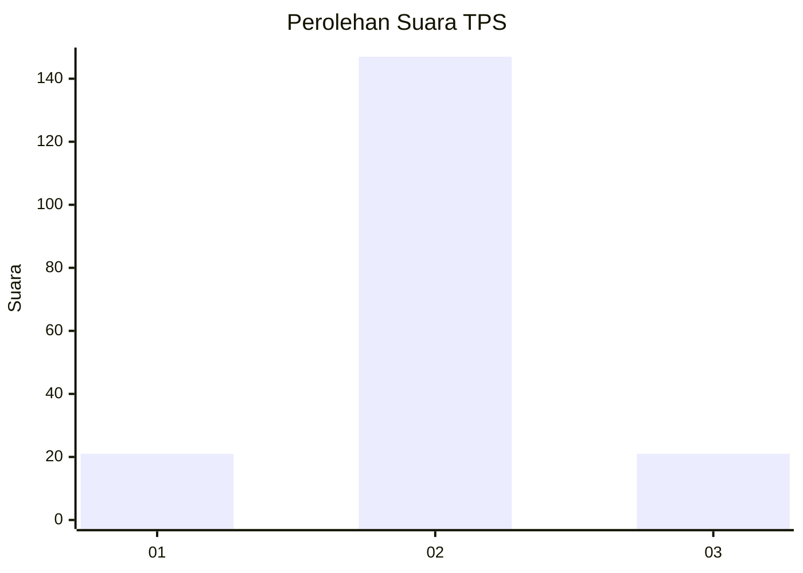
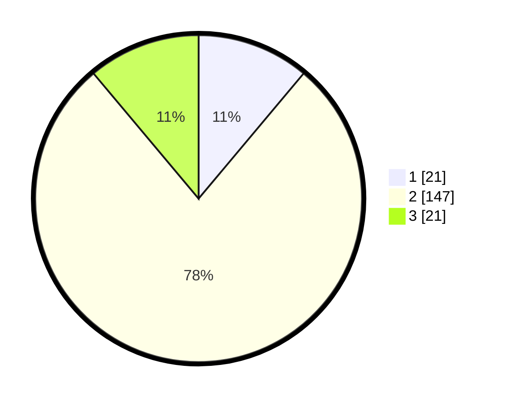

# Hasil

## Grafik

## Tabel

| No. | Nama Paslon    | Suara | Suara (raw) | Persentase |
|:--- |:-------------- | -----:| -----------:| ----------:|
| 1   | ANIES MUHAIMIN | 21    | [21][p-1]   | 11,11      |
| 2   | PRABOWO GIBRAN | 147   | [147][p-2]  | 77,78      |
| 3   | GANJAR MAHFUD  | 21    | [21][p-3]   | 11,11      |

[p-1]: https://github.com/gigit-pemilu/pemilu-2024/blob/main/pilpres/hitung-suara/sub/32-jawa-barat/sub/09-cirebon/sub/28-gegesik/sub/2001-kedungdalem/sub/007-tps/sub/paslon-1.txt
[p-2]: https://github.com/gigit-pemilu/pemilu-2024/blob/main/pilpres/hitung-suara/sub/32-jawa-barat/sub/09-cirebon/sub/28-gegesik/sub/2001-kedungdalem/sub/007-tps/sub/paslon-2.txt
[p-3]: https://github.com/gigit-pemilu/pemilu-2024/blob/main/pilpres/hitung-suara/sub/32-jawa-barat/sub/09-cirebon/sub/28-gegesik/sub/2001-kedungdalem/sub/007-tps/sub/paslon-3.txt

## Foto C Plano

https://sirekap-obj-formc.kpu.go.id/e4ad/pemilu/ppwp/32/09/28/20/01/3209282001007-20240215-021520--42fe0846-2651-4f75-be91-7fe797f940b4.jpg

https://sirekap-obj-formc.kpu.go.id/e4ad/pemilu/ppwp/32/09/28/20/01/3209282001007-20240214-233154--26d3ab7d-f6d2-4ee2-b03d-43e108ad00bf.jpg

https://sirekap-obj-formc.kpu.go.id/e4ad/pemilu/ppwp/32/09/28/20/01/3209282001007-20240214-233238--6f047c1f-cc39-4507-9560-12bdcef67af5.jpg

## Metadata

| Key        | Value               |
| ---------- | ------------------- |
| Time Stamp | 2024-02-19 06:16:00 |

