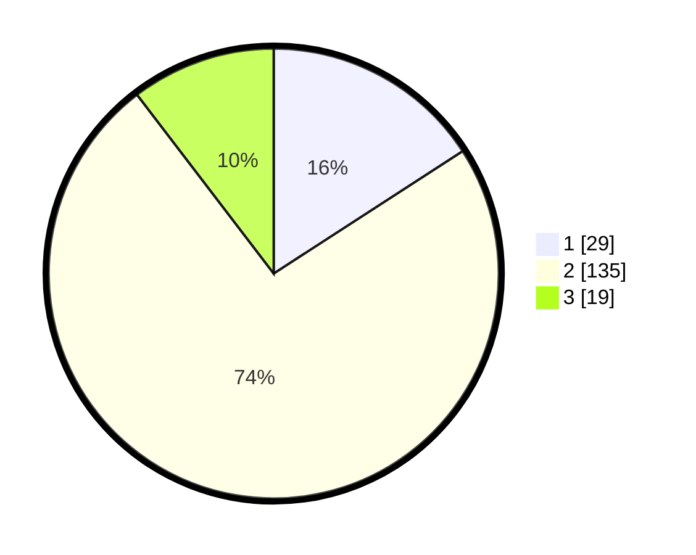

# Hasil

## Grafik

## Tabel

| No. | Nama Paslon    | Suara | Suara (raw) | Persentase |
|:--- |:-------------- | -----:| -----------:| ----------:|
| 1   | ANIES MUHAIMIN | 29    | [29][p-1]   | 15,85      |
| 2   | PRABOWO GIBRAN | 135   | [135][p-2]  | 73,77      |
| 3   | GANJAR MAHFUD  | 19    | [19][p-3]   | 10,38      |

[p-1]: https://github.com/gigit-pemilu/pemilu-2024-32-jawa-barat/blob/main/pilpres/hitung-suara/sub/32-jawa-barat/sub/09-cirebon/sub/29-kaliwedi/sub/2001-kalideres/sub/003-tps/sub/paslon-1.txt
[p-2]: https://github.com/gigit-pemilu/pemilu-2024-32-jawa-barat/blob/main/pilpres/hitung-suara/sub/32-jawa-barat/sub/09-cirebon/sub/29-kaliwedi/sub/2001-kalideres/sub/003-tps/sub/paslon-2.txt
[p-3]: https://github.com/gigit-pemilu/pemilu-2024-32-jawa-barat/blob/main/pilpres/hitung-suara/sub/32-jawa-barat/sub/09-cirebon/sub/29-kaliwedi/sub/2001-kalideres/sub/003-tps/sub/paslon-3.txt

## Foto C Plano

https://sirekap-obj-formc.kpu.go.id/96aa/pemilu/ppwp/32/09/29/20/01/3209292001003-20240218-153252--d05a9259-cb18-4945-a44b-96d534acd8c8.jpg

https://sirekap-obj-formc.kpu.go.id/96aa/pemilu/ppwp/32/09/29/20/01/3209292001003-20240218-153450--100ad3d5-c700-45c7-b544-d9e8b7e2a6a3.jpg

https://sirekap-obj-formc.kpu.go.id/96aa/pemilu/ppwp/32/09/29/20/01/3209292001003-20240218-153548--04e9a168-155c-49d6-9bb3-219ca1ca0877.jpg

## Metadata

| Key        | Value               |
| ---------- | ------------------- |
| Time Stamp | 2024-02-19 12:00:00 |

## DATA PEMILIH TETAP

Jumlah pemilih dalam DPT: **237**.
 * L: **557**.
 * P: **520**.

## DATA PENGGUNA HAK PILIH

Jumlah pengguna hak pilih dalam DPT: **586**.
 * L: **809**.
 * P: **497**.

Jumlah pengguna hak pilih dalam DPTb: **85**.
 * L: **0**.
 * P: **8**.

Jumlah pengguna hak pilih dalam DPK: **5**.
 * L: **85**.
 * P: **88**.

Jumlah pengguna hak pilih: **587**.
 * L: **850**.
 * P: **837**.

## JUMLAH SUARA SAH DAN TIDAK SAH

JUMLAH SELURUH SUARA SAH: **183**.

JUMLAH SUARA TIDAK SAH: **4**.

JUMLAH SELURUH SUARA SAH DAN SUARA TIDAK SAH: **187**.

