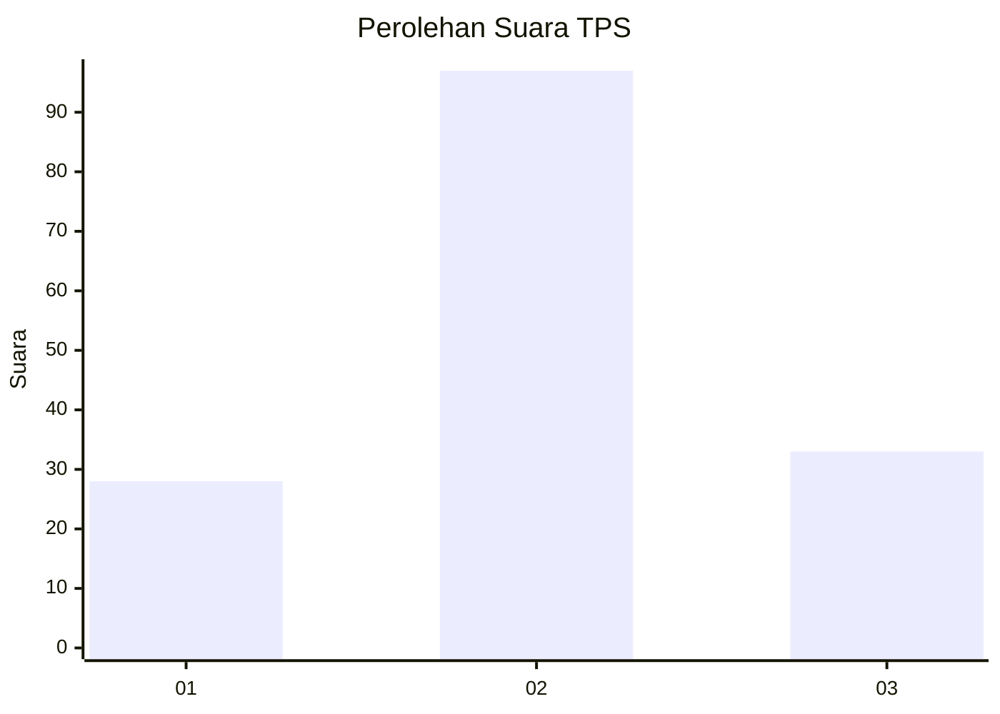
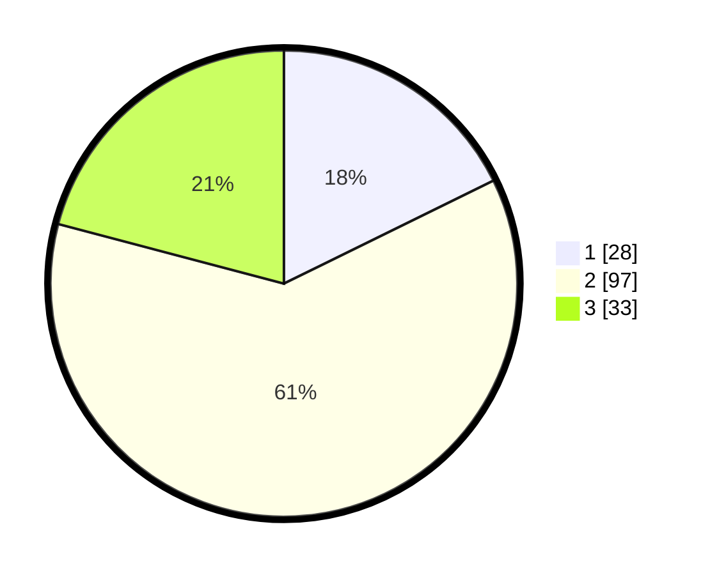

# Hasil

## Grafik

## Tabel

| No. | Nama Paslon    | Suara | Suara (raw) | Persentase |
|:--- |:-------------- | -----:| -----------:| ----------:|
| 1   | ANIES MUHAIMIN | 28    | [28][p-1]   | 17,72      |
| 2   | PRABOWO GIBRAN | 97    | [97][p-2]   | 61,39      |
| 3   | GANJAR MAHFUD  | 33    | [33][p-3]   | 20,89      |

[p-1]: https://github.com/gigit-pemilu/pemilu-2024-32-jawa-barat/blob/main/pilpres/hitung-suara/sub/32-jawa-barat/sub/09-cirebon/sub/29-kaliwedi/sub/2001-kalideres/sub/009-tps/sub/paslon-1.txt
[p-2]: https://github.com/gigit-pemilu/pemilu-2024-32-jawa-barat/blob/main/pilpres/hitung-suara/sub/32-jawa-barat/sub/09-cirebon/sub/29-kaliwedi/sub/2001-kalideres/sub/009-tps/sub/paslon-2.txt
[p-3]: https://github.com/gigit-pemilu/pemilu-2024-32-jawa-barat/blob/main/pilpres/hitung-suara/sub/32-jawa-barat/sub/09-cirebon/sub/29-kaliwedi/sub/2001-kalideres/sub/009-tps/sub/paslon-3.txt

## Foto C Plano

https://sirekap-obj-formc.kpu.go.id/3429/pemilu/ppwp/32/09/29/20/01/3209292001009-20240218-155731--114e103c-6a43-485e-a490-411605799aab.jpg

https://sirekap-obj-formc.kpu.go.id/3429/pemilu/ppwp/32/09/29/20/01/3209292001009-20240218-155756--83c08fd2-1c1d-4d81-8078-5b9262580e87.jpg

https://sirekap-obj-formc.kpu.go.id/3429/pemilu/ppwp/32/09/29/20/01/3209292001009-20240218-155844--5d0c7427-3269-46d3-b21e-985fc673d93b.jpg

## Metadata

| Key        | Value               |
| ---------- | ------------------- |
| Time Stamp | 2024-02-19 06:16:00 |

## DATA PEMILIH TETAP

Jumlah pemilih dalam DPT: **222**.
 * L: **121**.
 * P: **111**.

## DATA PENGGUNA HAK PILIH

Jumlah pengguna hak pilih dalam DPT: **968**.
 * L: **785**.
 * P: **577**.

Jumlah pengguna hak pilih dalam DPTb: **86**.
 * L: **802**.
 * P: **82**.

Jumlah pengguna hak pilih dalam DPK: **505**.
 * L: **801**.
 * P: **802**.

Jumlah pengguna hak pilih: **162**.
 * L: **855**.
 * P: **73**.

## JUMLAH SUARA SAH DAN TIDAK SAH

JUMLAH SELURUH SUARA SAH: **158**.

JUMLAH SUARA TIDAK SAH: **544**.

JUMLAH SELURUH SUARA SAH DAN SUARA TIDAK SAH: **152**.

