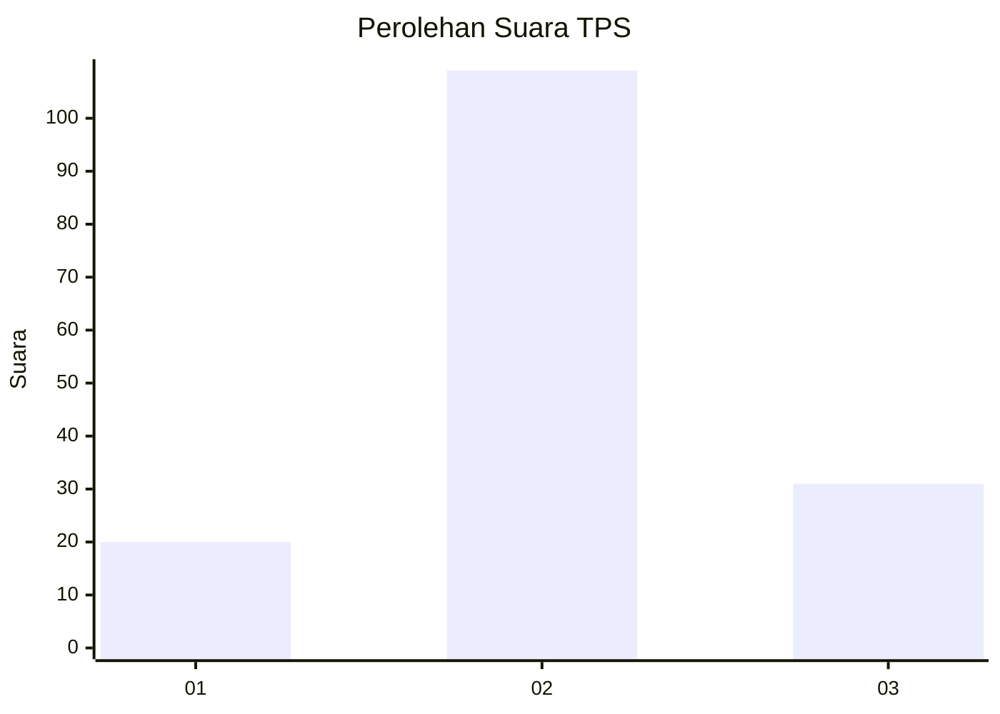
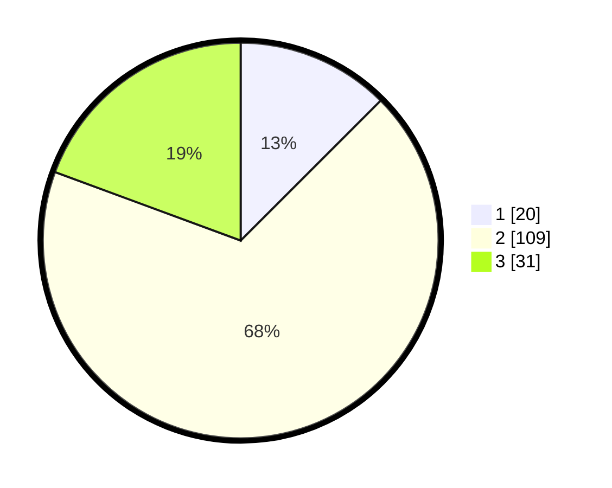

# Hasil

## Grafik

## Tabel

| No. | Nama Paslon    | Suara | Suara (raw) | Persentase |
|:--- |:-------------- | -----:| -----------:| ----------:|
| 1   | ANIES MUHAIMIN | 20    | [20][p-1]   | 12,50      |
| 2   | PRABOWO GIBRAN | 109   | [109][p-2]  | 68,13      |
| 3   | GANJAR MAHFUD  | 31    | [31][p-3]   | 19,38      |

[p-1]: https://github.com/gigit-pemilu/pemilu-2024-32-jawa-barat/blob/main/pilpres/hitung-suara/sub/32-jawa-barat/sub/09-cirebon/sub/29-kaliwedi/sub/2001-kalideres/sub/011-tps/sub/paslon-1.txt
[p-2]: https://github.com/gigit-pemilu/pemilu-2024-32-jawa-barat/blob/main/pilpres/hitung-suara/sub/32-jawa-barat/sub/09-cirebon/sub/29-kaliwedi/sub/2001-kalideres/sub/011-tps/sub/paslon-2.txt
[p-3]: https://github.com/gigit-pemilu/pemilu-2024-32-jawa-barat/blob/main/pilpres/hitung-suara/sub/32-jawa-barat/sub/09-cirebon/sub/29-kaliwedi/sub/2001-kalideres/sub/011-tps/sub/paslon-3.txt

## Foto C Plano

https://sirekap-obj-formc.kpu.go.id/050f/pemilu/ppwp/32/09/29/20/01/3209292001011-20240218-160007--09c7cd90-e528-4f4e-90e0-cc14298373dc.jpg

https://sirekap-obj-formc.kpu.go.id/050f/pemilu/ppwp/32/09/29/20/01/3209292001011-20240218-160036--47f2980a-7ade-4fe0-98c5-dc66a924fd40.jpg

https://sirekap-obj-formc.kpu.go.id/050f/pemilu/ppwp/32/09/29/20/01/3209292001011-20240218-160143--fdaa3181-36aa-48a2-b915-179d31aec777.jpg

## Metadata

| Key        | Value               |
| ---------- | ------------------- |
| Time Stamp | 2024-02-19 06:16:00 |

## DATA PEMILIH TETAP

Jumlah pemilih dalam DPT: **233**.
 * L: **130**.
 * P: **153**.

## DATA PENGGUNA HAK PILIH

Jumlah pengguna hak pilih dalam DPT: **467**.
 * L: **488**.
 * P: **373**.

Jumlah pengguna hak pilih dalam DPTb: **888**.
 * L: **848**.
 * P: **885**.

Jumlah pengguna hak pilih dalam DPK: **453**.
 * L: **844**.
 * P: **444**.

Jumlah pengguna hak pilih: **167**.
 * L: **421**.
 * P: **373**.

## JUMLAH SUARA SAH DAN TIDAK SAH

JUMLAH SELURUH SUARA SAH: **160**.

JUMLAH SUARA TIDAK SAH: **847**.

JUMLAH SELURUH SUARA SAH DAN SUARA TIDAK SAH: **123**.

