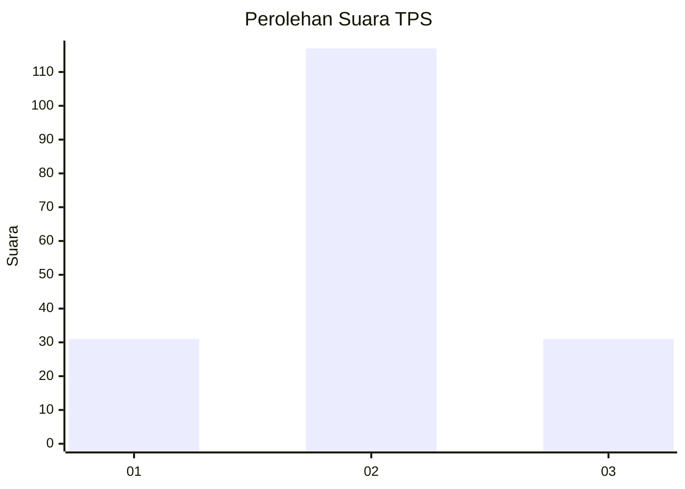
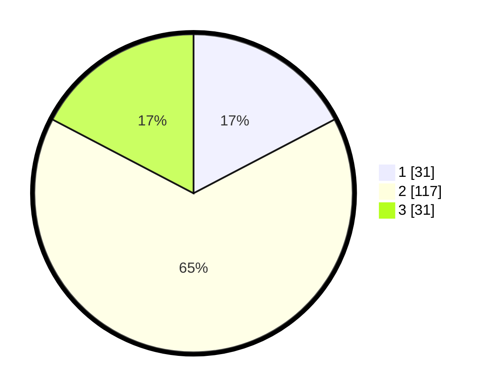

# Hasil

## Grafik

## Tabel

| No. | Nama Paslon    | Suara | Suara (raw) | Persentase |
|:--- |:-------------- | -----:| -----------:| ----------:|
| 1   | ANIES MUHAIMIN | 31    | [31][p-1]   | 17,32      |
| 2   | PRABOWO GIBRAN | 117   | [117][p-2]  | 65,36      |
| 3   | GANJAR MAHFUD  | 31    | [31][p-3]   | 17,32      |

[p-1]: https://github.com/gigit-pemilu/pemilu-2024/blob/main/pilpres/hitung-suara/sub/32-jawa-barat/sub/09-cirebon/sub/29-kaliwedi/sub/2006-kaliwedi-lor/sub/002-tps/sub/paslon-1.txt
[p-2]: https://github.com/gigit-pemilu/pemilu-2024/blob/main/pilpres/hitung-suara/sub/32-jawa-barat/sub/09-cirebon/sub/29-kaliwedi/sub/2006-kaliwedi-lor/sub/002-tps/sub/paslon-2.txt
[p-3]: https://github.com/gigit-pemilu/pemilu-2024/blob/main/pilpres/hitung-suara/sub/32-jawa-barat/sub/09-cirebon/sub/29-kaliwedi/sub/2006-kaliwedi-lor/sub/002-tps/sub/paslon-3.txt

## Foto C Plano

https://sirekap-obj-formc.kpu.go.id/f4f5/pemilu/ppwp/32/09/29/20/06/3209292006002-20240218-140625--67787328-7eb5-4907-9930-130f6a4e231c.jpg

https://sirekap-obj-formc.kpu.go.id/f4f5/pemilu/ppwp/32/09/29/20/06/3209292006002-20240218-140713--7e3c8be1-fbce-4b82-8fd3-947fd83d3fb3.jpg

https://sirekap-obj-formc.kpu.go.id/f4f5/pemilu/ppwp/32/09/29/20/06/3209292006002-20240218-140800--9af31804-2ab3-4763-89aa-e714ca8c4b97.jpg

## Metadata

| Key        | Value               |
| ---------- | ------------------- |
| Time Stamp | 2024-02-24 22:31:28 |

