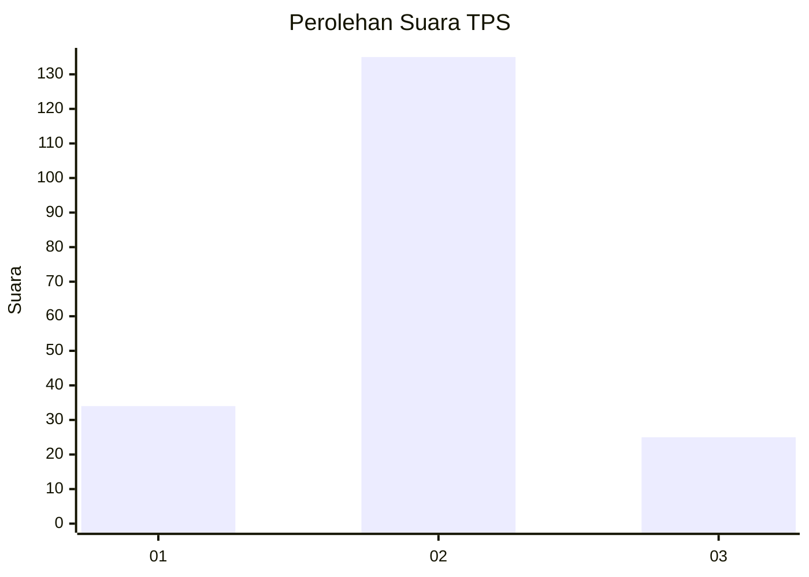
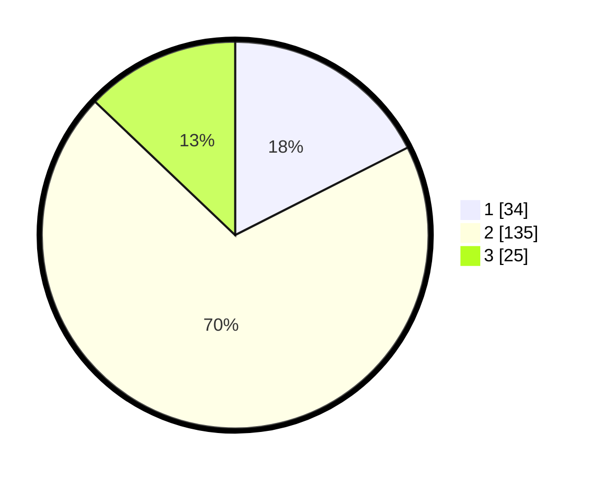

# Hasil

## Grafik

## Tabel

| No. | Nama Paslon    | Suara | Suara (raw) | Persentase |
|:--- |:-------------- | -----:| -----------:| ----------:|
| 1   | ANIES MUHAIMIN | 34    | [34][p-1]   | 17,53      |
| 2   | PRABOWO GIBRAN | 135   | [135][p-2]  | 69,59      |
| 3   | GANJAR MAHFUD  | 25    | [25][p-3]   | 12,89      |

[p-1]: https://github.com/gigit-pemilu/pemilu-2024/blob/main/pilpres/hitung-suara/sub/32-jawa-barat/sub/09-cirebon/sub/29-kaliwedi/sub/2006-kaliwedi-lor/sub/005-tps/sub/paslon-1.txt
[p-2]: https://github.com/gigit-pemilu/pemilu-2024/blob/main/pilpres/hitung-suara/sub/32-jawa-barat/sub/09-cirebon/sub/29-kaliwedi/sub/2006-kaliwedi-lor/sub/005-tps/sub/paslon-2.txt
[p-3]: https://github.com/gigit-pemilu/pemilu-2024/blob/main/pilpres/hitung-suara/sub/32-jawa-barat/sub/09-cirebon/sub/29-kaliwedi/sub/2006-kaliwedi-lor/sub/005-tps/sub/paslon-3.txt

## Foto C Plano

https://sirekap-obj-formc.kpu.go.id/d2d3/pemilu/ppwp/32/09/29/20/06/3209292006005-20240218-142939--973a7c35-1510-4440-b420-4d8915c9472d.jpg

https://sirekap-obj-formc.kpu.go.id/d2d3/pemilu/ppwp/32/09/29/20/06/3209292006005-20240218-143011--108b76d6-0624-4796-b3d9-d2e452880047.jpg

https://sirekap-obj-formc.kpu.go.id/d2d3/pemilu/ppwp/32/09/29/20/06/3209292006005-20240218-143037--8a2ef952-6e8d-4ab3-a8cc-245bbcecc50b.jpg

## Metadata

| Key        | Value               |
| ---------- | ------------------- |
| Time Stamp | 2024-02-25 09:00:00 |

