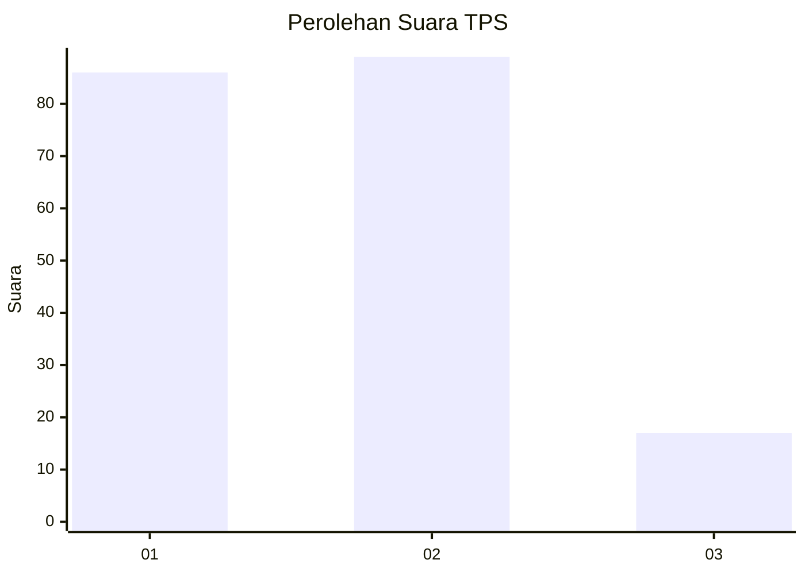
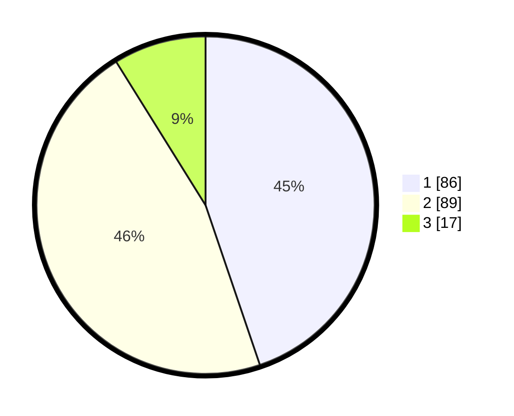

# Hasil

## Grafik

## Tabel

| No. | Nama Paslon    | Suara | Suara (raw) | Persentase |
|:--- |:-------------- | -----:| -----------:| ----------:|
| 1   | ANIES MUHAIMIN | 86    | [86][p-1]   | 44,79      |
| 2   | PRABOWO GIBRAN | 89    | [89][p-2]   | 46,35      |
| 3   | GANJAR MAHFUD  | 17    | [17][p-3]   | 8,85       |

[p-1]: https://github.com/gigit-pemilu/pemilu-2024-32-jawa-barat/blob/main/pilpres/hitung-suara/sub/32-jawa-barat/sub/09-cirebon/sub/30-gebang/sub/2001-dompyong-kulon/sub/004-tps/sub/paslon-1.txt
[p-2]: https://github.com/gigit-pemilu/pemilu-2024-32-jawa-barat/blob/main/pilpres/hitung-suara/sub/32-jawa-barat/sub/09-cirebon/sub/30-gebang/sub/2001-dompyong-kulon/sub/004-tps/sub/paslon-2.txt
[p-3]: https://github.com/gigit-pemilu/pemilu-2024-32-jawa-barat/blob/main/pilpres/hitung-suara/sub/32-jawa-barat/sub/09-cirebon/sub/30-gebang/sub/2001-dompyong-kulon/sub/004-tps/sub/paslon-3.txt

## Foto C Plano

https://sirekap-obj-formc.kpu.go.id/2a22/pemilu/ppwp/32/09/30/20/01/3209302001004-20240216-173017--eb56673d-32ab-41f4-8b6e-19eff1531af6.jpg

https://sirekap-obj-formc.kpu.go.id/2a22/pemilu/ppwp/32/09/30/20/01/3209302001004-20240216-173204--15435152-6367-4abb-bf92-135d2d17bfe5.jpg

https://sirekap-obj-formc.kpu.go.id/2a22/pemilu/ppwp/32/09/30/20/01/3209302001004-20240216-173359--f46d207f-202b-4062-bc02-96157a32e661.jpg

## Metadata

| Key        | Value               |
| ---------- | ------------------- |
| Time Stamp | 2024-02-17 16:00:02 |

