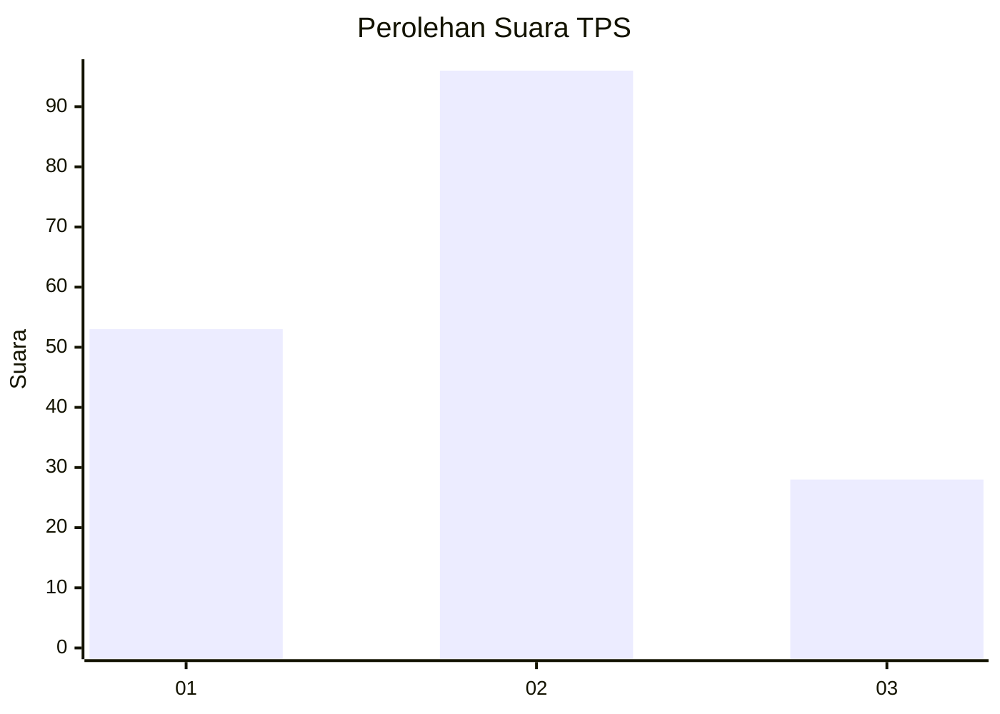
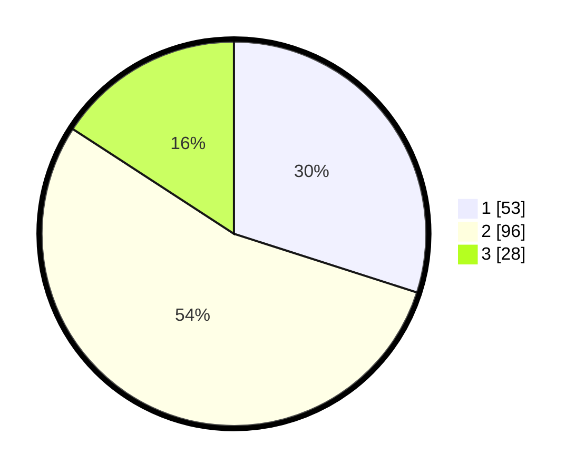

# Hasil

## Grafik

## Tabel

| No. | Nama Paslon    | Suara | Suara (raw) | Persentase |
|:--- |:-------------- | -----:| -----------:| ----------:|
| 1   | ANIES MUHAIMIN | 53    | [53][p-1]   | 29,94      |
| 2   | PRABOWO GIBRAN | 96    | [96][p-2]   | 54,24      |
| 3   | GANJAR MAHFUD  | 28    | [28][p-3]   | 15,82      |

[p-1]: https://github.com/gigit-pemilu/pemilu-2024/blob/main/pilpres/hitung-suara/sub/32-jawa-barat/sub/09-cirebon/sub/32-pasaleman/sub/2001-tonjong/sub/004-tps/sub/paslon-1.txt
[p-2]: https://github.com/gigit-pemilu/pemilu-2024/blob/main/pilpres/hitung-suara/sub/32-jawa-barat/sub/09-cirebon/sub/32-pasaleman/sub/2001-tonjong/sub/004-tps/sub/paslon-2.txt
[p-3]: https://github.com/gigit-pemilu/pemilu-2024/blob/main/pilpres/hitung-suara/sub/32-jawa-barat/sub/09-cirebon/sub/32-pasaleman/sub/2001-tonjong/sub/004-tps/sub/paslon-3.txt

## Foto C Plano

https://sirekap-obj-formc.kpu.go.id/25fe/pemilu/ppwp/32/09/32/20/01/3209322001004-20240219-045612--066dfa00-3f35-44fe-89cd-f76e62db3dcd.jpg

https://sirekap-obj-formc.kpu.go.id/25fe/pemilu/ppwp/32/09/32/20/01/3209322001004-20240219-045701--5ceded1b-f9ea-477a-b30b-12062244d674.jpg

https://sirekap-obj-formc.kpu.go.id/25fe/pemilu/ppwp/32/09/32/20/01/3209322001004-20240219-045740--da26fbe5-4d64-44f4-95b3-a993d62a7a53.jpg

## Metadata

| Key        | Value               |
| ---------- | ------------------- |
| Time Stamp | 2024-02-24 22:31:28 |

