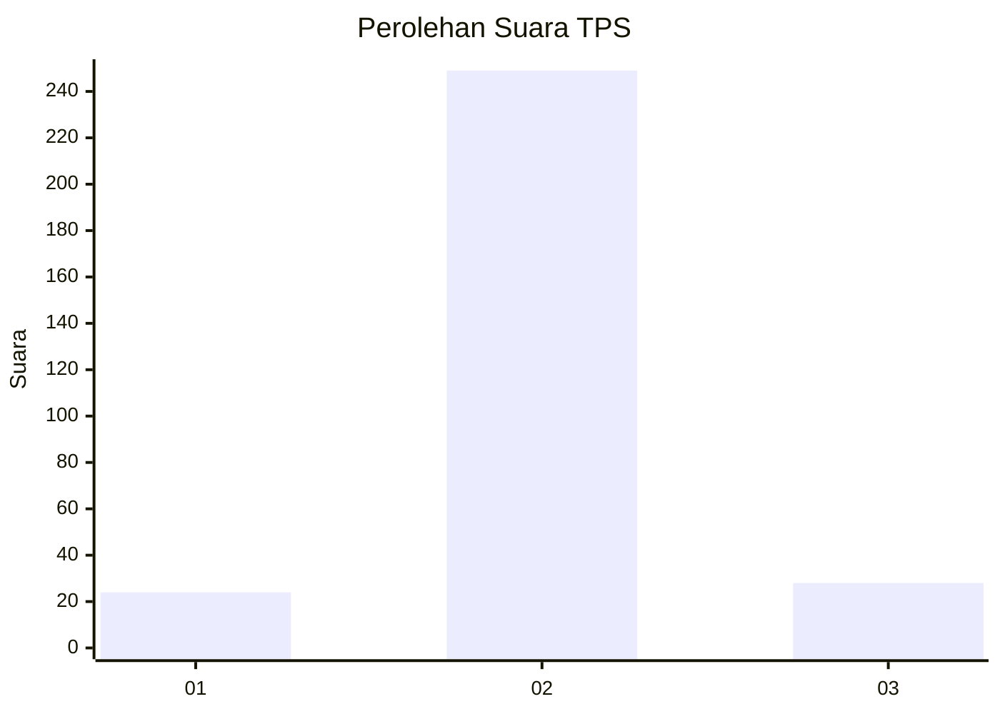
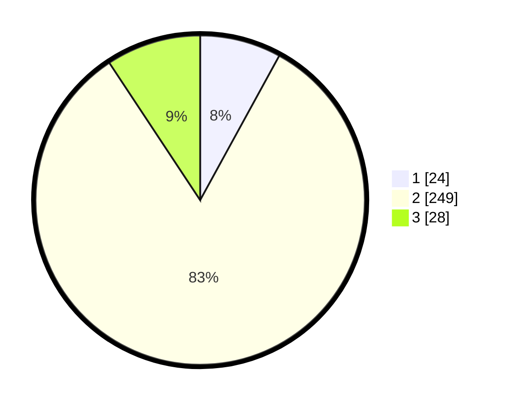

# Hasil

## Grafik

## Tabel

| No. | Nama Paslon    | Suara | Suara (raw) | Persentase |
|:--- |:-------------- | -----:| -----------:| ----------:|
| 1   | ANIES MUHAIMIN | 24    | [24][p-1]   | 7,97       |
| 2   | PRABOWO GIBRAN | 249   | [249][p-2]  | 82,72      |
| 3   | GANJAR MAHFUD  | 28    | [28][p-3]   | 9,30       |

[p-1]: https://github.com/gigit-pemilu/pemilu-2024-32-jawa-barat/blob/main/pilpres/hitung-suara/sub/32-jawa-barat/sub/09-cirebon/sub/33-pabuaran/sub/2006-hulubanteng/sub/005-tps/sub/paslon-1.txt
[p-2]: https://github.com/gigit-pemilu/pemilu-2024-32-jawa-barat/blob/main/pilpres/hitung-suara/sub/32-jawa-barat/sub/09-cirebon/sub/33-pabuaran/sub/2006-hulubanteng/sub/005-tps/sub/paslon-2.txt
[p-3]: https://github.com/gigit-pemilu/pemilu-2024-32-jawa-barat/blob/main/pilpres/hitung-suara/sub/32-jawa-barat/sub/09-cirebon/sub/33-pabuaran/sub/2006-hulubanteng/sub/005-tps/sub/paslon-3.txt

## Foto C Plano

https://sirekap-obj-formc.kpu.go.id/027b/pemilu/ppwp/32/09/33/20/06/3209332006005-20240218-085505--298d293f-bc96-40cd-9c2e-c901b41ce704.jpg

https://sirekap-obj-formc.kpu.go.id/027b/pemilu/ppwp/32/09/33/20/06/3209332006005-20240218-085026--89bd6a20-4e44-448d-8bbd-c305b140aba8.jpg

https://sirekap-obj-formc.kpu.go.id/027b/pemilu/ppwp/32/09/33/20/06/3209332006005-20240218-085139--8eb4cc44-97f3-437b-9080-8439bf21227b.jpg

## Metadata

| Key        | Value               |
| ---------- | ------------------- |
| Time Stamp | 2024-02-19 06:16:00 |

