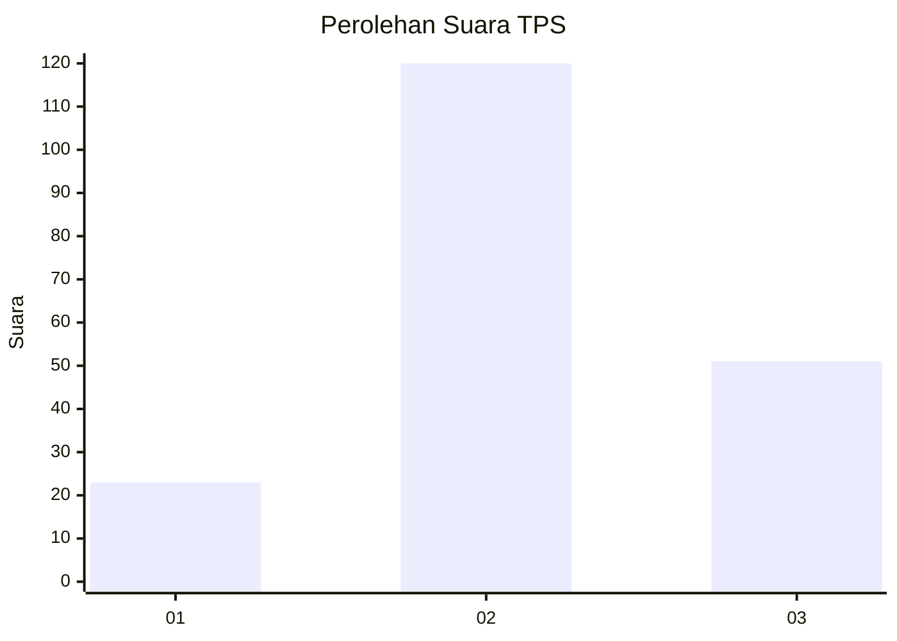
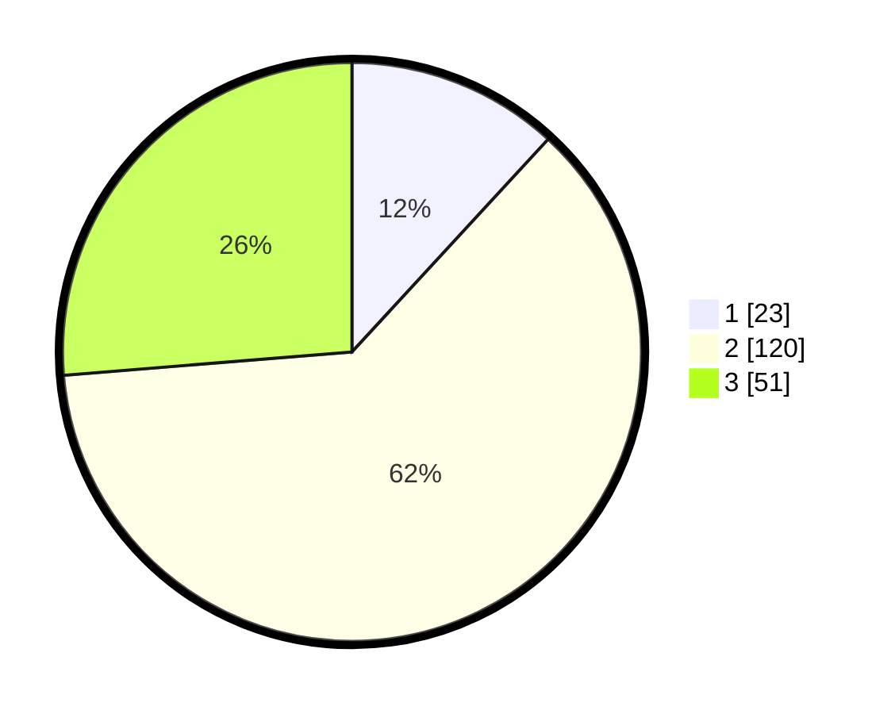

# Hasil

## Grafik

## Tabel

| No. | Nama Paslon    | Suara | Suara (raw) | Persentase |
|:--- |:-------------- | -----:| -----------:| ----------:|
| 1   | ANIES MUHAIMIN | 23    | [23][p-1]   | 11,86      |
| 2   | PRABOWO GIBRAN | 120   | [120][p-2]  | 61,86      |
| 3   | GANJAR MAHFUD  | 51    | [51][p-3]   | 26,29      |

[p-1]: https://github.com/gigit-pemilu/pemilu-2024/blob/main/pilpres/hitung-suara/sub/32-jawa-barat/sub/09-cirebon/sub/34-karangwareng/sub/2001-seuseupan/sub/001-tps/sub/paslon-1.txt
[p-2]: https://github.com/gigit-pemilu/pemilu-2024/blob/main/pilpres/hitung-suara/sub/32-jawa-barat/sub/09-cirebon/sub/34-karangwareng/sub/2001-seuseupan/sub/001-tps/sub/paslon-2.txt
[p-3]: https://github.com/gigit-pemilu/pemilu-2024/blob/main/pilpres/hitung-suara/sub/32-jawa-barat/sub/09-cirebon/sub/34-karangwareng/sub/2001-seuseupan/sub/001-tps/sub/paslon-3.txt

## Foto C Plano

https://sirekap-obj-formc.kpu.go.id/92b7/pemilu/ppwp/32/09/34/20/01/3209342001001-20240216-120342--52aba39a-88a0-419d-9e7f-d61394ce738a.jpg

https://sirekap-obj-formc.kpu.go.id/92b7/pemilu/ppwp/32/09/34/20/01/3209342001001-20240215-194839--fa5d32a3-8fdb-4065-bcc6-4ee6faa38df8.jpg

https://sirekap-obj-formc.kpu.go.id/92b7/pemilu/ppwp/32/09/34/20/01/3209342001001-20240216-121424--04416e9d-6877-4353-96a0-9a2290ed92df.jpg

## Metadata

| Key        | Value               |
| ---------- | ------------------- |
| Time Stamp | 2024-02-16 22:01:00 |

