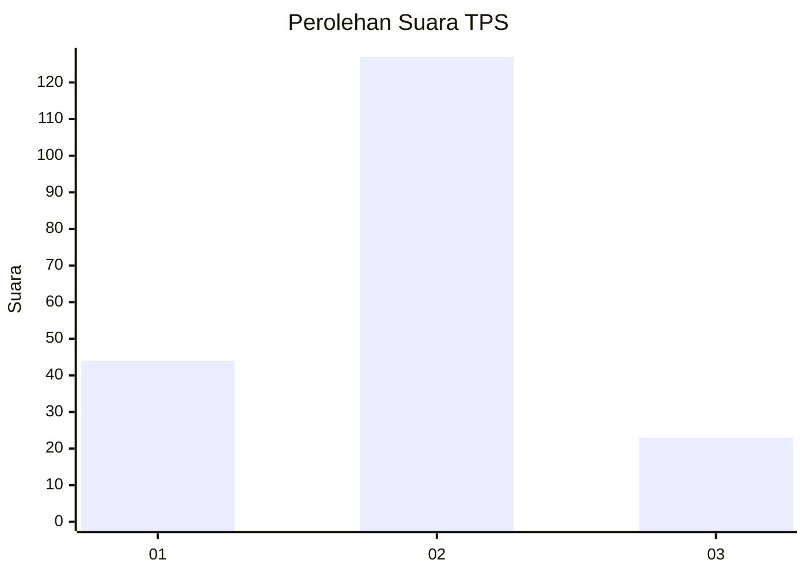
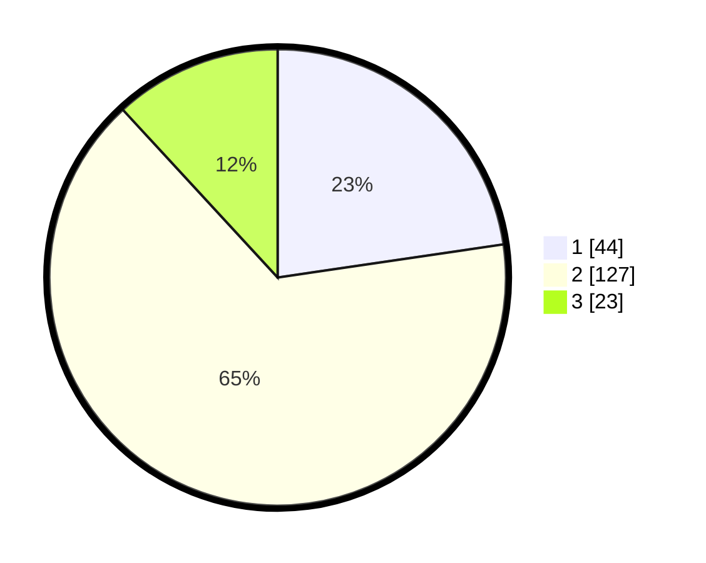

# Hasil

## Grafik

## Tabel

| No. | Nama Paslon    | Suara | Suara (raw) | Persentase |
|:--- |:-------------- | -----:| -----------:| ----------:|
| 1   | ANIES MUHAIMIN | 44    | [44][p-1]   | 22,68      |
| 2   | PRABOWO GIBRAN | 127   | [127][p-2]  | 65,46      |
| 3   | GANJAR MAHFUD  | 23    | [23][p-3]   | 11,86      |

[p-1]: https://github.com/gigit-pemilu/pemilu-2024-32-jawa-barat/blob/main/pilpres/hitung-suara/sub/32-jawa-barat/sub/09-cirebon/sub/34-karangwareng/sub/2001-seuseupan/sub/002-tps/sub/paslon-1.txt
[p-2]: https://github.com/gigit-pemilu/pemilu-2024-32-jawa-barat/blob/main/pilpres/hitung-suara/sub/32-jawa-barat/sub/09-cirebon/sub/34-karangwareng/sub/2001-seuseupan/sub/002-tps/sub/paslon-2.txt
[p-3]: https://github.com/gigit-pemilu/pemilu-2024-32-jawa-barat/blob/main/pilpres/hitung-suara/sub/32-jawa-barat/sub/09-cirebon/sub/34-karangwareng/sub/2001-seuseupan/sub/002-tps/sub/paslon-3.txt

## Foto C Plano

https://sirekap-obj-formc.kpu.go.id/38bf/pemilu/ppwp/32/09/34/20/01/3209342001002-20240215-161101--c683bb75-8c9c-4b9e-b06a-92feffe6ee76.jpg

https://sirekap-obj-formc.kpu.go.id/38bf/pemilu/ppwp/32/09/34/20/01/3209342001002-20240215-161446--f9c33183-0613-4b5f-9d45-2887e36e1bce.jpg

https://sirekap-obj-formc.kpu.go.id/38bf/pemilu/ppwp/32/09/34/20/01/3209342001002-20240215-161610--606788ec-743a-46a7-bddc-7457b69e4346.jpg

## Metadata

| Key        | Value               |
| ---------- | ------------------- |
| Time Stamp | 2024-02-16 22:01:00 |

