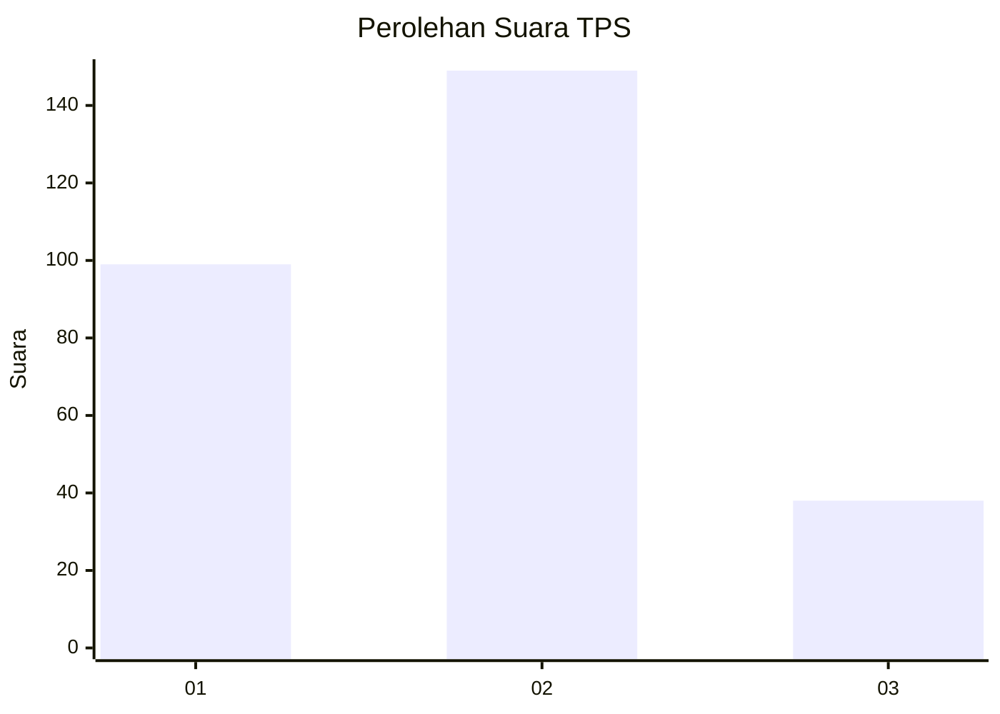
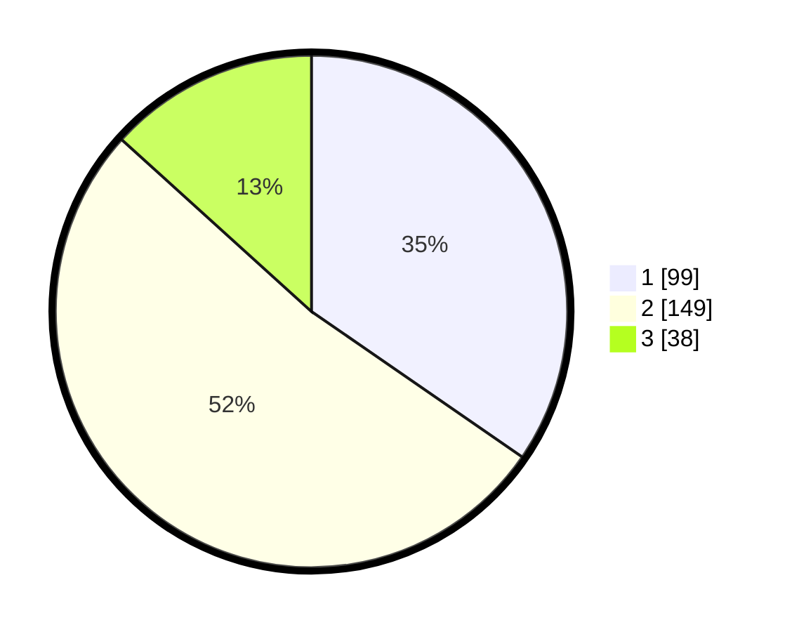

# Hasil

## Grafik

## Tabel

| No. | Nama Paslon    | Suara | Suara (raw) | Persentase |
|:--- |:-------------- | -----:| -----------:| ----------:|
| 1   | ANIES MUHAIMIN | 99    | [99][p-1]   | 34,62      |
| 2   | PRABOWO GIBRAN | 149   | [149][p-2]  | 52,10      |
| 3   | GANJAR MAHFUD  | 38    | [38][p-3]   | 13,29      |

[p-1]: https://github.com/gigit-pemilu/pemilu-2024-32-jawa-barat/blob/main/pilpres/hitung-suara/sub/32-jawa-barat/sub/09-cirebon/sub/36-plered/sub/2002-kaliwulu/sub/008-tps/sub/paslon-1.txt
[p-2]: https://github.com/gigit-pemilu/pemilu-2024-32-jawa-barat/blob/main/pilpres/hitung-suara/sub/32-jawa-barat/sub/09-cirebon/sub/36-plered/sub/2002-kaliwulu/sub/008-tps/sub/paslon-2.txt
[p-3]: https://github.com/gigit-pemilu/pemilu-2024-32-jawa-barat/blob/main/pilpres/hitung-suara/sub/32-jawa-barat/sub/09-cirebon/sub/36-plered/sub/2002-kaliwulu/sub/008-tps/sub/paslon-3.txt

## Foto C Plano

https://sirekap-obj-formc.kpu.go.id/ec28/pemilu/ppwp/32/09/36/20/02/3209362002008-20240217-162445--e40b08d8-583e-40e2-8678-584535a44602.jpg

https://sirekap-obj-formc.kpu.go.id/ec28/pemilu/ppwp/32/09/36/20/02/3209362002008-20240217-163038--e940d872-1cfe-420b-88c7-09f1c9260eb5.jpg

https://sirekap-obj-formc.kpu.go.id/ec28/pemilu/ppwp/32/09/36/20/02/3209362002008-20240217-152352--fe3b2289-2f5e-4712-9a17-3419e8d0d380.jpg

## Metadata

| Key        | Value               |
| ---------- | ------------------- |
| Time Stamp | 2024-02-24 22:31:28 |

