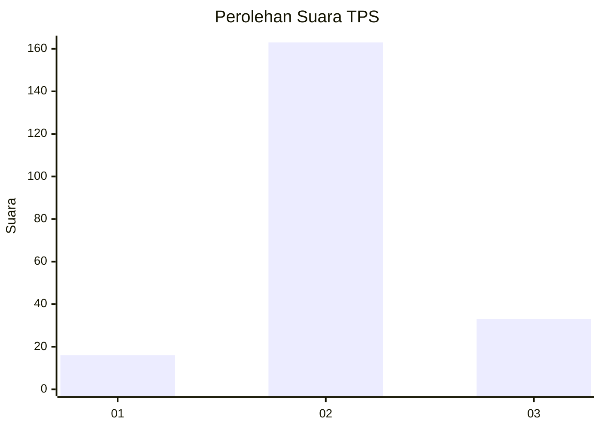

# Hasil

## Grafik

## Tabel

| No. | Nama Paslon    | Suara | Suara (raw) | Persentase |
|:--- |:-------------- | -----:| -----------:| ----------:|
| 1   | ANIES MUHAIMIN | 16    | [16][p-1]   | 7,55       |
| 2   | PRABOWO GIBRAN | 163   | [163][p-2]  | 76,89      |
| 3   | GANJAR MAHFUD  | 33    | [33][p-3]   | 15,57      |

[p-1]: https://github.com/gigit-pemilu/pemilu-2024-32-jawa-barat/blob/main/pilpres/hitung-suara/sub/32-jawa-barat/sub/09-cirebon/sub/37-gempol/sub/2001-cikeusal/sub/001-tps/sub/paslon-1.txt
[p-2]: https://github.com/gigit-pemilu/pemilu-2024-32-jawa-barat/blob/main/pilpres/hitung-suara/sub/32-jawa-barat/sub/09-cirebon/sub/37-gempol/sub/2001-cikeusal/sub/001-tps/sub/paslon-2.txt
[p-3]: https://github.com/gigit-pemilu/pemilu-2024-32-jawa-barat/blob/main/pilpres/hitung-suara/sub/32-jawa-barat/sub/09-cirebon/sub/37-gempol/sub/2001-cikeusal/sub/001-tps/sub/paslon-3.txt

## Foto C Plano

https://sirekap-obj-formc.kpu.go.id/8fa4/pemilu/ppwp/32/09/37/20/01/3209372001001-20240219-210014--b3d28373-df18-46f0-b8fd-84c5147146d9.jpg

https://sirekap-obj-formc.kpu.go.id/8fa4/pemilu/ppwp/32/09/37/20/01/3209372001001-20240219-210441--4841d6c5-fbbc-4c1b-8d90-24ff33151bde.jpg

https://sirekap-obj-formc.kpu.go.id/8fa4/pemilu/ppwp/32/09/37/20/01/3209372001001-20240214-224621--0868736e-83fd-4748-a8e0-877c3943ab37.jpg

## Metadata

| Key        | Value               |
| ---------- | ------------------- |
| Time Stamp | 2024-02-25 15:00:00 |

