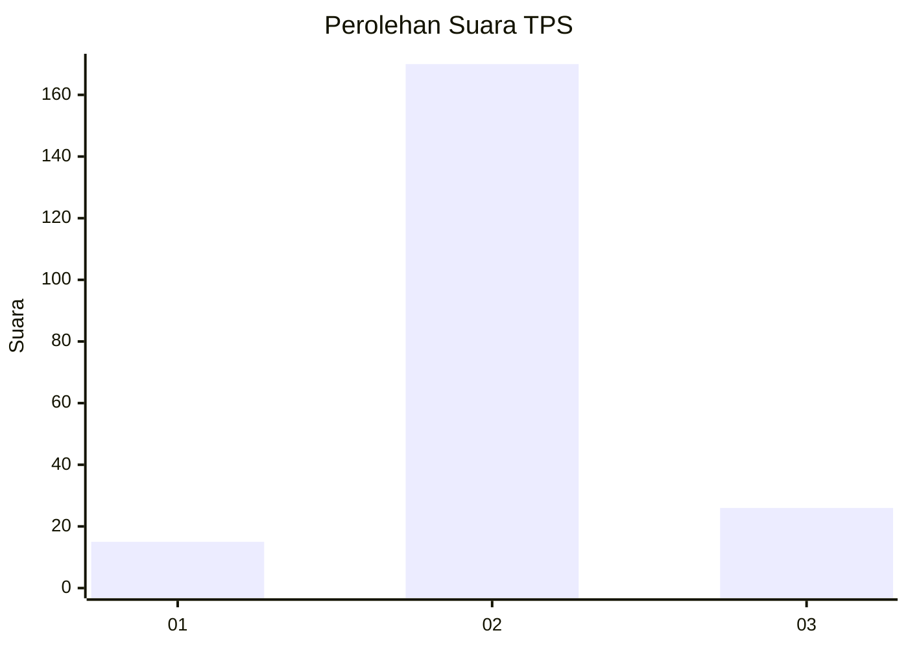
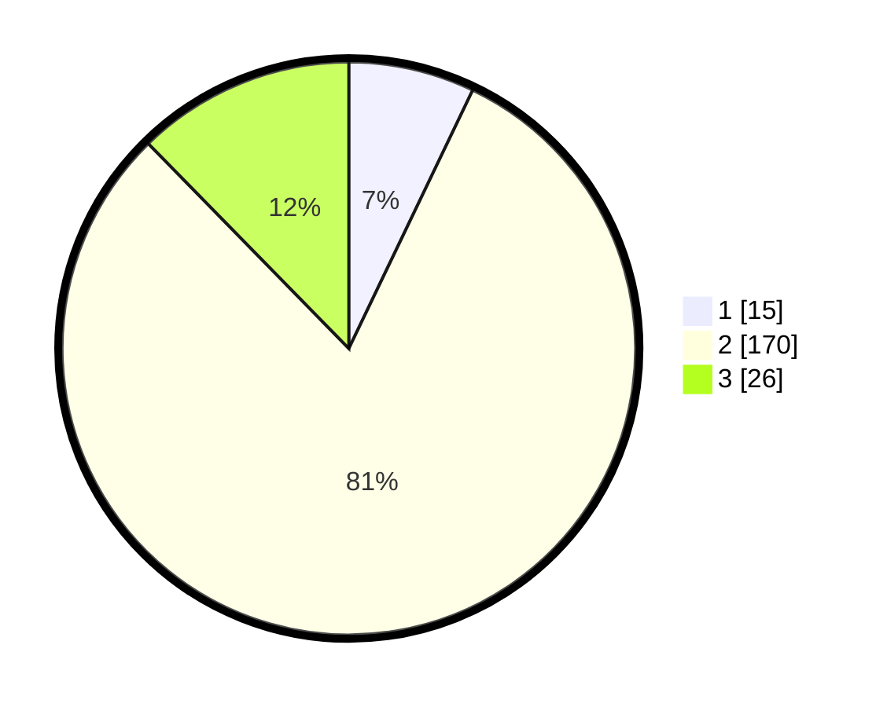

# Hasil

## Grafik

## Tabel

| No. | Nama Paslon    | Suara | Suara (raw) | Persentase |
|:--- |:-------------- | -----:| -----------:| ----------:|
| 1   | ANIES MUHAIMIN | 15    | [15][p-1]   | 7,11       |
| 2   | PRABOWO GIBRAN | 170   | [170][p-2]  | 80,57      |
| 3   | GANJAR MAHFUD  | 26    | [26][p-3]   | 12,32      |

[p-1]: https://github.com/gigit-pemilu/pemilu-2024/blob/main/pilpres/hitung-suara/sub/32-jawa-barat/sub/09-cirebon/sub/37-gempol/sub/2001-cikeusal/sub/003-tps/sub/paslon-1.txt
[p-2]: https://github.com/gigit-pemilu/pemilu-2024/blob/main/pilpres/hitung-suara/sub/32-jawa-barat/sub/09-cirebon/sub/37-gempol/sub/2001-cikeusal/sub/003-tps/sub/paslon-2.txt
[p-3]: https://github.com/gigit-pemilu/pemilu-2024/blob/main/pilpres/hitung-suara/sub/32-jawa-barat/sub/09-cirebon/sub/37-gempol/sub/2001-cikeusal/sub/003-tps/sub/paslon-3.txt

## Foto C Plano

https://sirekap-obj-formc.kpu.go.id/321a/pemilu/ppwp/32/09/37/20/01/3209372001003-20240219-122356--f758b3ca-2408-45ad-9958-5f8b7cb1690a.jpg

https://sirekap-obj-formc.kpu.go.id/321a/pemilu/ppwp/32/09/37/20/01/3209372001003-20240219-114538--24d3787b-9a0e-43f7-a995-b61c565c5956.jpg

https://sirekap-obj-formc.kpu.go.id/321a/pemilu/ppwp/32/09/37/20/01/3209372001003-20240219-114103--2d1f417e-9b51-4931-80b2-023d155a644f.jpg

## Metadata

| Key        | Value               |
| ---------- | ------------------- |
| Time Stamp | 2024-02-24 22:31:28 |

