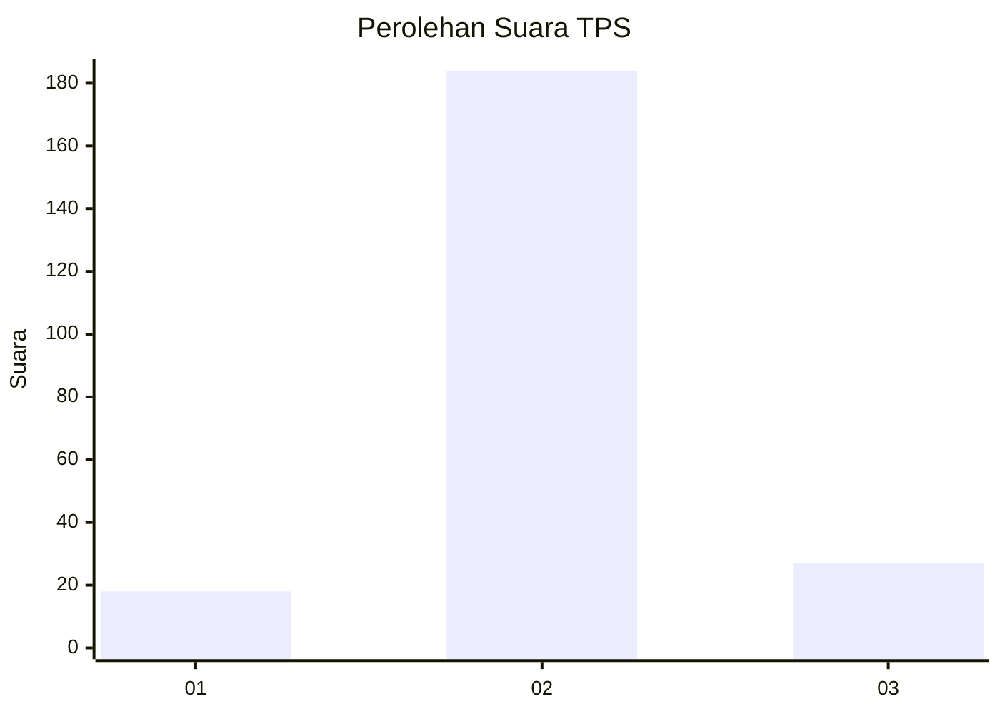
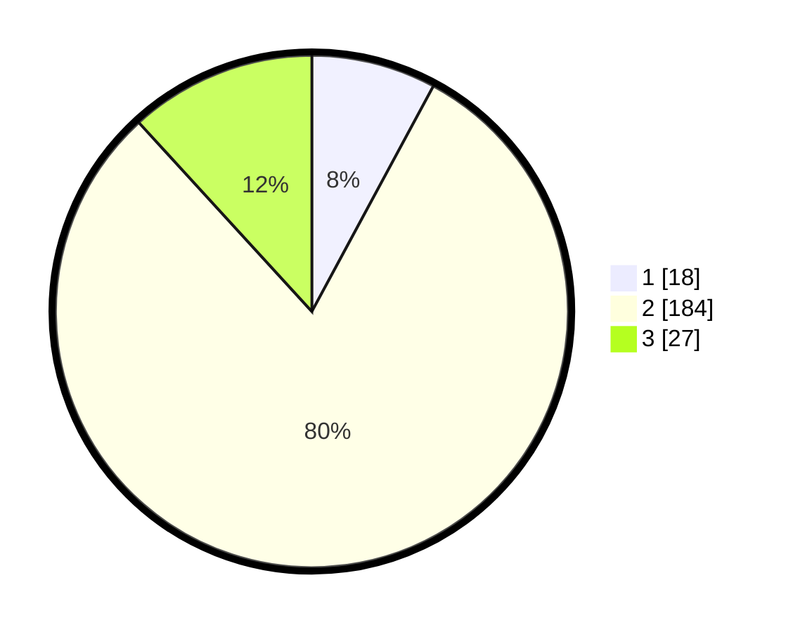

# Hasil

## Grafik

## Tabel

| No. | Nama Paslon    | Suara | Suara (raw) | Persentase |
|:--- |:-------------- | -----:| -----------:| ----------:|
| 1   | ANIES MUHAIMIN | 18    | [18][p-1]   | 7,86       |
| 2   | PRABOWO GIBRAN | 184   | [184][p-2]  | 80,35      |
| 3   | GANJAR MAHFUD  | 27    | [27][p-3]   | 11,79      |

[p-1]: https://github.com/gigit-pemilu/pemilu-2024-32-jawa-barat/blob/main/pilpres/hitung-suara/sub/32-jawa-barat/sub/09-cirebon/sub/37-gempol/sub/2001-cikeusal/sub/005-tps/sub/paslon-1.txt
[p-2]: https://github.com/gigit-pemilu/pemilu-2024-32-jawa-barat/blob/main/pilpres/hitung-suara/sub/32-jawa-barat/sub/09-cirebon/sub/37-gempol/sub/2001-cikeusal/sub/005-tps/sub/paslon-2.txt
[p-3]: https://github.com/gigit-pemilu/pemilu-2024-32-jawa-barat/blob/main/pilpres/hitung-suara/sub/32-jawa-barat/sub/09-cirebon/sub/37-gempol/sub/2001-cikeusal/sub/005-tps/sub/paslon-3.txt

## Foto C Plano

https://sirekap-obj-formc.kpu.go.id/23a9/pemilu/ppwp/32/09/37/20/01/3209372001005-20240216-084548--df76f679-b2f2-425a-ae6a-349f040a1bba.jpg

https://sirekap-obj-formc.kpu.go.id/23a9/pemilu/ppwp/32/09/37/20/01/3209372001005-20240215-115700--da0968ea-b1a3-4623-b931-d4e82d9f6382.jpg

https://sirekap-obj-formc.kpu.go.id/23a9/pemilu/ppwp/32/09/37/20/01/3209372001005-20240215-021219--eaa8a628-a840-42d3-a191-6300ab697c0a.jpg

## Metadata

| Key        | Value               |
| ---------- | ------------------- |
| Time Stamp | 2024-02-16 10:00:28 |

