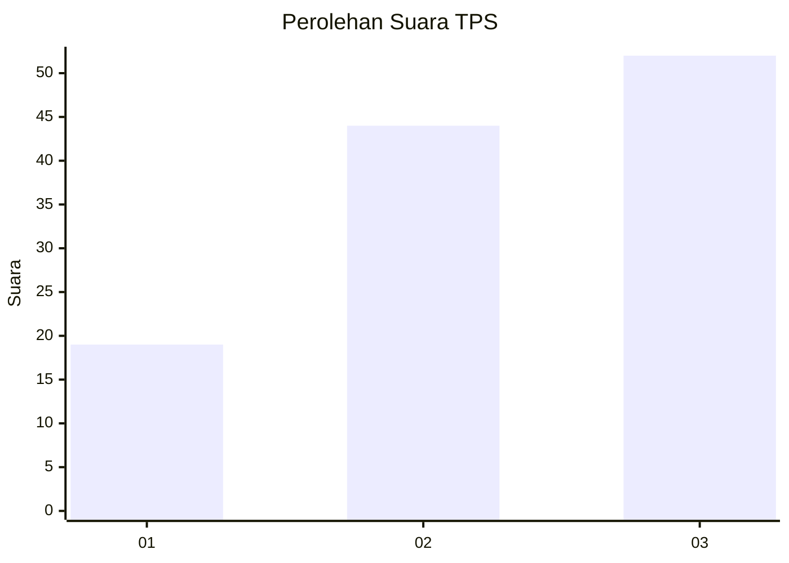
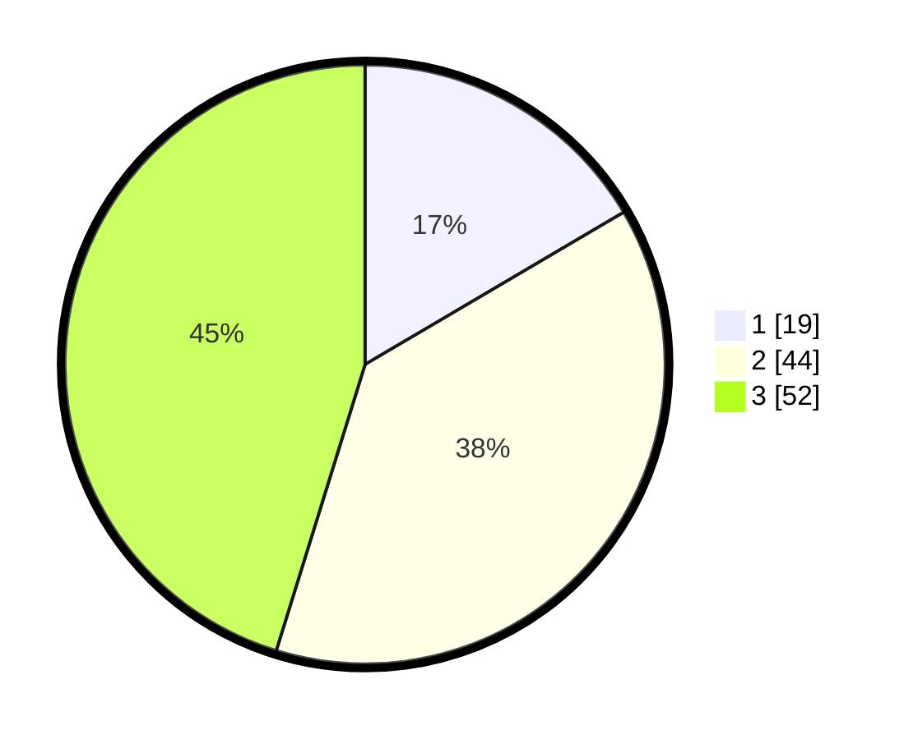

# Hasil

## Grafik

## Tabel

| No. | Nama Paslon    | Suara | Suara (raw) | Persentase |
|:--- |:-------------- | -----:| -----------:| ----------:|
| 1   | ANIES MUHAIMIN | 19    | [19][p-1]   | 16,52      |
| 2   | PRABOWO GIBRAN | 44    | [44][p-2]   | 38,26      |
| 3   | GANJAR MAHFUD  | 52    | [52][p-3]   | 45,22      |

[p-1]: https://github.com/gigit-pemilu/pemilu-2024-32-jawa-barat/blob/main/pilpres/hitung-suara/sub/32-jawa-barat/sub/09-cirebon/sub/37-gempol/sub/2005-gempol/sub/004-tps/sub/paslon-1.txt
[p-2]: https://github.com/gigit-pemilu/pemilu-2024-32-jawa-barat/blob/main/pilpres/hitung-suara/sub/32-jawa-barat/sub/09-cirebon/sub/37-gempol/sub/2005-gempol/sub/004-tps/sub/paslon-2.txt
[p-3]: https://github.com/gigit-pemilu/pemilu-2024-32-jawa-barat/blob/main/pilpres/hitung-suara/sub/32-jawa-barat/sub/09-cirebon/sub/37-gempol/sub/2005-gempol/sub/004-tps/sub/paslon-3.txt

## Foto C Plano

https://sirekap-obj-formc.kpu.go.id/83e5/pemilu/ppwp/32/09/37/20/05/3209372005004-20240217-170132--0866c5ec-e81b-4028-af93-09e063cb0807.jpg

https://sirekap-obj-formc.kpu.go.id/83e5/pemilu/ppwp/32/09/37/20/05/3209372005004-20240215-193234--bba887d3-a6f8-4b87-8216-5a30995289d6.jpg

https://sirekap-obj-formc.kpu.go.id/83e5/pemilu/ppwp/32/09/37/20/05/3209372005004-20240215-192410--9c40ce60-b101-45bf-aea7-e1cf3f1e51f7.jpg

## Metadata

| Key        | Value               |
| ---------- | ------------------- |
| Time Stamp | 2024-02-17 17:30:00 |

