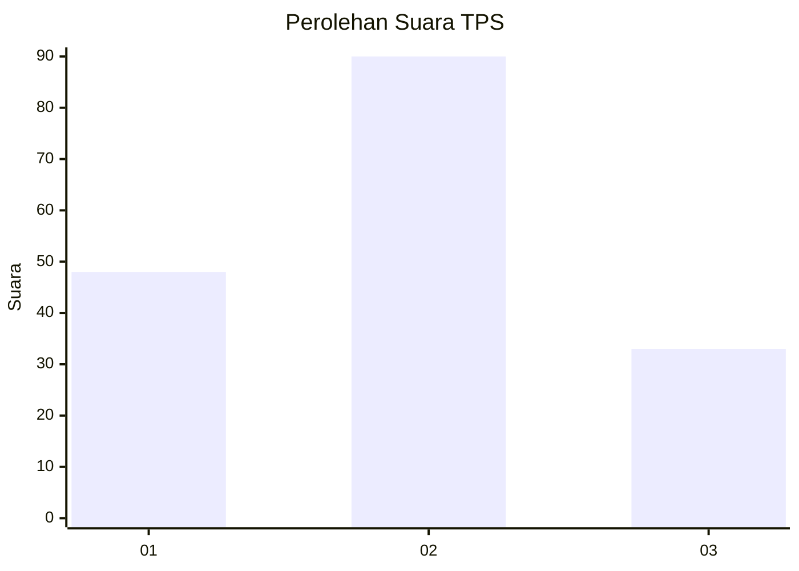
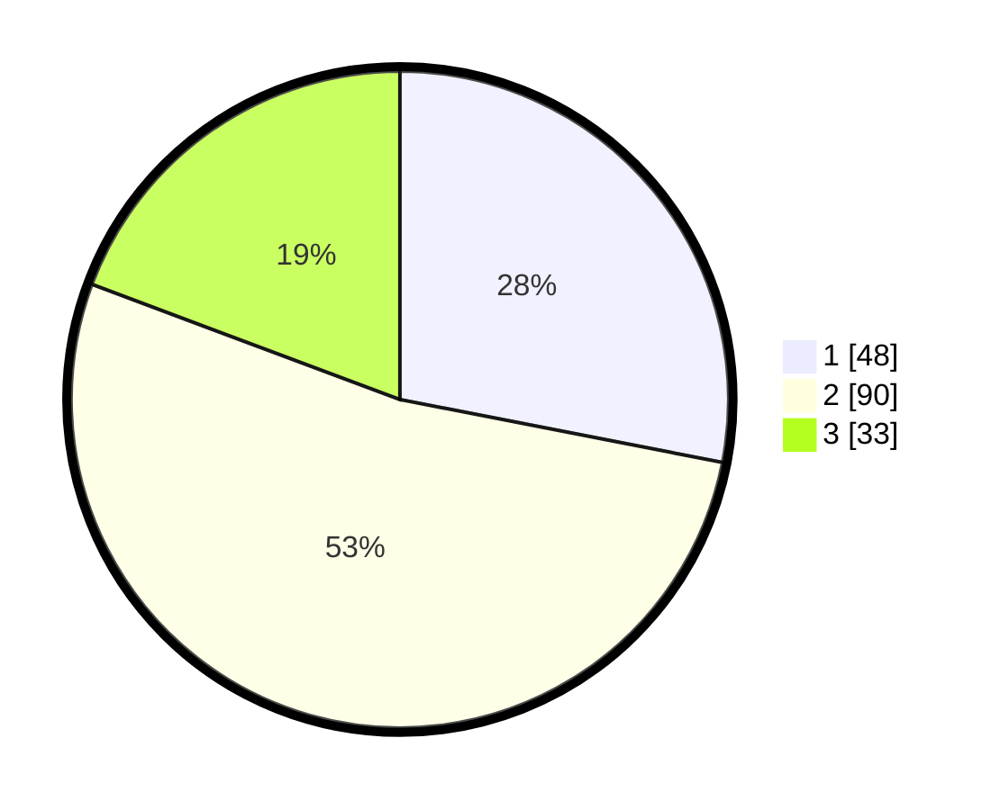

# Hasil

## Grafik

## Tabel

| No. | Nama Paslon    | Suara | Suara (raw) | Persentase |
|:--- |:-------------- | -----:| -----------:| ----------:|
| 1   | ANIES MUHAIMIN | 48    | [48][p-1]   | 28,07      |
| 2   | PRABOWO GIBRAN | 90    | [90][p-2]   | 52,63      |
| 3   | GANJAR MAHFUD  | 33    | [33][p-3]   | 19,30      |

[p-1]: https://github.com/gigit-pemilu/pemilu-2024-32-jawa-barat/blob/main/pilpres/hitung-suara/sub/32-jawa-barat/sub/09-cirebon/sub/38-greged/sub/2001-gumulung-lebak/sub/003-tps/sub/paslon-1.txt
[p-2]: https://github.com/gigit-pemilu/pemilu-2024-32-jawa-barat/blob/main/pilpres/hitung-suara/sub/32-jawa-barat/sub/09-cirebon/sub/38-greged/sub/2001-gumulung-lebak/sub/003-tps/sub/paslon-2.txt
[p-3]: https://github.com/gigit-pemilu/pemilu-2024-32-jawa-barat/blob/main/pilpres/hitung-suara/sub/32-jawa-barat/sub/09-cirebon/sub/38-greged/sub/2001-gumulung-lebak/sub/003-tps/sub/paslon-3.txt

## Foto C Plano

https://sirekap-obj-formc.kpu.go.id/a882/pemilu/ppwp/32/09/38/20/01/3209382001003-20240215-045039--330b0572-4630-4f83-a89f-5e8437ca137f.jpg

https://sirekap-obj-formc.kpu.go.id/a882/pemilu/ppwp/32/09/38/20/01/3209382001003-20240215-045134--25cf7c94-b83e-4f35-b4da-a1be24074b1d.jpg

https://sirekap-obj-formc.kpu.go.id/a882/pemilu/ppwp/32/09/38/20/01/3209382001003-20240215-045343--a5c88f70-38e0-4782-a806-fc36b10229af.jpg

## Metadata

| Key        | Value               |
| ---------- | ------------------- |
| Time Stamp | 2024-02-25 13:00:00 |

