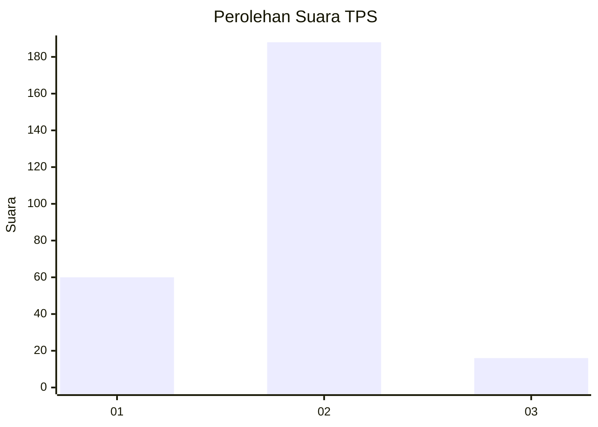

# Hasil

## Grafik

## Tabel

| No. | Nama Paslon    | Suara | Suara (raw) | Persentase |
|:--- |:-------------- | -----:| -----------:| ----------:|
| 1   | ANIES MUHAIMIN | 60    | [60][p-1]   | 22,73      |
| 2   | PRABOWO GIBRAN | 188   | [188][p-2]  | 71,21      |
| 3   | GANJAR MAHFUD  | 16    | [16][p-3]   | 6,06       |

[p-1]: https://github.com/gigit-pemilu/pemilu-2024/blob/main/pilpres/hitung-suara/sub/32-jawa-barat/sub/09-cirebon/sub/38-greged/sub/2001-gumulung-lebak/sub/020-tps/sub/paslon-1.txt
[p-2]: https://github.com/gigit-pemilu/pemilu-2024/blob/main/pilpres/hitung-suara/sub/32-jawa-barat/sub/09-cirebon/sub/38-greged/sub/2001-gumulung-lebak/sub/020-tps/sub/paslon-2.txt
[p-3]: https://github.com/gigit-pemilu/pemilu-2024/blob/main/pilpres/hitung-suara/sub/32-jawa-barat/sub/09-cirebon/sub/38-greged/sub/2001-gumulung-lebak/sub/020-tps/sub/paslon-3.txt

## Foto C Plano

https://sirekap-obj-formc.kpu.go.id/cc87/pemilu/ppwp/32/09/38/20/01/3209382001020-20240219-163349--77cfd6ab-3b69-4848-bb6c-009bc2e70291.jpg

https://sirekap-obj-formc.kpu.go.id/cc87/pemilu/ppwp/32/09/38/20/01/3209382001020-20240214-235429--6b6e7934-6e46-4248-9152-dedf27a2a84b.jpg

https://sirekap-obj-formc.kpu.go.id/cc87/pemilu/ppwp/32/09/38/20/01/3209382001020-20240214-235527--27ef27db-dbea-43de-9aaa-b4b61c0e6a3f.jpg

## Metadata

| Key        | Value               |
| ---------- | ------------------- |
| Time Stamp | 2024-02-19 17:00:00 |

