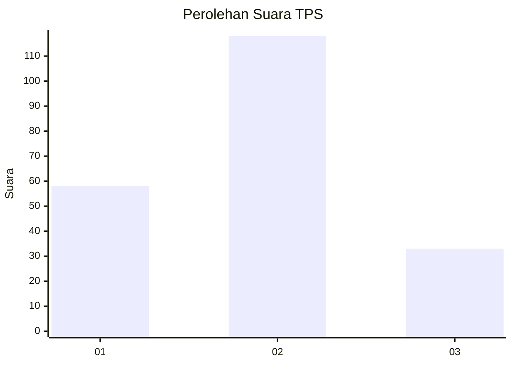
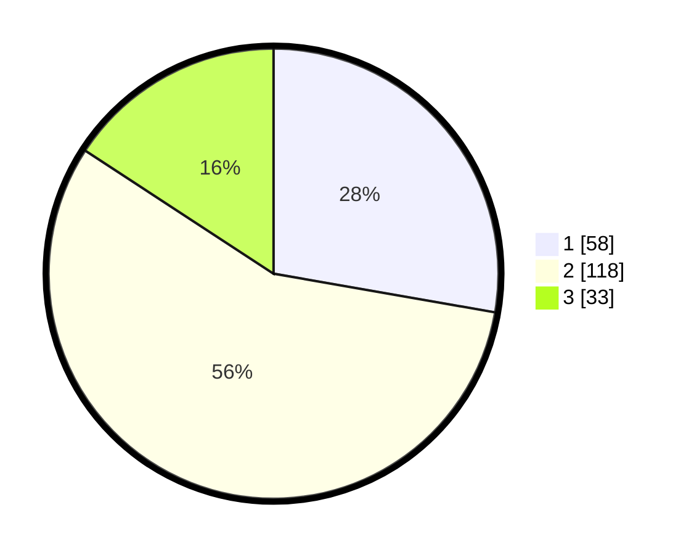

# Hasil

## Grafik

## Tabel

| No. | Nama Paslon    | Suara | Suara (raw) | Persentase |
|:--- |:-------------- | -----:| -----------:| ----------:|
| 1   | ANIES MUHAIMIN | 58    | [58][p-1]   | 27,75      |
| 2   | PRABOWO GIBRAN | 118   | [118][p-2]  | 56,46      |
| 3   | GANJAR MAHFUD  | 33    | [33][p-3]   | 15,79      |

[p-1]: https://github.com/gigit-pemilu/pemilu-2024-32-jawa-barat/blob/main/pilpres/hitung-suara/sub/32-jawa-barat/sub/09-cirebon/sub/39-suranenggala/sub/2003-muara/sub/001-tps/sub/paslon-1.txt
[p-2]: https://github.com/gigit-pemilu/pemilu-2024-32-jawa-barat/blob/main/pilpres/hitung-suara/sub/32-jawa-barat/sub/09-cirebon/sub/39-suranenggala/sub/2003-muara/sub/001-tps/sub/paslon-2.txt
[p-3]: https://github.com/gigit-pemilu/pemilu-2024-32-jawa-barat/blob/main/pilpres/hitung-suara/sub/32-jawa-barat/sub/09-cirebon/sub/39-suranenggala/sub/2003-muara/sub/001-tps/sub/paslon-3.txt

## Foto C Plano

https://sirekap-obj-formc.kpu.go.id/d951/pemilu/ppwp/32/09/39/20/03/3209392003001-20240217-143146--cf1a0ccf-48e2-4f18-a397-8e26c9820009.jpg

https://sirekap-obj-formc.kpu.go.id/d951/pemilu/ppwp/32/09/39/20/03/3209392003001-20240217-143448--88e05665-9c90-4b52-91f7-83ffc94b5fc2.jpg

https://sirekap-obj-formc.kpu.go.id/d951/pemilu/ppwp/32/09/39/20/03/3209392003001-20240214-193944--bd9576c1-2aa8-4101-ab25-55f475eea6e8.jpg

## Metadata

| Key        | Value               |
| ---------- | ------------------- |
| Time Stamp | 2024-02-19 17:00:00 |

