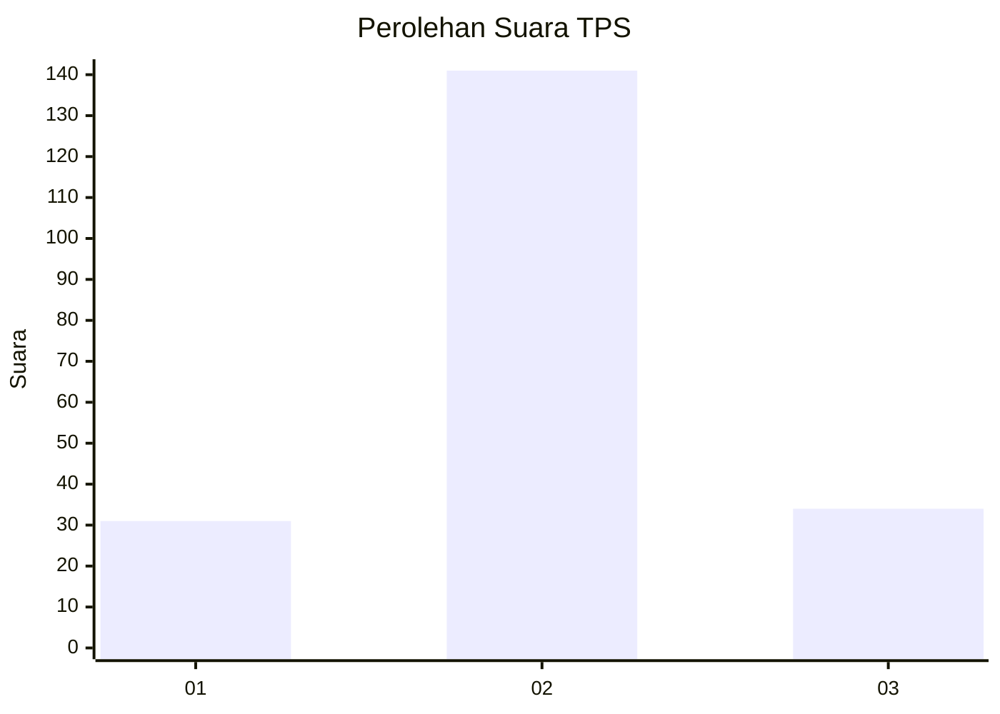
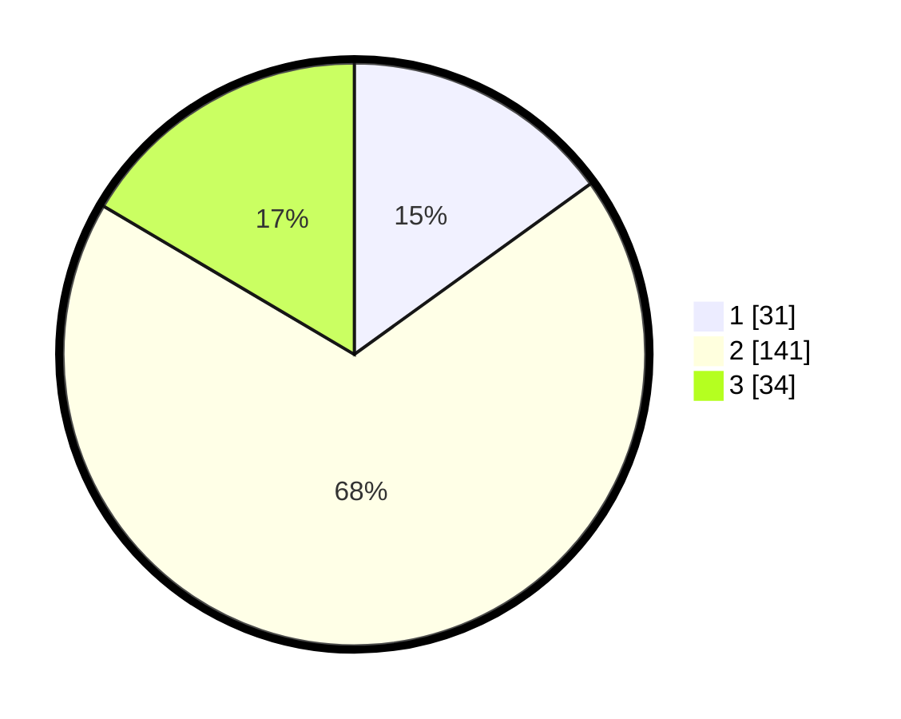

# Hasil

## Grafik

## Tabel

| No. | Nama Paslon    | Suara | Suara (raw) | Persentase |
|:--- |:-------------- | -----:| -----------:| ----------:|
| 1   | ANIES MUHAIMIN | 31    | [31][p-1]   | 15,05      |
| 2   | PRABOWO GIBRAN | 141   | [141][p-2]  | 68,45      |
| 3   | GANJAR MAHFUD  | 34    | [34][p-3]   | 16,50      |

[p-1]: https://github.com/gigit-pemilu/pemilu-2024-32-jawa-barat/blob/main/pilpres/hitung-suara/sub/32-jawa-barat/sub/09-cirebon/sub/39-suranenggala/sub/2003-muara/sub/002-tps/sub/paslon-1.txt
[p-2]: https://github.com/gigit-pemilu/pemilu-2024-32-jawa-barat/blob/main/pilpres/hitung-suara/sub/32-jawa-barat/sub/09-cirebon/sub/39-suranenggala/sub/2003-muara/sub/002-tps/sub/paslon-2.txt
[p-3]: https://github.com/gigit-pemilu/pemilu-2024-32-jawa-barat/blob/main/pilpres/hitung-suara/sub/32-jawa-barat/sub/09-cirebon/sub/39-suranenggala/sub/2003-muara/sub/002-tps/sub/paslon-3.txt

## Foto C Plano

https://sirekap-obj-formc.kpu.go.id/2b16/pemilu/ppwp/32/09/39/20/03/3209392003002-20240217-142444--9d5d3351-7681-4348-96b8-6096675e164d.jpg

https://sirekap-obj-formc.kpu.go.id/2b16/pemilu/ppwp/32/09/39/20/03/3209392003002-20240217-135708--05f3c1a6-e0f2-4284-bdb7-fbfd0667f77b.jpg

https://sirekap-obj-formc.kpu.go.id/2b16/pemilu/ppwp/32/09/39/20/03/3209392003002-20240217-135801--ee011c34-4a2c-4992-b961-eea51c02c7ae.jpg

## Metadata

| Key        | Value               |
| ---------- | ------------------- |
| Time Stamp | 2024-02-19 17:00:00 |

