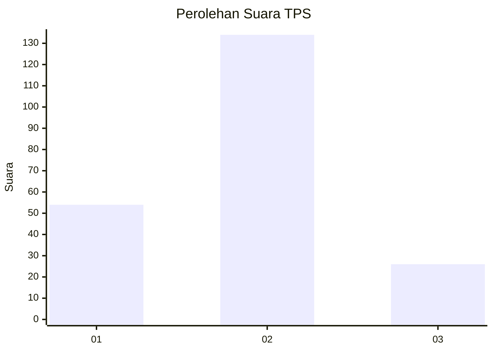
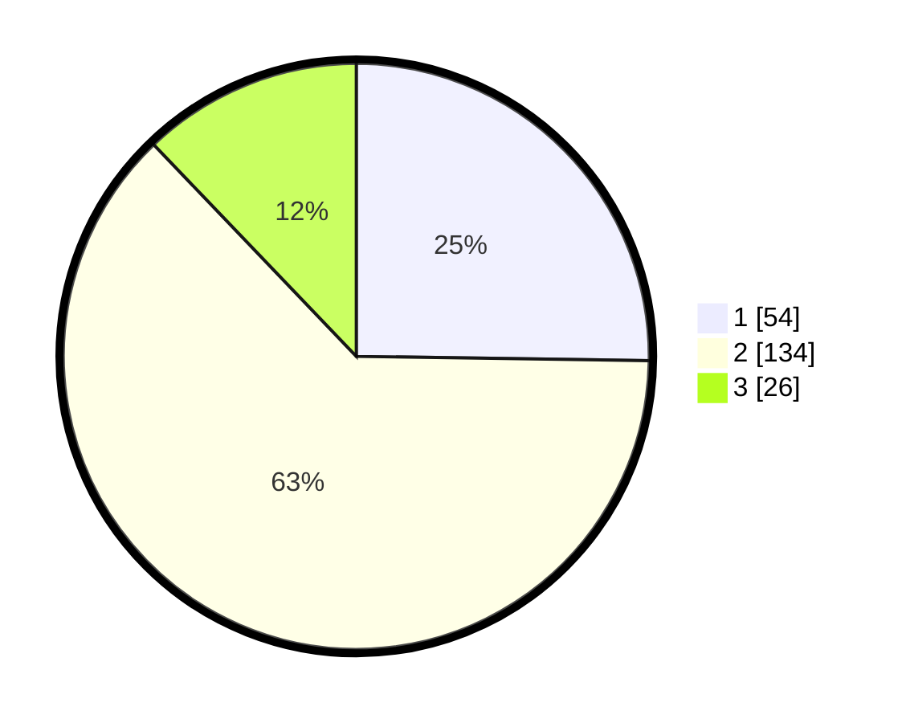

# Hasil

## Grafik

## Tabel

| No. | Nama Paslon    | Suara | Suara (raw) | Persentase |
|:--- |:-------------- | -----:| -----------:| ----------:|
| 1   | ANIES MUHAIMIN | 54    | [54][p-1]   | 25,23      |
| 2   | PRABOWO GIBRAN | 134   | [134][p-2]  | 62,62      |
| 3   | GANJAR MAHFUD  | 26    | [26][p-3]   | 12,15      |

[p-1]: https://github.com/gigit-pemilu/pemilu-2024/blob/main/pilpres/hitung-suara/sub/32-jawa-barat/sub/09-cirebon/sub/39-suranenggala/sub/2003-muara/sub/004-tps/sub/paslon-1.txt
[p-2]: https://github.com/gigit-pemilu/pemilu-2024/blob/main/pilpres/hitung-suara/sub/32-jawa-barat/sub/09-cirebon/sub/39-suranenggala/sub/2003-muara/sub/004-tps/sub/paslon-2.txt
[p-3]: https://github.com/gigit-pemilu/pemilu-2024/blob/main/pilpres/hitung-suara/sub/32-jawa-barat/sub/09-cirebon/sub/39-suranenggala/sub/2003-muara/sub/004-tps/sub/paslon-3.txt

## Foto C Plano

https://sirekap-obj-formc.kpu.go.id/3b84/pemilu/ppwp/32/09/39/20/03/3209392003004-20240217-145628--ccc7aef8-a066-472b-9490-8dd0f700cbef.jpg

https://sirekap-obj-formc.kpu.go.id/3b84/pemilu/ppwp/32/09/39/20/03/3209392003004-20240217-143908--e2ff6ab3-6c2b-4121-aefd-50bdbcac144f.jpg

https://sirekap-obj-formc.kpu.go.id/3b84/pemilu/ppwp/32/09/39/20/03/3209392003004-20240217-143305--574f01bb-be71-4cdc-81b5-4a80f53bf480.jpg

## Metadata

| Key        | Value               |
| ---------- | ------------------- |
| Time Stamp | 2024-02-19 18:00:00 |

