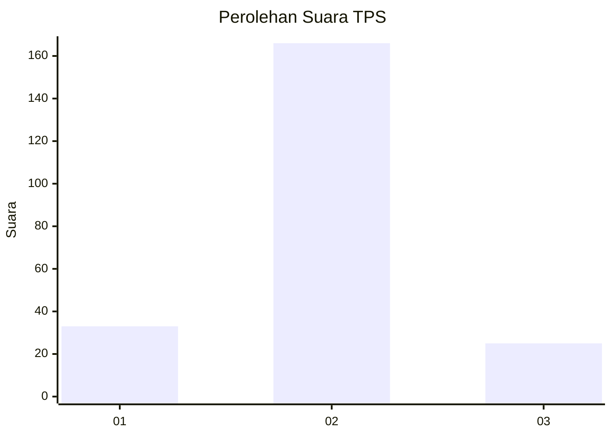
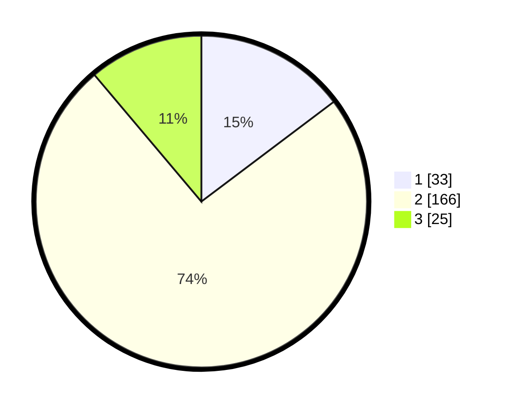

# Hasil

## Grafik

## Tabel

| No. | Nama Paslon    | Suara | Suara (raw) | Persentase |
|:--- |:-------------- | -----:| -----------:| ----------:|
| 1   | ANIES MUHAIMIN | 33    | [33][p-1]   | 14,73      |
| 2   | PRABOWO GIBRAN | 166   | [166][p-2]  | 74,11      |
| 3   | GANJAR MAHFUD  | 25    | [25][p-3]   | 11,16      |

[p-1]: https://github.com/gigit-pemilu/pemilu-2024-32-jawa-barat/blob/main/pilpres/hitung-suara/sub/32-jawa-barat/sub/09-cirebon/sub/39-suranenggala/sub/2003-muara/sub/006-tps/sub/paslon-1.txt
[p-2]: https://github.com/gigit-pemilu/pemilu-2024-32-jawa-barat/blob/main/pilpres/hitung-suara/sub/32-jawa-barat/sub/09-cirebon/sub/39-suranenggala/sub/2003-muara/sub/006-tps/sub/paslon-2.txt
[p-3]: https://github.com/gigit-pemilu/pemilu-2024-32-jawa-barat/blob/main/pilpres/hitung-suara/sub/32-jawa-barat/sub/09-cirebon/sub/39-suranenggala/sub/2003-muara/sub/006-tps/sub/paslon-3.txt

## Foto C Plano

https://sirekap-obj-formc.kpu.go.id/4752/pemilu/ppwp/32/09/39/20/03/3209392003006-20240214-222535--2042087a-ffd8-49c6-a9f9-bae7c234e4ab.jpg

https://sirekap-obj-formc.kpu.go.id/4752/pemilu/ppwp/32/09/39/20/03/3209392003006-20240215-013823--139d2897-cfbe-4146-9870-fd0615eb955e.jpg

https://sirekap-obj-formc.kpu.go.id/4752/pemilu/ppwp/32/09/39/20/03/3209392003006-20240214-222418--754a70f2-186a-4fda-a813-3ad660ae2946.jpg

## Metadata

| Key        | Value               |
| ---------- | ------------------- |
| Time Stamp | 2024-02-19 18:00:00 |

