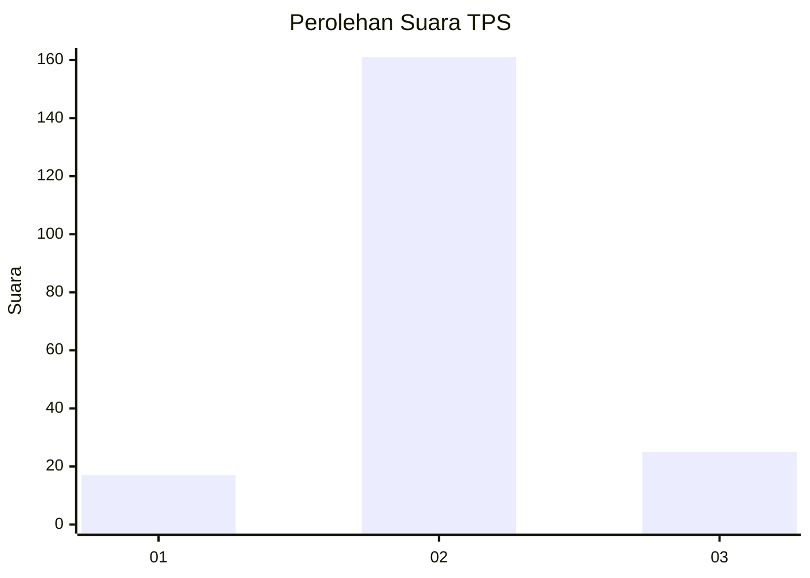
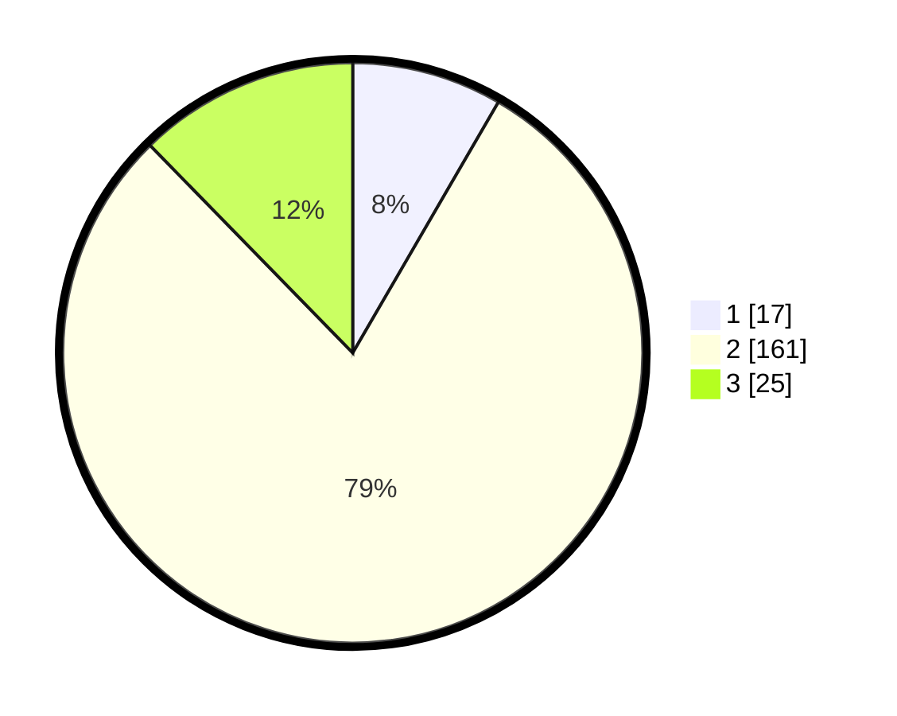

# Hasil

## Grafik

## Tabel

| No. | Nama Paslon    | Suara | Suara (raw) | Persentase |
|:--- |:-------------- | -----:| -----------:| ----------:|
| 1   | ANIES MUHAIMIN | 17    | [17][p-1]   | 8,37       |
| 2   | PRABOWO GIBRAN | 161   | [161][p-2]  | 79,31      |
| 3   | GANJAR MAHFUD  | 25    | [25][p-3]   | 12,32      |

[p-1]: https://github.com/gigit-pemilu/pemilu-2024/blob/main/pilpres/hitung-suara/sub/32-jawa-barat/sub/09-cirebon/sub/39-suranenggala/sub/2009-suranenggala-kulon/sub/002-tps/sub/paslon-1.txt
[p-2]: https://github.com/gigit-pemilu/pemilu-2024/blob/main/pilpres/hitung-suara/sub/32-jawa-barat/sub/09-cirebon/sub/39-suranenggala/sub/2009-suranenggala-kulon/sub/002-tps/sub/paslon-2.txt
[p-3]: https://github.com/gigit-pemilu/pemilu-2024/blob/main/pilpres/hitung-suara/sub/32-jawa-barat/sub/09-cirebon/sub/39-suranenggala/sub/2009-suranenggala-kulon/sub/002-tps/sub/paslon-3.txt

## Foto C Plano

https://sirekap-obj-formc.kpu.go.id/511b/pemilu/ppwp/32/09/39/20/09/3209392009002-20240214-194001--b9d8bcf7-0a46-42b4-a70b-3fae96f3d807.jpg

https://sirekap-obj-formc.kpu.go.id/511b/pemilu/ppwp/32/09/39/20/09/3209392009002-20240214-194009--54bb00e8-3694-4c8e-987a-8f1809d0c8fb.jpg

https://sirekap-obj-formc.kpu.go.id/511b/pemilu/ppwp/32/09/39/20/09/3209392009002-20240214-194015--c384e3eb-7c21-42fa-82b6-591f993db283.jpg

## Metadata

| Key        | Value               |
| ---------- | ------------------- |
| Time Stamp | 2024-02-16 06:30:27 |

## DATA PEMILIH TETAP

Jumlah pemilih dalam DPT: **20**.
 * L: **55**.
 * P: **770**.

## DATA PENGGUNA HAK PILIH

Jumlah pengguna hak pilih dalam DPT: **200**.
 * L: **0**.
 * P: **2**.

Jumlah pengguna hak pilih dalam DPTb: **528**.
 * L: **6**.
 * P: **97**.

Jumlah pengguna hak pilih dalam DPK: **50**.
 * L: **0**.
 * P: **0**.

Jumlah pengguna hak pilih: **6**.
 * L: **300**.
 * P: **4**.

## JUMLAH SUARA SAH DAN TIDAK SAH

JUMLAH SELURUH SUARA SAH: **203**.

JUMLAH SUARA TIDAK SAH: **0**.

JUMLAH SELURUH SUARA SAH DAN SUARA TIDAK SAH: **203**.

