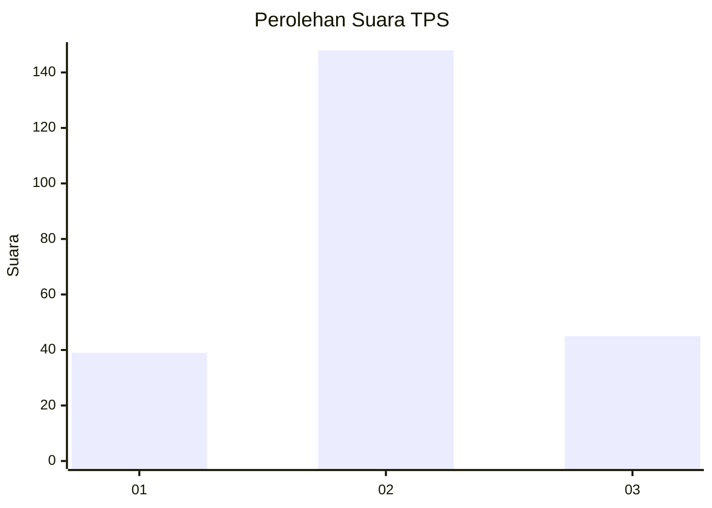
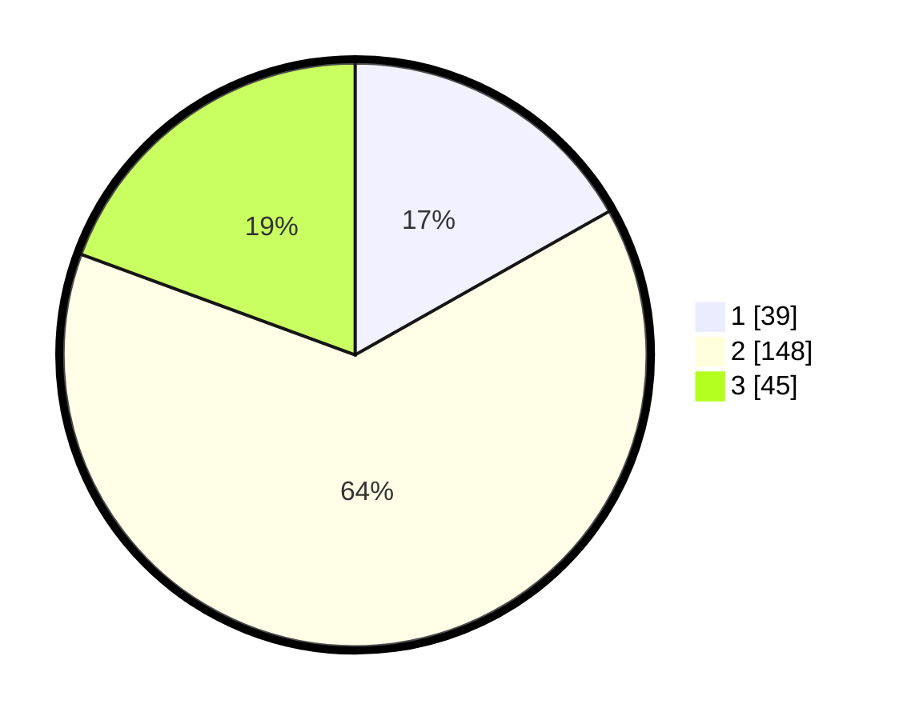

# Hasil

## Grafik

## Tabel

| No. | Nama Paslon    | Suara | Suara (raw) | Persentase |
|:--- |:-------------- | -----:| -----------:| ----------:|
| 1   | ANIES MUHAIMIN | 39    | [39][p-1]   | 16,81      |
| 2   | PRABOWO GIBRAN | 148   | [148][p-2]  | 63,79      |
| 3   | GANJAR MAHFUD  | 45    | [45][p-3]   | 19,40      |

[p-1]: https://github.com/gigit-pemilu/pemilu-2024-32-jawa-barat/blob/main/pilpres/hitung-suara/sub/32-jawa-barat/sub/09-cirebon/sub/40-jamblang/sub/2001-jamblang/sub/006-tps/sub/paslon-1.txt
[p-2]: https://github.com/gigit-pemilu/pemilu-2024-32-jawa-barat/blob/main/pilpres/hitung-suara/sub/32-jawa-barat/sub/09-cirebon/sub/40-jamblang/sub/2001-jamblang/sub/006-tps/sub/paslon-2.txt
[p-3]: https://github.com/gigit-pemilu/pemilu-2024-32-jawa-barat/blob/main/pilpres/hitung-suara/sub/32-jawa-barat/sub/09-cirebon/sub/40-jamblang/sub/2001-jamblang/sub/006-tps/sub/paslon-3.txt

## Foto C Plano

https://sirekap-obj-formc.kpu.go.id/806e/pemilu/ppwp/32/09/40/20/01/3209402001006-20240215-021620--7e4cf746-38cb-49bc-8fb0-779c6e9d9906.jpg

https://sirekap-obj-formc.kpu.go.id/806e/pemilu/ppwp/32/09/40/20/01/3209402001006-20240215-021847--ab4e96bc-20c6-4981-b6db-8783c4707119.jpg

https://sirekap-obj-formc.kpu.go.id/806e/pemilu/ppwp/32/09/40/20/01/3209402001006-20240215-022130--c569c69a-de73-4027-9f79-51c761005508.jpg

## Metadata

| Key        | Value               |
| ---------- | ------------------- |
| Time Stamp | 2024-02-25 17:00:00 |

