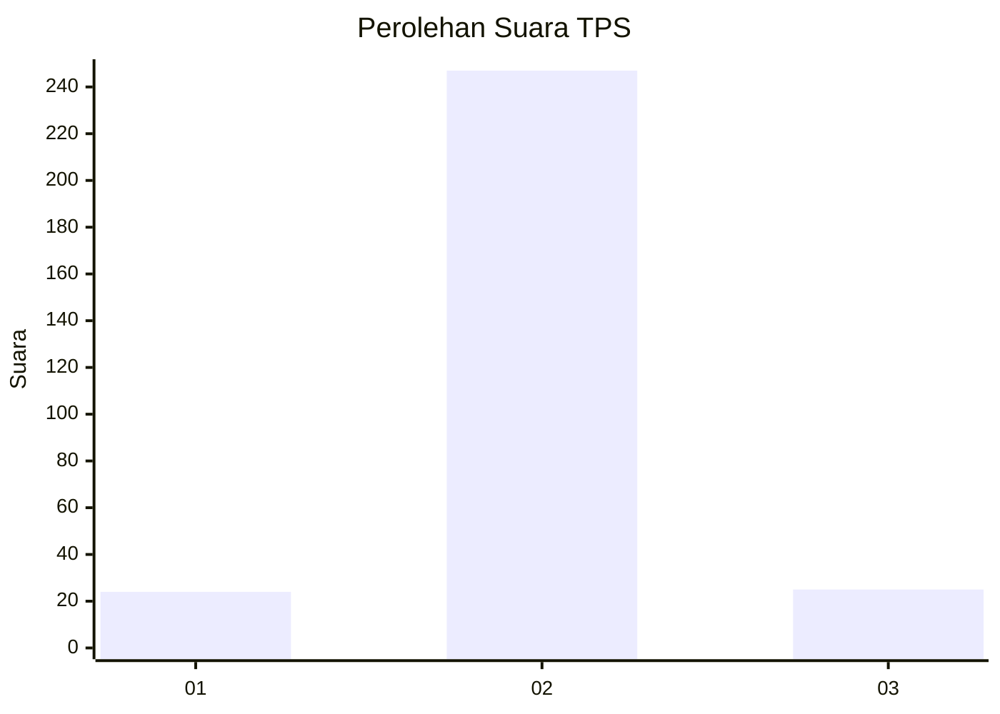
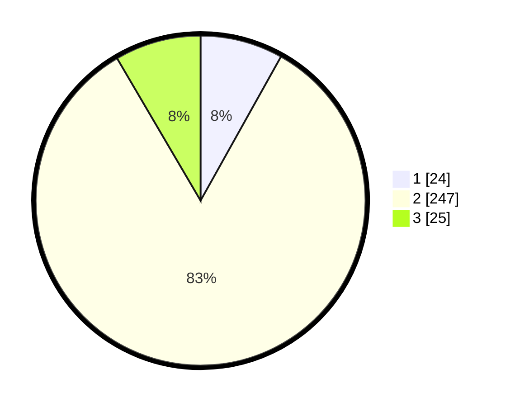

# Hasil

## Grafik

## Tabel

| No. | Nama Paslon    | Suara | Suara (raw) | Persentase |
|:--- |:-------------- | -----:| -----------:| ----------:|
| 1   | ANIES MUHAIMIN | 24    | [24][p-1]   | 8,11       |
| 2   | PRABOWO GIBRAN | 247   | [247][p-2]  | 83,45      |
| 3   | GANJAR MAHFUD  | 25    | [25][p-3]   | 8,45       |

[p-1]: https://github.com/gigit-pemilu/pemilu-2024-32-jawa-barat/blob/main/pilpres/hitung-suara/sub/32-jawa-barat/sub/09-cirebon/sub/40-jamblang/sub/2006-orimalang/sub/008-tps/sub/paslon-1.txt
[p-2]: https://github.com/gigit-pemilu/pemilu-2024-32-jawa-barat/blob/main/pilpres/hitung-suara/sub/32-jawa-barat/sub/09-cirebon/sub/40-jamblang/sub/2006-orimalang/sub/008-tps/sub/paslon-2.txt
[p-3]: https://github.com/gigit-pemilu/pemilu-2024-32-jawa-barat/blob/main/pilpres/hitung-suara/sub/32-jawa-barat/sub/09-cirebon/sub/40-jamblang/sub/2006-orimalang/sub/008-tps/sub/paslon-3.txt

## Foto C Plano

https://sirekap-obj-formc.kpu.go.id/f5bc/pemilu/ppwp/32/09/40/20/06/3209402006008-20240217-221922--9353edae-982c-4129-94a5-a1b7d490eac4.jpg

https://sirekap-obj-formc.kpu.go.id/f5bc/pemilu/ppwp/32/09/40/20/06/3209402006008-20240217-222001--1b2ac999-56c8-4c38-bd60-a5fa7dd8e9d2.jpg

https://sirekap-obj-formc.kpu.go.id/f5bc/pemilu/ppwp/32/09/40/20/06/3209402006008-20240217-222203--d7af7137-c3f9-4790-985c-4d6a895903d3.jpg

## Metadata

| Key        | Value               |
| ---------- | ------------------- |
| Time Stamp | 2024-02-24 22:31:28 |

