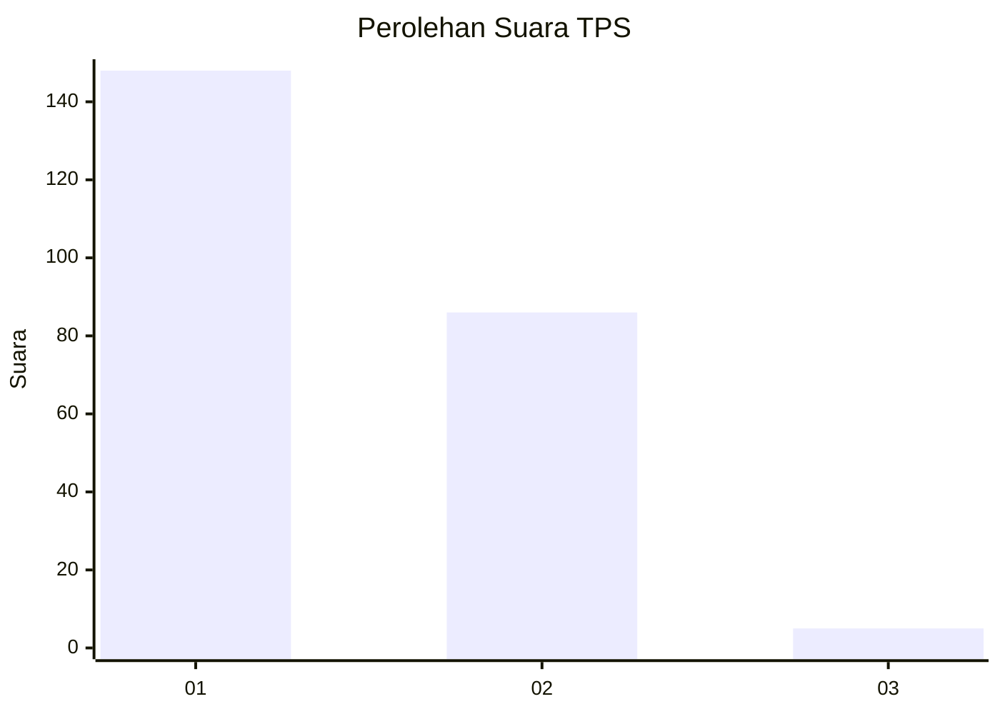
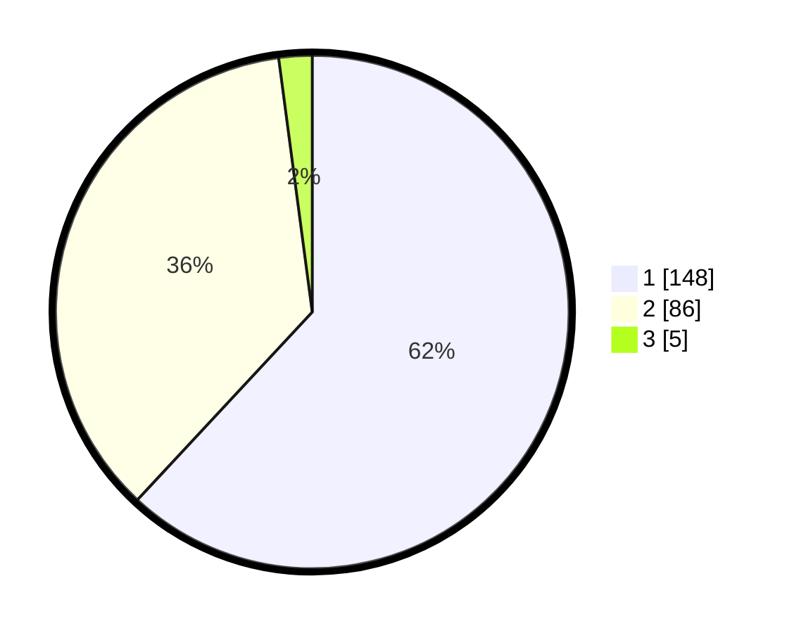

# Hasil

## Grafik

## Tabel

| No. | Nama Paslon    | Suara | Suara (raw) | Persentase |
|:--- |:-------------- | -----:| -----------:| ----------:|
| 1   | ANIES MUHAIMIN | 148   | [148][p-1]  | 61,92      |
| 2   | PRABOWO GIBRAN | 86    | [86][p-2]   | 35,98      |
| 3   | GANJAR MAHFUD  | 5     | [5][p-3]    | 2,09       |

[p-1]: https://github.com/gigit-pemilu/pemilu-2024-32-jawa-barat/blob/main/pilpres/hitung-suara/sub/32-jawa-barat/sub/10-majalengka/sub/01-lemahsugih/sub/2007-kepuh/sub/005-tps/sub/paslon-1.txt
[p-2]: https://github.com/gigit-pemilu/pemilu-2024-32-jawa-barat/blob/main/pilpres/hitung-suara/sub/32-jawa-barat/sub/10-majalengka/sub/01-lemahsugih/sub/2007-kepuh/sub/005-tps/sub/paslon-2.txt
[p-3]: https://github.com/gigit-pemilu/pemilu-2024-32-jawa-barat/blob/main/pilpres/hitung-suara/sub/32-jawa-barat/sub/10-majalengka/sub/01-lemahsugih/sub/2007-kepuh/sub/005-tps/sub/paslon-3.txt

## Foto C Plano

https://sirekap-obj-formc.kpu.go.id/b7c0/pemilu/ppwp/32/10/01/20/07/3210012007005-20240216-200241--cea79f40-5920-48dd-bbc7-d149df584a90.jpg

https://sirekap-obj-formc.kpu.go.id/b7c0/pemilu/ppwp/32/10/01/20/07/3210012007005-20240214-220350--6651cbff-7bcc-42d9-897d-106c6d1bf8de.jpg

https://sirekap-obj-formc.kpu.go.id/b7c0/pemilu/ppwp/32/10/01/20/07/3210012007005-20240214-220405--87de5c5e-c6d9-44d6-8a85-d2f51c708697.jpg

## Metadata

| Key        | Value               |
| ---------- | ------------------- |
| Time Stamp | 2024-02-16 21:01:00 |

