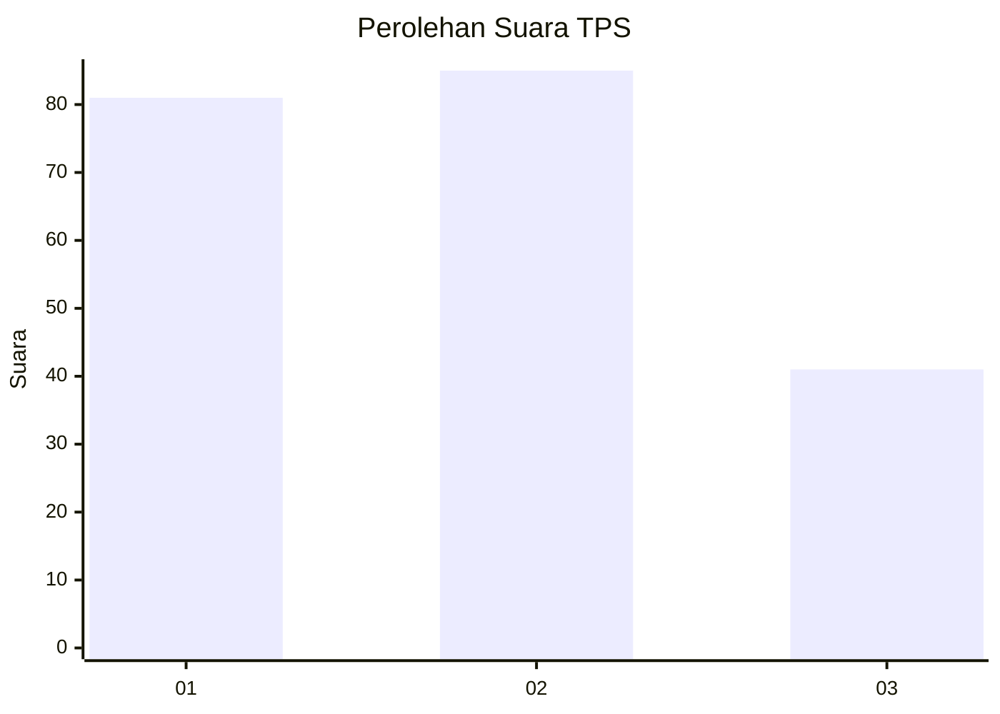
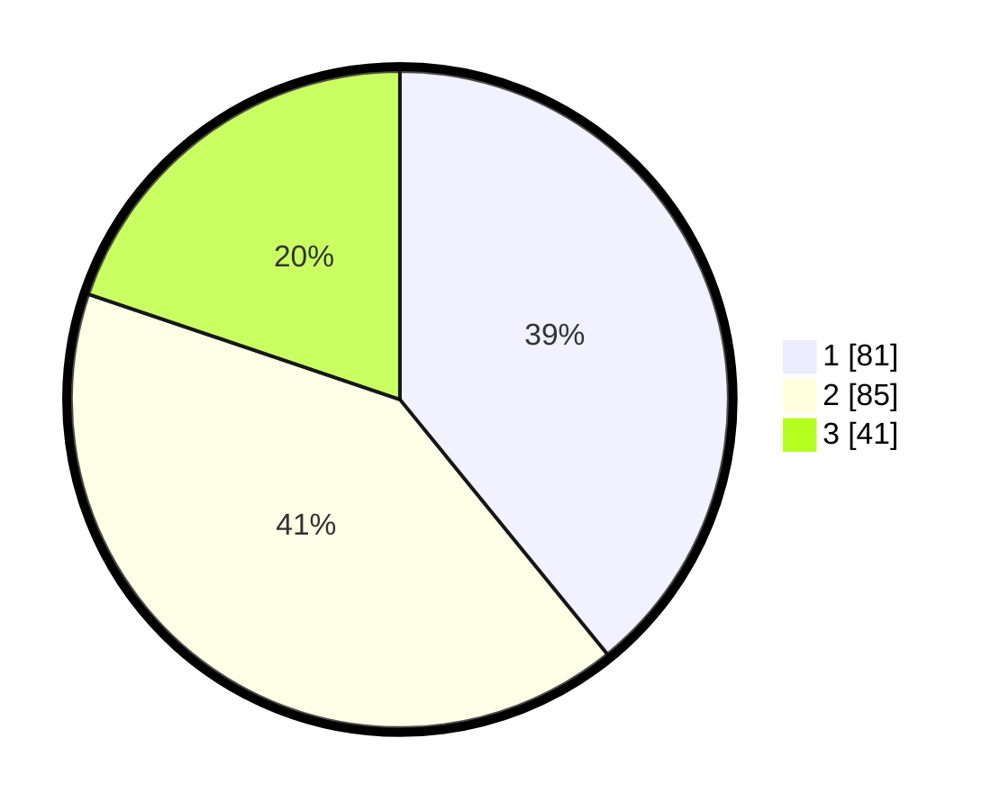

# Hasil

## Grafik

## Tabel

| No. | Nama Paslon    | Suara | Suara (raw) | Persentase |
|:--- |:-------------- | -----:| -----------:| ----------:|
| 1   | ANIES MUHAIMIN | 81    | [81][p-1]   | 39,13      |
| 2   | PRABOWO GIBRAN | 85    | [85][p-2]   | 41,06      |
| 3   | GANJAR MAHFUD  | 41    | [41][p-3]   | 19,81      |

[p-1]: https://github.com/gigit-pemilu/pemilu-2024-32-jawa-barat/blob/main/pilpres/hitung-suara/sub/32-jawa-barat/sub/10-majalengka/sub/02-bantarujeg/sub/2002-cipeundeuy/sub/001-tps/sub/paslon-1.txt
[p-2]: https://github.com/gigit-pemilu/pemilu-2024-32-jawa-barat/blob/main/pilpres/hitung-suara/sub/32-jawa-barat/sub/10-majalengka/sub/02-bantarujeg/sub/2002-cipeundeuy/sub/001-tps/sub/paslon-2.txt
[p-3]: https://github.com/gigit-pemilu/pemilu-2024-32-jawa-barat/blob/main/pilpres/hitung-suara/sub/32-jawa-barat/sub/10-majalengka/sub/02-bantarujeg/sub/2002-cipeundeuy/sub/001-tps/sub/paslon-3.txt

## Foto C Plano

https://sirekap-obj-formc.kpu.go.id/7a04/pemilu/ppwp/32/10/02/20/02/3210022002001-20240214-215301--7f0b01cf-3d02-4ce1-bf8d-d3a9bdb57f69.jpg

https://sirekap-obj-formc.kpu.go.id/7a04/pemilu/ppwp/32/10/02/20/02/3210022002001-20240214-214418--ee83e934-851c-43e1-af90-e4c8c715c391.jpg

https://sirekap-obj-formc.kpu.go.id/7a04/pemilu/ppwp/32/10/02/20/02/3210022002001-20240214-214455--f3111032-5522-4e81-8c16-066bc7883f0d.jpg

## Metadata

| Key        | Value               |
| ---------- | ------------------- |
| Time Stamp | 2024-02-24 22:31:28 |

