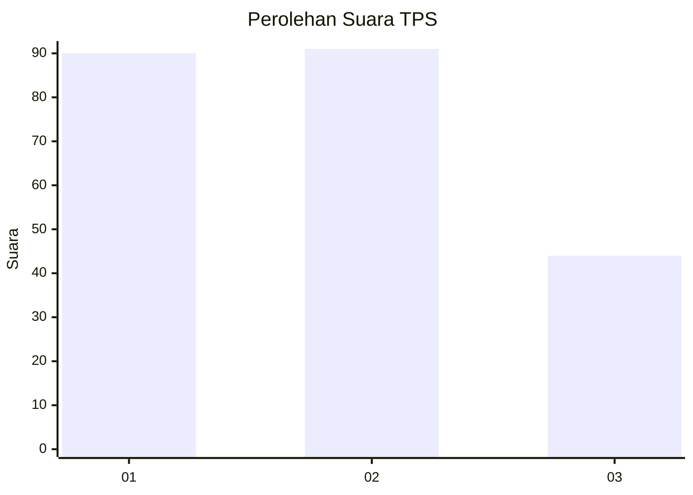
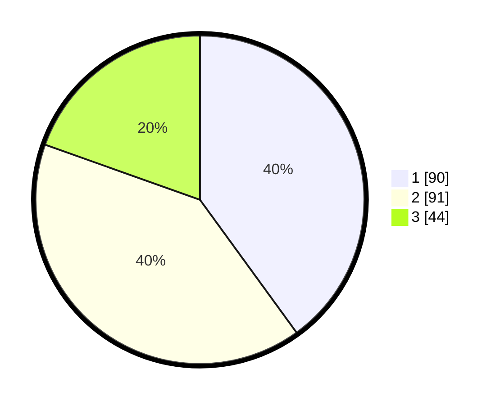

# Hasil

## Grafik

## Tabel

| No. | Nama Paslon    | Suara | Suara (raw) | Persentase |
|:--- |:-------------- | -----:| -----------:| ----------:|
| 1   | ANIES MUHAIMIN | 90    | [90][p-1]   | 40,00      |
| 2   | PRABOWO GIBRAN | 91    | [91][p-2]   | 40,44      |
| 3   | GANJAR MAHFUD  | 44    | [44][p-3]   | 19,56      |

[p-1]: https://github.com/gigit-pemilu/pemilu-2024-32-jawa-barat/blob/main/pilpres/hitung-suara/sub/32-jawa-barat/sub/10-majalengka/sub/02-bantarujeg/sub/2002-cipeundeuy/sub/002-tps/sub/paslon-1.txt
[p-2]: https://github.com/gigit-pemilu/pemilu-2024-32-jawa-barat/blob/main/pilpres/hitung-suara/sub/32-jawa-barat/sub/10-majalengka/sub/02-bantarujeg/sub/2002-cipeundeuy/sub/002-tps/sub/paslon-2.txt
[p-3]: https://github.com/gigit-pemilu/pemilu-2024-32-jawa-barat/blob/main/pilpres/hitung-suara/sub/32-jawa-barat/sub/10-majalengka/sub/02-bantarujeg/sub/2002-cipeundeuy/sub/002-tps/sub/paslon-3.txt

## Foto C Plano

https://sirekap-obj-formc.kpu.go.id/c736/pemilu/ppwp/32/10/02/20/02/3210022002002-20240214-215639--ec96136c-a6bf-4717-84d0-ed3ad8f7aecc.jpg

https://sirekap-obj-formc.kpu.go.id/c736/pemilu/ppwp/32/10/02/20/02/3210022002002-20240214-203330--7ad683c3-5e52-47f3-bee4-078b4e61ac37.jpg

https://sirekap-obj-formc.kpu.go.id/c736/pemilu/ppwp/32/10/02/20/02/3210022002002-20240214-203740--36c9447d-0714-4bcf-96a1-89e5560a8134.jpg

## Metadata

| Key        | Value               |
| ---------- | ------------------- |
| Time Stamp | 2024-02-15 04:00:24 |

