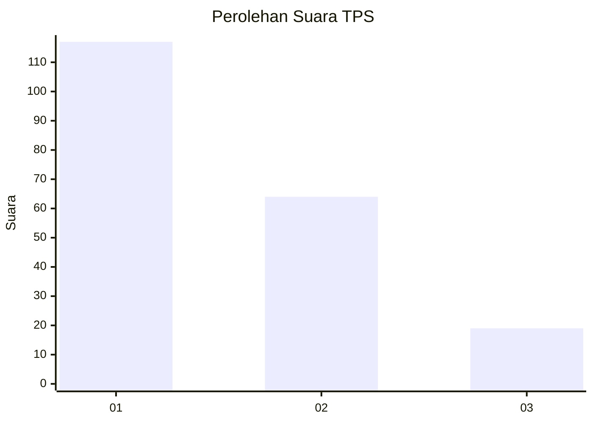
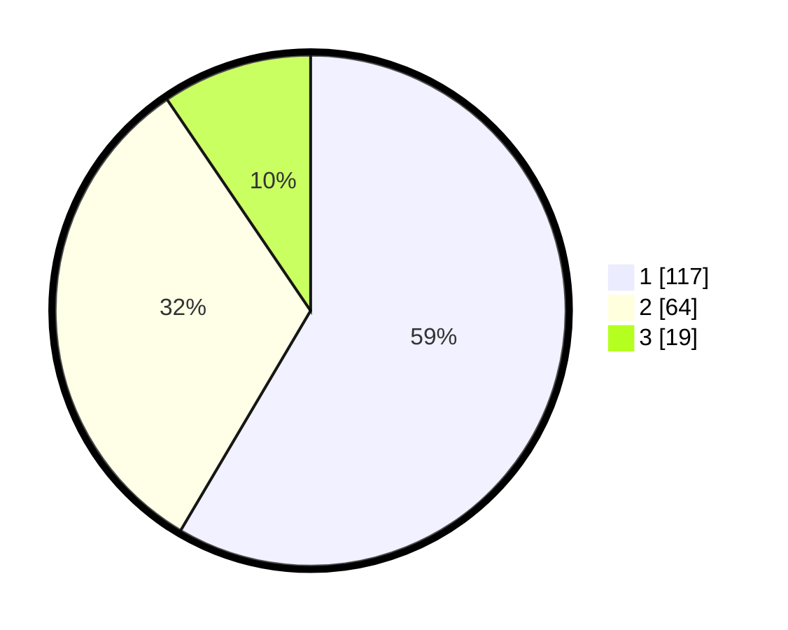

# Hasil

## Grafik

## Tabel

| No. | Nama Paslon    | Suara | Suara (raw) | Persentase |
|:--- |:-------------- | -----:| -----------:| ----------:|
| 1   | ANIES MUHAIMIN | 117   | [117][p-1]  | 58,50      |
| 2   | PRABOWO GIBRAN | 64    | [64][p-2]   | 32,00      |
| 3   | GANJAR MAHFUD  | 19    | [19][p-3]   | 9,50       |

[p-1]: https://github.com/gigit-pemilu/pemilu-2024/blob/main/pilpres/hitung-suara/sub/32-jawa-barat/sub/10-majalengka/sub/02-bantarujeg/sub/2002-cipeundeuy/sub/003-tps/sub/paslon-1.txt
[p-2]: https://github.com/gigit-pemilu/pemilu-2024/blob/main/pilpres/hitung-suara/sub/32-jawa-barat/sub/10-majalengka/sub/02-bantarujeg/sub/2002-cipeundeuy/sub/003-tps/sub/paslon-2.txt
[p-3]: https://github.com/gigit-pemilu/pemilu-2024/blob/main/pilpres/hitung-suara/sub/32-jawa-barat/sub/10-majalengka/sub/02-bantarujeg/sub/2002-cipeundeuy/sub/003-tps/sub/paslon-3.txt

## Foto C Plano

https://sirekap-obj-formc.kpu.go.id/5ae6/pemilu/ppwp/32/10/02/20/02/3210022002003-20240214-214824--5fe3c272-31b0-4919-aef7-056900a33a2d.jpg

https://sirekap-obj-formc.kpu.go.id/5ae6/pemilu/ppwp/32/10/02/20/02/3210022002003-20240214-214925--38453cfd-bf00-48da-9c43-a0e313cc2460.jpg

https://sirekap-obj-formc.kpu.go.id/5ae6/pemilu/ppwp/32/10/02/20/02/3210022002003-20240214-215021--9e354240-5fa1-4d73-8577-cdc79d2015e0.jpg

## Metadata

| Key        | Value               |
| ---------- | ------------------- |
| Time Stamp | 2024-02-15 15:00:29 |

