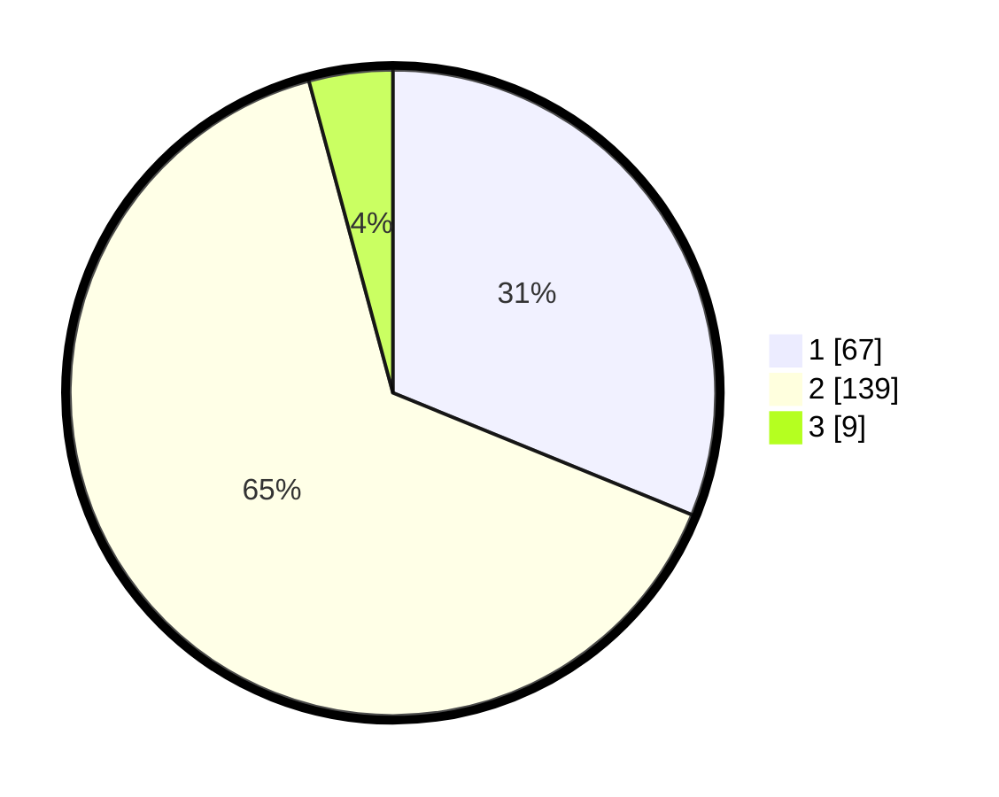

# Hasil

## Grafik

## Tabel

| No. | Nama Paslon    | Suara | Suara (raw) | Persentase |
|:--- |:-------------- | -----:| -----------:| ----------:|
| 1   | ANIES MUHAIMIN | 67    | [67][p-1]   | 31,16      |
| 2   | PRABOWO GIBRAN | 139   | [139][p-2]  | 64,65      |
| 3   | GANJAR MAHFUD  | 9     | [9][p-3]    | 4,19       |

[p-1]: https://github.com/gigit-pemilu/pemilu-2024/blob/main/pilpres/hitung-suara/sub/32-jawa-barat/sub/10-majalengka/sub/03-cikijing/sub/2001-sukasari/sub/005-tps/sub/paslon-1.txt
[p-2]: https://github.com/gigit-pemilu/pemilu-2024/blob/main/pilpres/hitung-suara/sub/32-jawa-barat/sub/10-majalengka/sub/03-cikijing/sub/2001-sukasari/sub/005-tps/sub/paslon-2.txt
[p-3]: https://github.com/gigit-pemilu/pemilu-2024/blob/main/pilpres/hitung-suara/sub/32-jawa-barat/sub/10-majalengka/sub/03-cikijing/sub/2001-sukasari/sub/005-tps/sub/paslon-3.txt

## Foto C Plano

https://sirekap-obj-formc.kpu.go.id/de47/pemilu/ppwp/32/10/03/20/01/3210032001005-20240219-101905--490c125d-18af-4cfc-8784-ffc5d186d830.jpg

https://sirekap-obj-formc.kpu.go.id/de47/pemilu/ppwp/32/10/03/20/01/3210032001005-20240219-102131--f67ad5e3-9d13-4d33-aa98-edf7fe74dd78.jpg

https://sirekap-obj-formc.kpu.go.id/de47/pemilu/ppwp/32/10/03/20/01/3210032001005-20240219-102339--56a634f0-79a1-4a2c-ae43-dd0770f2394c.jpg

## Metadata

| Key        | Value               |
| ---------- | ------------------- |
| Time Stamp | 2024-02-24 22:31:28 |

