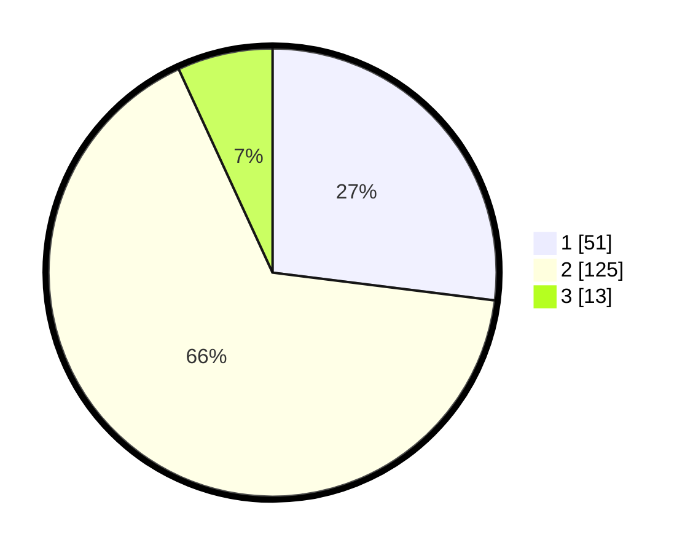

# Hasil

## Grafik

## Tabel

| No. | Nama Paslon    | Suara | Suara (raw) | Persentase |
|:--- |:-------------- | -----:| -----------:| ----------:|
| 1   | ANIES MUHAIMIN | 51    | [51][p-1]   | 26,98      |
| 2   | PRABOWO GIBRAN | 125   | [125][p-2]  | 66,14      |
| 3   | GANJAR MAHFUD  | 13    | [13][p-3]   | 6,88       |

[p-1]: https://github.com/gigit-pemilu/pemilu-2024-32-jawa-barat/blob/main/pilpres/hitung-suara/sub/32-jawa-barat/sub/10-majalengka/sub/04-talaga/sub/2001-lampuyang/sub/002-tps/sub/paslon-1.txt
[p-2]: https://github.com/gigit-pemilu/pemilu-2024-32-jawa-barat/blob/main/pilpres/hitung-suara/sub/32-jawa-barat/sub/10-majalengka/sub/04-talaga/sub/2001-lampuyang/sub/002-tps/sub/paslon-2.txt
[p-3]: https://github.com/gigit-pemilu/pemilu-2024-32-jawa-barat/blob/main/pilpres/hitung-suara/sub/32-jawa-barat/sub/10-majalengka/sub/04-talaga/sub/2001-lampuyang/sub/002-tps/sub/paslon-3.txt

## Foto C Plano

https://sirekap-obj-formc.kpu.go.id/130b/pemilu/ppwp/32/10/04/20/01/3210042001002-20240214-215923--c6a612a7-ecea-4341-9ae0-81d1e91c7739.jpg

https://sirekap-obj-formc.kpu.go.id/130b/pemilu/ppwp/32/10/04/20/01/3210042001002-20240214-213017--caa5a8c4-d604-4ba0-acd1-ee1bb960c683.jpg

https://sirekap-obj-formc.kpu.go.id/130b/pemilu/ppwp/32/10/04/20/01/3210042001002-20240214-213439--e0b9d732-575d-4c43-b99c-485be688e731.jpg

## Metadata

| Key        | Value               |
| ---------- | ------------------- |
| Time Stamp | 2024-02-24 22:31:28 |

