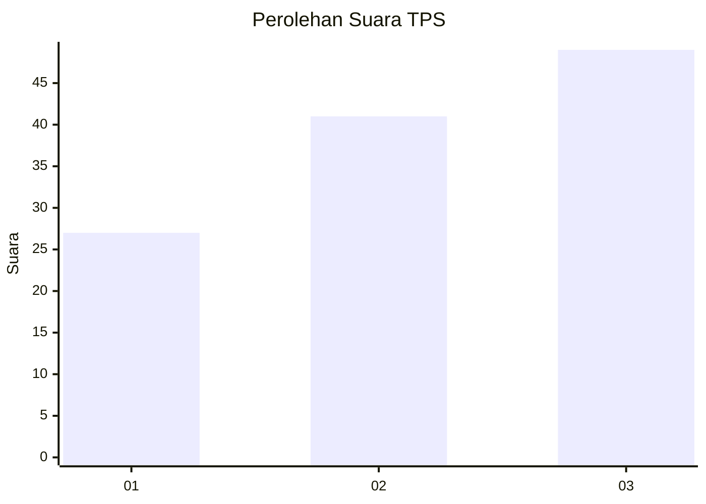
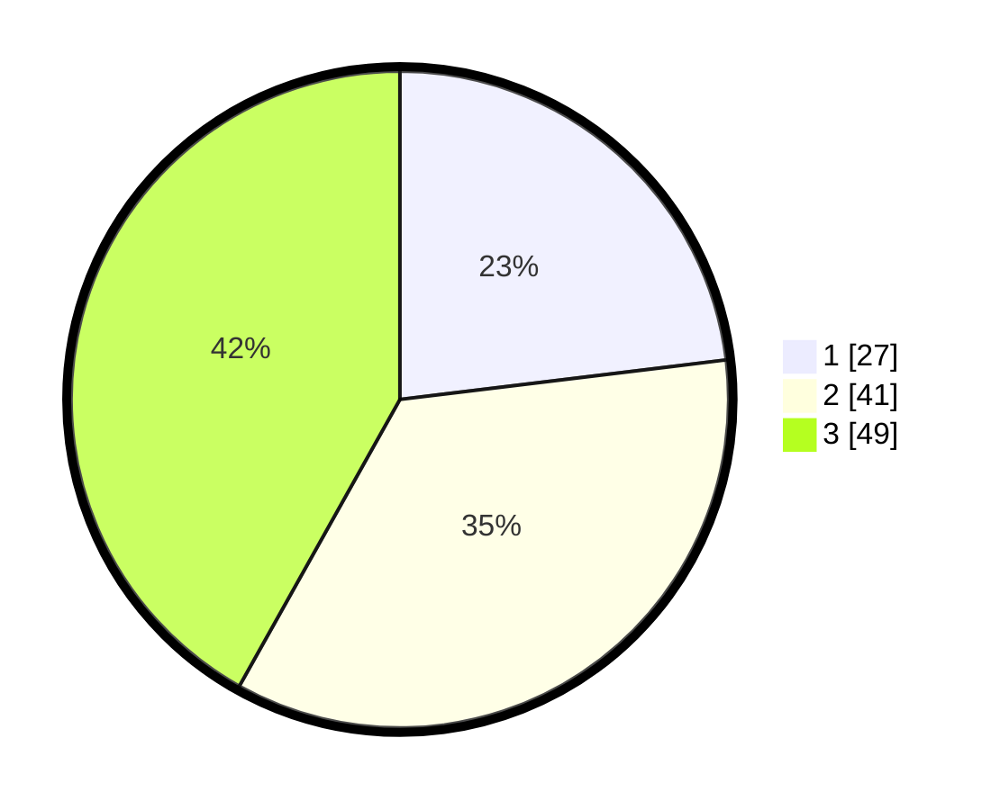

# Hasil

## Grafik

## Tabel

| No. | Nama Paslon    | Suara | Suara (raw) | Persentase |
|:--- |:-------------- | -----:| -----------:| ----------:|
| 1   | ANIES MUHAIMIN | 27    | [27][p-1]   | 23,08      |
| 2   | PRABOWO GIBRAN | 41    | [41][p-2]   | 35,04      |
| 3   | GANJAR MAHFUD  | 49    | [49][p-3]   | 41,88      |

[p-1]: https://github.com/gigit-pemilu/pemilu-2024-32-jawa-barat/blob/main/pilpres/hitung-suara/sub/32-jawa-barat/sub/10-majalengka/sub/05-argapura/sub/2001-sagara/sub/002-tps/sub/paslon-1.txt
[p-2]: https://github.com/gigit-pemilu/pemilu-2024-32-jawa-barat/blob/main/pilpres/hitung-suara/sub/32-jawa-barat/sub/10-majalengka/sub/05-argapura/sub/2001-sagara/sub/002-tps/sub/paslon-2.txt
[p-3]: https://github.com/gigit-pemilu/pemilu-2024-32-jawa-barat/blob/main/pilpres/hitung-suara/sub/32-jawa-barat/sub/10-majalengka/sub/05-argapura/sub/2001-sagara/sub/002-tps/sub/paslon-3.txt

## Foto C Plano

https://sirekap-obj-formc.kpu.go.id/fe9b/pemilu/ppwp/32/10/05/20/01/3210052001002-20240215-002920--654e207b-48cc-4375-b02a-9e5f8a3fcbb3.jpg

https://sirekap-obj-formc.kpu.go.id/fe9b/pemilu/ppwp/32/10/05/20/01/3210052001002-20240215-002956--0d01a630-ef98-4886-9e92-941608f564f1.jpg

https://sirekap-obj-formc.kpu.go.id/fe9b/pemilu/ppwp/32/10/05/20/01/3210052001002-20240215-003015--802622a3-517a-4ba7-b01c-46c784213f57.jpg

## Metadata

| Key        | Value               |
| ---------- | ------------------- |
| Time Stamp | 2024-02-25 12:00:00 |

