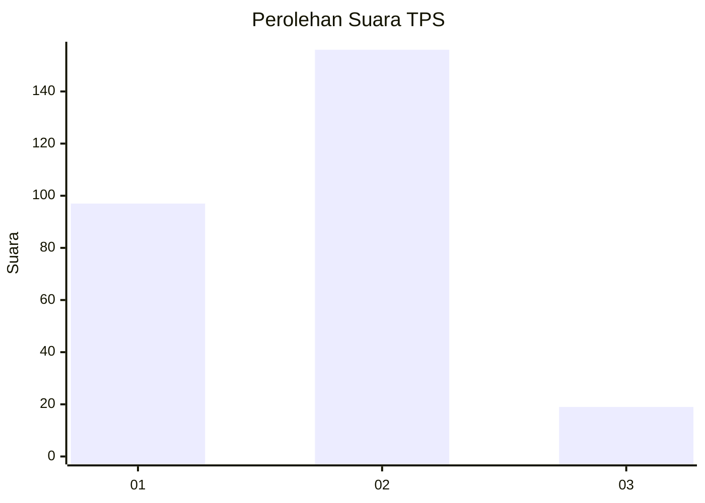
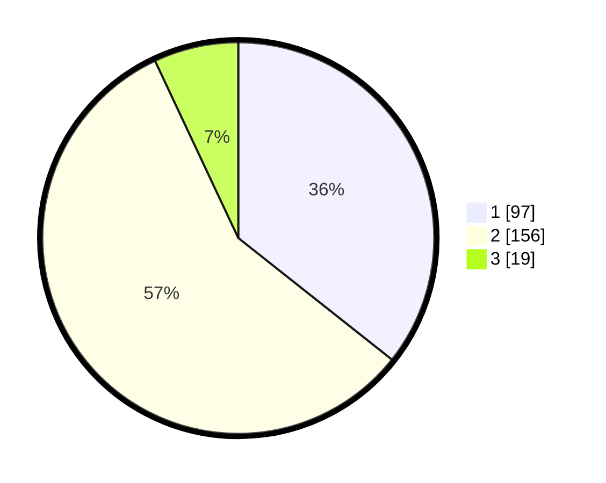

# Hasil

## Grafik

## Tabel

| No. | Nama Paslon    | Suara | Suara (raw) | Persentase |
|:--- |:-------------- | -----:| -----------:| ----------:|
| 1   | ANIES MUHAIMIN | 97    | [97][p-1]   | 35,66      |
| 2   | PRABOWO GIBRAN | 156   | [156][p-2]  | 57,35      |
| 3   | GANJAR MAHFUD  | 19    | [19][p-3]   | 6,99       |

[p-1]: https://github.com/gigit-pemilu/pemilu-2024-32-jawa-barat/blob/main/pilpres/hitung-suara/sub/32-jawa-barat/sub/10-majalengka/sub/05-argapura/sub/2001-sagara/sub/005-tps/sub/paslon-1.txt
[p-2]: https://github.com/gigit-pemilu/pemilu-2024-32-jawa-barat/blob/main/pilpres/hitung-suara/sub/32-jawa-barat/sub/10-majalengka/sub/05-argapura/sub/2001-sagara/sub/005-tps/sub/paslon-2.txt
[p-3]: https://github.com/gigit-pemilu/pemilu-2024-32-jawa-barat/blob/main/pilpres/hitung-suara/sub/32-jawa-barat/sub/10-majalengka/sub/05-argapura/sub/2001-sagara/sub/005-tps/sub/paslon-3.txt

## Foto C Plano

https://sirekap-obj-formc.kpu.go.id/58b0/pemilu/ppwp/32/10/05/20/01/3210052001005-20240215-011328--22e23876-092a-40ce-a5d2-9e88c877b7e0.jpg

https://sirekap-obj-formc.kpu.go.id/58b0/pemilu/ppwp/32/10/05/20/01/3210052001005-20240215-011012--19925a29-e205-4441-83f9-68c1b4806976.jpg

https://sirekap-obj-formc.kpu.go.id/58b0/pemilu/ppwp/32/10/05/20/01/3210052001005-20240215-011555--53a51170-199e-435a-a41a-8e4d9b2e3c87.jpg

## Metadata

| Key        | Value               |
| ---------- | ------------------- |
| Time Stamp | 2024-03-01 18:00:00 |

