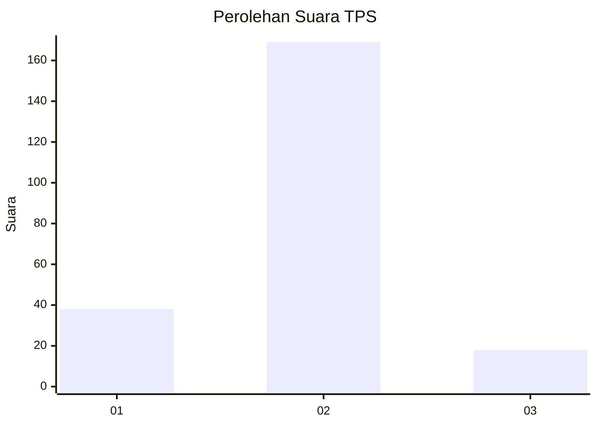
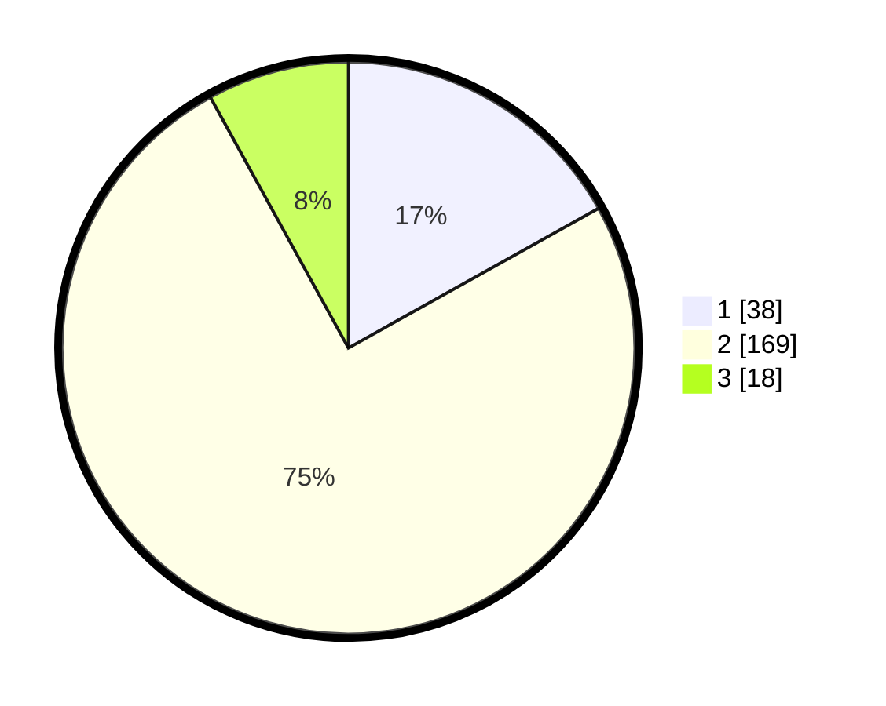

# Hasil

## Grafik

## Tabel

| No. | Nama Paslon    | Suara | Suara (raw) | Persentase |
|:--- |:-------------- | -----:| -----------:| ----------:|
| 1   | ANIES MUHAIMIN | 38    | [38][p-1]   | 16,89      |
| 2   | PRABOWO GIBRAN | 169   | [169][p-2]  | 75,11      |
| 3   | GANJAR MAHFUD  | 18    | [18][p-3]   | 8,00       |

[p-1]: https://github.com/gigit-pemilu/pemilu-2024-32-jawa-barat/blob/main/pilpres/hitung-suara/sub/32-jawa-barat/sub/10-majalengka/sub/05-argapura/sub/2002-cibunut/sub/002-tps/sub/paslon-1.txt
[p-2]: https://github.com/gigit-pemilu/pemilu-2024-32-jawa-barat/blob/main/pilpres/hitung-suara/sub/32-jawa-barat/sub/10-majalengka/sub/05-argapura/sub/2002-cibunut/sub/002-tps/sub/paslon-2.txt
[p-3]: https://github.com/gigit-pemilu/pemilu-2024-32-jawa-barat/blob/main/pilpres/hitung-suara/sub/32-jawa-barat/sub/10-majalengka/sub/05-argapura/sub/2002-cibunut/sub/002-tps/sub/paslon-3.txt

## Foto C Plano

https://sirekap-obj-formc.kpu.go.id/83f9/pemilu/ppwp/32/10/05/20/02/3210052002002-20240215-174809--bf41c051-3051-4ffc-9e79-0542d4f86ddd.jpg

https://sirekap-obj-formc.kpu.go.id/83f9/pemilu/ppwp/32/10/05/20/02/3210052002002-20240215-071831--53d8911b-d916-4657-b260-1ae016f7269f.jpg

https://sirekap-obj-formc.kpu.go.id/83f9/pemilu/ppwp/32/10/05/20/02/3210052002002-20240215-072007--c5b2a493-807a-407a-895f-2141ea0200f1.jpg

## Metadata

| Key        | Value               |
| ---------- | ------------------- |
| Time Stamp | 2024-02-24 22:31:28 |

