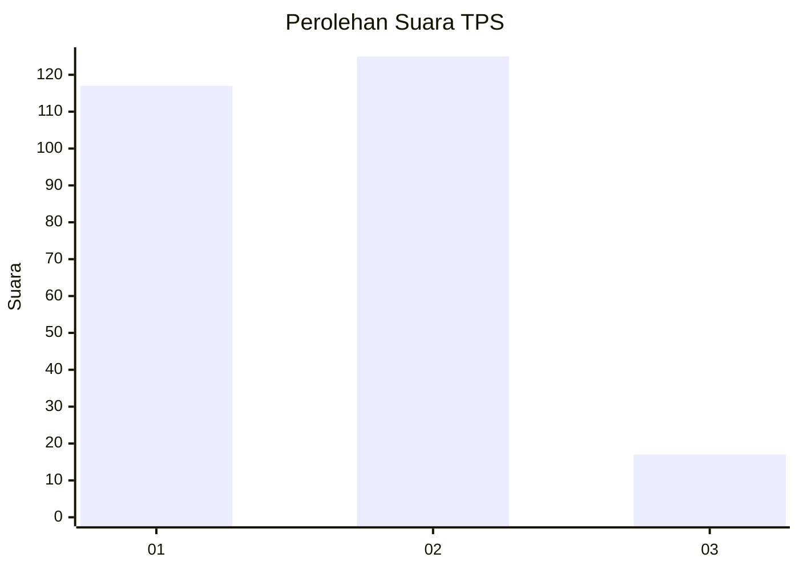
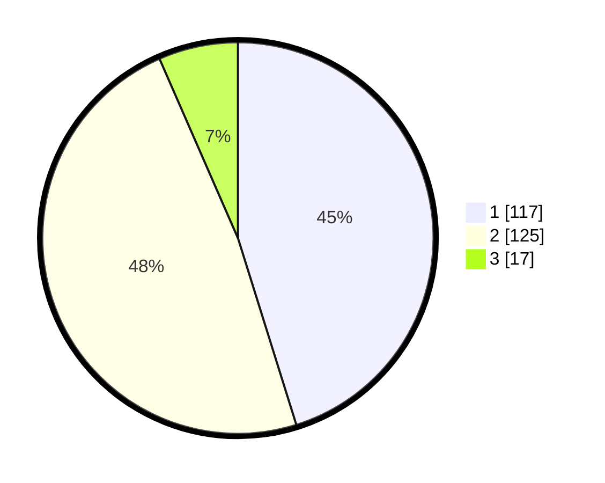

# Hasil

## Grafik

## Tabel

| No. | Nama Paslon    | Suara | Suara (raw) | Persentase |
|:--- |:-------------- | -----:| -----------:| ----------:|
| 1   | ANIES MUHAIMIN | 117   | [117][p-1]  | 45,17      |
| 2   | PRABOWO GIBRAN | 125   | [125][p-2]  | 48,26      |
| 3   | GANJAR MAHFUD  | 17    | [17][p-3]   | 6,56       |

[p-1]: https://github.com/gigit-pemilu/pemilu-2024/blob/main/pilpres/hitung-suara/sub/32-jawa-barat/sub/10-majalengka/sub/05-argapura/sub/2014-argalingga/sub/008-tps/sub/paslon-1.txt
[p-2]: https://github.com/gigit-pemilu/pemilu-2024/blob/main/pilpres/hitung-suara/sub/32-jawa-barat/sub/10-majalengka/sub/05-argapura/sub/2014-argalingga/sub/008-tps/sub/paslon-2.txt
[p-3]: https://github.com/gigit-pemilu/pemilu-2024/blob/main/pilpres/hitung-suara/sub/32-jawa-barat/sub/10-majalengka/sub/05-argapura/sub/2014-argalingga/sub/008-tps/sub/paslon-3.txt

## Foto C Plano

https://sirekap-obj-formc.kpu.go.id/7967/pemilu/ppwp/32/10/05/20/14/3210052014008-20240215-004300--6dbe156a-6474-4265-b2ef-e2fea9ba2f47.jpg

https://sirekap-obj-formc.kpu.go.id/7967/pemilu/ppwp/32/10/05/20/14/3210052014008-20240215-004406--56405b91-1133-4b9c-bd01-c01d6999f25d.jpg

https://sirekap-obj-formc.kpu.go.id/7967/pemilu/ppwp/32/10/05/20/14/3210052014008-20240215-004535--3b167903-f5b0-49d8-a68e-f9a07dd17f9f.jpg

## Metadata

| Key        | Value               |
| ---------- | ------------------- |
| Time Stamp | 2024-02-25 12:00:00 |

