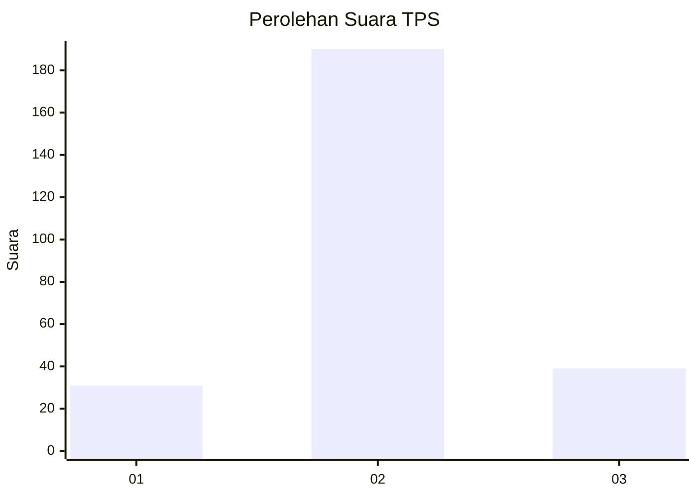
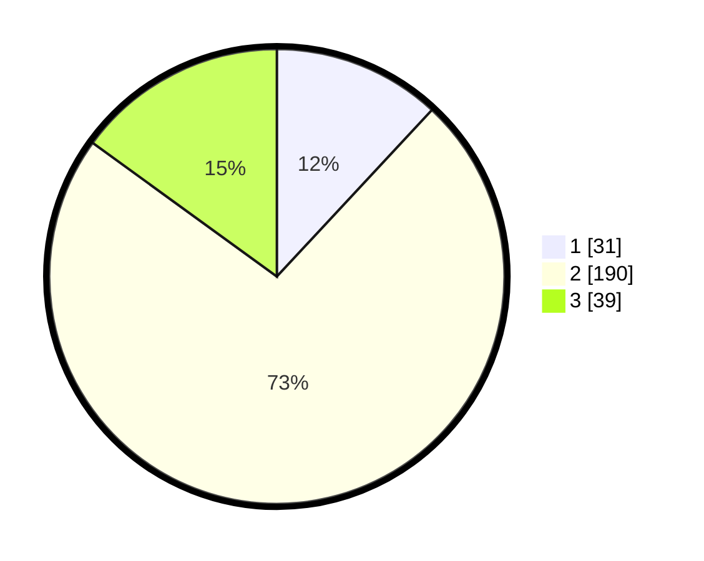

# Hasil

## Grafik

## Tabel

| No. | Nama Paslon    | Suara | Suara (raw) | Persentase |
|:--- |:-------------- | -----:| -----------:| ----------:|
| 1   | ANIES MUHAIMIN | 31    | [31][p-1]   | 11,92      |
| 2   | PRABOWO GIBRAN | 190   | [190][p-2]  | 73,08      |
| 3   | GANJAR MAHFUD  | 39    | [39][p-3]   | 15,00      |

[p-1]: https://github.com/gigit-pemilu/pemilu-2024-32-jawa-barat/blob/main/pilpres/hitung-suara/sub/32-jawa-barat/sub/10-majalengka/sub/10-leuwimunding/sub/2001-parakan/sub/006-tps/sub/paslon-1.txt
[p-2]: https://github.com/gigit-pemilu/pemilu-2024-32-jawa-barat/blob/main/pilpres/hitung-suara/sub/32-jawa-barat/sub/10-majalengka/sub/10-leuwimunding/sub/2001-parakan/sub/006-tps/sub/paslon-2.txt
[p-3]: https://github.com/gigit-pemilu/pemilu-2024-32-jawa-barat/blob/main/pilpres/hitung-suara/sub/32-jawa-barat/sub/10-majalengka/sub/10-leuwimunding/sub/2001-parakan/sub/006-tps/sub/paslon-3.txt

## Foto C Plano

https://sirekap-obj-formc.kpu.go.id/b32e/pemilu/ppwp/32/10/10/20/01/3210102001006-20240215-152047--627d46ab-5db0-4da5-95f5-f880de35a3ae.jpg

https://sirekap-obj-formc.kpu.go.id/b32e/pemilu/ppwp/32/10/10/20/01/3210102001006-20240215-152212--17a01ac0-57cb-4a19-a6f1-c0178d77141e.jpg

https://sirekap-obj-formc.kpu.go.id/b32e/pemilu/ppwp/32/10/10/20/01/3210102001006-20240215-152358--ab031cec-6220-43b4-8e65-683a860b22e6.jpg

## Metadata

| Key        | Value               |
| ---------- | ------------------- |
| Time Stamp | 2024-02-15 18:30:25 |

