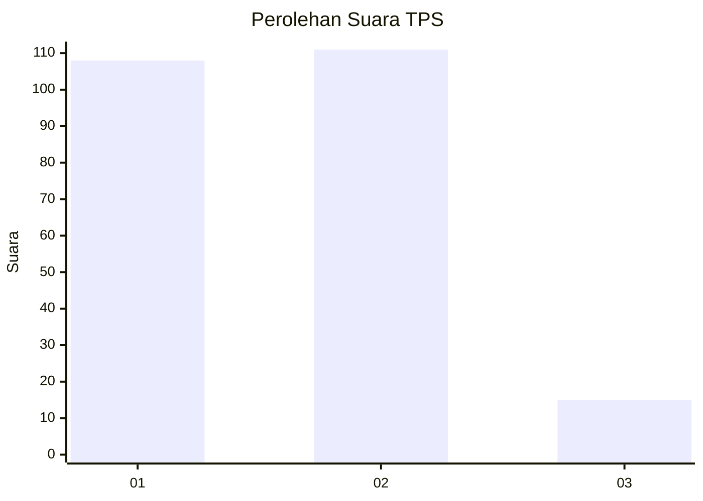
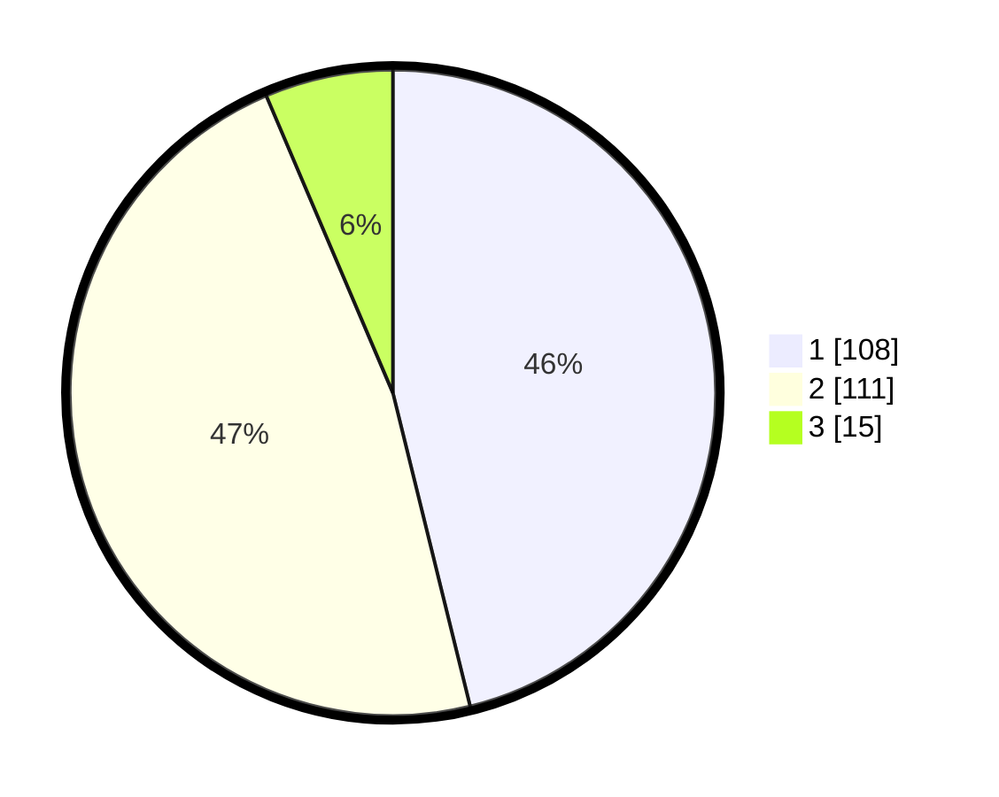

# Hasil

## Grafik

## Tabel

| No. | Nama Paslon    | Suara | Suara (raw) | Persentase |
|:--- |:-------------- | -----:| -----------:| ----------:|
| 1   | ANIES MUHAIMIN | 108   | [108][p-1]  | 46,15      |
| 2   | PRABOWO GIBRAN | 111   | [111][p-2]  | 47,44      |
| 3   | GANJAR MAHFUD  | 15    | [15][p-3]   | 6,41       |

[p-1]: https://github.com/gigit-pemilu/pemilu-2024-32-jawa-barat/blob/main/pilpres/hitung-suara/sub/32-jawa-barat/sub/10-majalengka/sub/13-kadipaten/sub/2001-heuleut/sub/004-tps/sub/paslon-1.txt
[p-2]: https://github.com/gigit-pemilu/pemilu-2024-32-jawa-barat/blob/main/pilpres/hitung-suara/sub/32-jawa-barat/sub/10-majalengka/sub/13-kadipaten/sub/2001-heuleut/sub/004-tps/sub/paslon-2.txt
[p-3]: https://github.com/gigit-pemilu/pemilu-2024-32-jawa-barat/blob/main/pilpres/hitung-suara/sub/32-jawa-barat/sub/10-majalengka/sub/13-kadipaten/sub/2001-heuleut/sub/004-tps/sub/paslon-3.txt

## Foto C Plano

https://sirekap-obj-formc.kpu.go.id/9e2f/pemilu/ppwp/32/10/13/20/01/3210132001004-20240215-074302--b75199bd-b6fe-4e73-ace0-193940962925.jpg

https://sirekap-obj-formc.kpu.go.id/9e2f/pemilu/ppwp/32/10/13/20/01/3210132001004-20240216-135812--b2b850a3-259e-47b7-932c-4c6c52ef4cbe.jpg

https://sirekap-obj-formc.kpu.go.id/9e2f/pemilu/ppwp/32/10/13/20/01/3210132001004-20240216-135812--f9c73a6d-04ac-47a1-beeb-8b534fb515d9.jpg

## Metadata

| Key        | Value               |
| ---------- | ------------------- |
| Time Stamp | 2024-02-22 12:00:00 |

