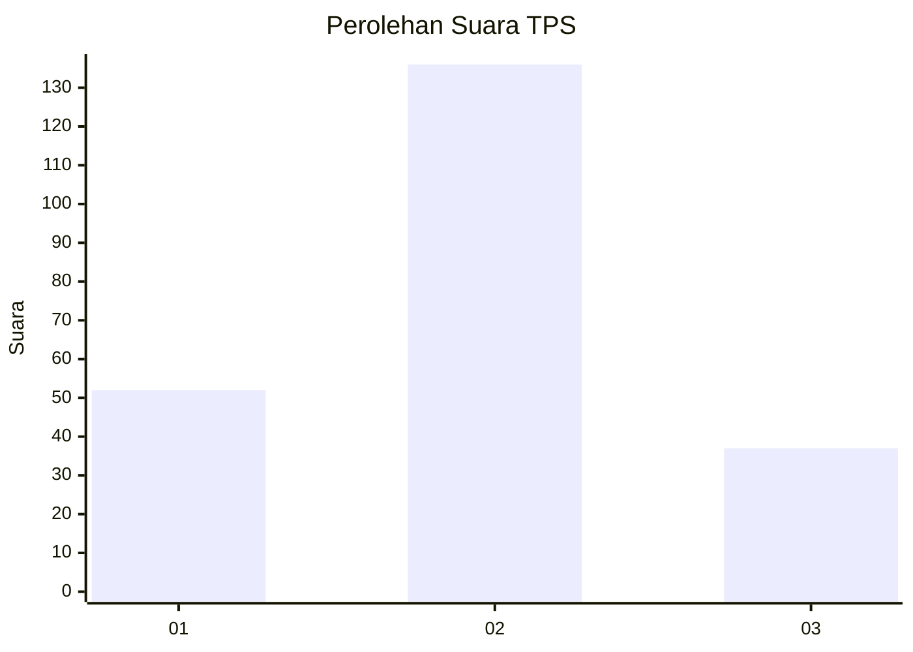

# Hasil

## Grafik

## Tabel

| No. | Nama Paslon    | Suara | Suara (raw) | Persentase |
|:--- |:-------------- | -----:| -----------:| ----------:|
| 1   | ANIES MUHAIMIN | 52    | [52][p-1]   | 23,11      |
| 2   | PRABOWO GIBRAN | 136   | [136][p-2]  | 60,44      |
| 3   | GANJAR MAHFUD  | 37    | [37][p-3]   | 16,44      |

[p-1]: https://github.com/gigit-pemilu/pemilu-2024/blob/main/pilpres/hitung-suara/sub/32-jawa-barat/sub/10-majalengka/sub/16-ligung/sub/2001-cibogor/sub/004-tps/sub/paslon-1.txt
[p-2]: https://github.com/gigit-pemilu/pemilu-2024/blob/main/pilpres/hitung-suara/sub/32-jawa-barat/sub/10-majalengka/sub/16-ligung/sub/2001-cibogor/sub/004-tps/sub/paslon-2.txt
[p-3]: https://github.com/gigit-pemilu/pemilu-2024/blob/main/pilpres/hitung-suara/sub/32-jawa-barat/sub/10-majalengka/sub/16-ligung/sub/2001-cibogor/sub/004-tps/sub/paslon-3.txt

## Foto C Plano

https://sirekap-obj-formc.kpu.go.id/224d/pemilu/ppwp/32/10/16/20/01/3210162001004-20240220-172411--b5fa39a2-e33f-4144-a1e2-e9e81b89df45.jpg

https://sirekap-obj-formc.kpu.go.id/224d/pemilu/ppwp/32/10/16/20/01/3210162001004-20240217-120244--0a557917-b22e-41e7-85e6-6fc5b0ee9e51.jpg

https://sirekap-obj-formc.kpu.go.id/224d/pemilu/ppwp/32/10/16/20/01/3210162001004-20240217-120716--c7cbbc05-b0d3-4e70-999d-aa3a2ff4032c.jpg

## Metadata

| Key        | Value               |
| ---------- | ------------------- |
| Time Stamp | 2024-02-24 22:31:28 |

